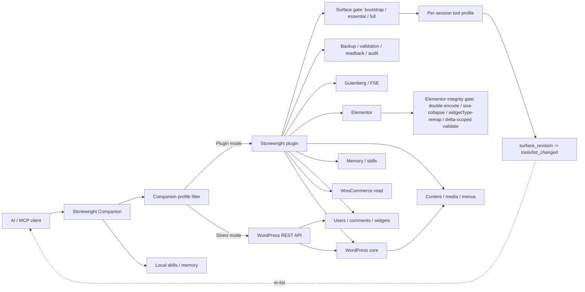

<p align="center">
  
</p>

<h1 align="center">Stonewright</h1>

<p align="center">
  <strong>AI agents that design and build Elementor pages safely</strong><br />
  Plus guarded Gutenberg, full-site REST, WP-CLI, and self-improving skills — with or without a plugin.
</p>

<p align="center">
  <a href="https://github.com/cosmincraciun97/stonewright-wp-mcp/releases"></a>
  <a href="https://github.com/cosmincraciun97/stonewright-wp-mcp/actions/workflows/ci.yml"></a>
  
  
  
  
</p>

Stonewright is a WordPress MCP stack for AI coding agents. **Elementor** is a first-class surface in Plugin mode (typed engines, DesignSpec, kit globals). **Direct mode** works against core REST with an Application Password without installing the plugin: companion-local skills/memory, and Elementor document edits **without opening the editor** via WP-CLI (local) or REST meta when registered (remote). Full batch-mutate engines remain plugin-only.

> “Safe” here is a **design goal**: operating modes, permissions, confirmations, backups, validation, readback, and audit logging make agent-driven changes more recoverable. It is not an absolute security guarantee. Use staging, review changes, and keep normal WordPress backups.

<p align="center">
  <a href="https://github.com/cosmincraciun97/stonewright-wp-mcp/releases">Download latest release</a>
  ·
  <a href="docs/installation.md">Installation</a>
  ·
  <a href="docs/install-prompts.md">AI install prompts</a>
  ·
  <a href="SECURITY.md">Security</a>
  ·
  <a href="docs/ability-truth-matrix.md">Capability matrix</a>
  ·
  <a href="docs/direct-mode-e2e.md">Direct mode</a>
  ·
  <a href="CONTRIBUTING.md">Contributing</a>
</p>

<!-- Maintainer: add the Stonewright workflow demo here. Do not remove this comment until the asset is available. -->

## Capabilities

Counts are derived from `docs/ability-truth-matrix.md` (plugin) and `DIRECT_TOOL_NAMES` (Direct). Do not hand-edit totals without regenerating the matrix.

### Plugin mode — **317** abilities

| Category | Count | Highlights |
|---|---:|---|
| Elementor widgets (compat) | 94 | Generated per-widget builders |
| Elementor V3 | 25+ | Structure edit, batch-mutate, kit globals, build-from-spec, transactions |
| Design | 14 | DesignSpec validate/render, native plan, intent |
| Elementor V4 | 13 | Atomic nodes, variables, classes (experimental) |
| Site | 17 | Snapshot, inventory, health, pulse, plugins, theme, shortcodes |
| Gutenberg + FSE | 20 | Blocks, theme.json, templates, global styles |
| Content + media | 16 | Pages/posts, bulk upsert, upload, stock |
| ACF / SEO / CPT | 13 | Field groups/values, multi-plugin SEO, CPT/tax register |
| Comments / users / widgets / settings / themes / plugins / revisions | 28 | REST-parity admin ops |
| WP-CLI | 6 | Status, discover, run, batch, jobs |
| Memory + skills + expertise | 16 | Learning, skills, expertise packs |
| Security + audit + sandbox | 12 | Tokens, one-time links, sandbox lifecycle |
| Other (menus, blueprints, brand kits, runtime, search, WC, theme builder, …) | rest | See full [matrix](docs/ability-truth-matrix.md) |

### Direct mode — **99** tools (pluginless)

| Area | Tools (group) | Notes |
|---|---|---|
| Content & Gutenberg | list/get/create/update + compose + **validate** | Round-trip heuristics after writes |
| Elementor (local WP-CLI) | **status / data-get / data-update** | Mandatory file backup; CSS flush best-effort |
| Media, menus, taxonomy, templates, global styles | REST | Core endpoints |
| Comments, users, app passwords, widgets | REST | Write-gated |
| Plugins, themes, settings, health | REST | Destructive confirms |
| WooCommerce | products/orders/sales | Read-only |
| ACF / SEO | fields get/update, seo-head | REST when plugins expose them |
| Self-improvement | skill-*, memory, learning, **task-start**, **agents-md-sync** | `~/.stonewright/` storage |
| WP-CLI | status/discover/run/batch/jobs | Tokenized `execFile` argv |
| Safety | write gating, confirm, audit JSONL, backups | Task-start required before writes (default) |

## What you can do with Stonewright

- Inspect an existing WordPress site before changing it
- Create or update Gutenberg content and block-theme structures (Plugin mode; partial Direct mode for core posts/pages)
- Build and modify Elementor documents through validated DesignSpec workflows (**Plugin mode**)
- Manage content, media, navigation, and selected site settings
- Create snapshots or revisions before supported mutations
- Validate DesignSpec payloads and read back important changes
- Restore supported changes when something goes wrong (**Plugin mode** audit/restore paths)
- Preserve project conventions and learned corrections (**Plugin mode** memory/skills)
- Perform guarded WP-CLI-assisted operations via the companion
- Use core REST workflows without installing the plugin through **Direct mode**

## Why Stonewright

- **Elementor widget and schema intelligence** — live controls and typed writes (Plugin mode)
- **Gutenberg, FSE, templates, patterns, and `theme.json`**
- **Persistent project memory and learned corrections** (Plugin mode)
- **Validation and readback** on DesignSpec and major write paths
- **Audit logging and change history** (Plugin mode)
- **Backups and restore workflows** for supported post mutations
- **Tool-surface and token-budget management** (profiles, priorities, client caps)
- **Plugin-less Direct mode** for core REST
- **Explicit operating modes** (`development`, `staging`, `production-safe`) and confirmation tokens for destructive work

## Choose your setup

Capabilities differ between modes. Prefer Plugin mode when you need Elementor, blueprints, memory, skills, audit, or full DesignSpec engines.

### Plugin mode — recommended for full capabilities

Install the Stonewright plugin for advanced Elementor workflows, blueprints and brand kits, memory and skills, audit/restore, DesignSpec validation, `php-execute`, and the broader ability surface.

### Direct mode — plugin-less core REST + local Elementor data

The companion authenticates with a WordPress Application Password and exposes **99** tools without installing Stonewright. Elementor documents can be edited **without the Elementor editor** via `stonewright-elementor-data-get` / `data-update` (local WP-CLI preferred; remote Direct falls back to core REST meta when `_elementor_data` is registered, with a file backup under `~/.stonewright/backups/`). This path has no Elementor schema validation — use Plugin mode `elementor-v3-batch-mutate` for production engines. DesignSpec, php-execute, and site-hosted skills remain plugin-only. See [docs/direct-mode-e2e.md](docs/direct-mode-e2e.md) and [docs/install-prompts.md](docs/install-prompts.md).

## Quick Start

**Plugin mode (about five steps):**

1. Download the latest `stonewright-*.zip` from [GitHub Releases](https://github.com/cosmincraciun97/stonewright-wp-mcp/releases) (includes prereleases).
2. In WordPress: **Plugins → Add New → Upload Plugin** → activate **Stonewright**.
3. Open **Stonewright → Setup**, enable abilities, and create an Application Password.
4. Configure your MCP client to run the companion (see below).
5. In Setup, run **Verify connection** (live MCP loopback). Optionally run `npx @stonewright/companion doctor` from a shell.
6. Call `stonewright-task-start` (or `stonewright-context-bootstrap` as a compatibility path) before WordPress work.

MCP surface modes (`bootstrap` / `essential` / `full`) control how many plugin abilities appear to clients. Public ability and Direct-tool contracts live under [docs/contracts/](docs/contracts/). Elementor multi-step edits use the [transaction envelope](docs/transactions.md).

<details>
<summary>MCP client config (Plugin mode companion)</summary>

Use the latest release companion package URL from [Releases](https://github.com/cosmincraciun97/stonewright-wp-mcp/releases) (do not hardcode a stale alpha):

```json
{
  "mcpServers": {
    "stonewright": {
      "command": "npx",
      "args": [
        "-y",
        "--package",
        "https://github.com/cosmincraciun97/stonewright-wp-mcp/releases/download/vVERSION/stonewright-companion-VERSION.tgz",
        "stonewright-mcp"
      ],
      "env": {
        "STONEWRIGHT_WP_URL": "https://your-site.example.com",
        "STONEWRIGHT_WP_USERNAME": "admin",
        "STONEWRIGHT_WP_APP_PASSWORD": "xxxx xxxx xxxx xxxx xxxx xxxx",
        "STONEWRIGHT_MCP_TOOL_PROFILE": "essential"
      }
    }
  }
}
```

Replace `VERSION` with the exact release version without the leading `v`, as
shown on the GitHub Releases page. Site MCP endpoint when using the WordPress
MCP adapter directly:

```text
https://your-site.example.com/wp-json/mcp/stonewright
```

HTTP local sites are supported; Setup treats plain HTTP as informational, not a hard failure.

</details>

<details>
<summary>Direct mode (plugin-less)</summary>

1. Create a WordPress Application Password for an admin user. On plain HTTP local sites, set `WP_ENVIRONMENT_TYPE` to `local` in `wp-config.php` if Application Passwords require it.
2. Run the companion `init` command from the latest release package (or configure env vars) and paste the MCP JSON into your client:

   ```bash
   npx -y --package https://github.com/cosmincraciun97/stonewright-wp-mcp/releases/download/vVERSION/stonewright-companion-VERSION.tgz stonewright-companion init
   ```
3. First calls: `stonewright-site-discover`, `stonewright-setup-profile`.
4. Read [docs/direct-mode-e2e.md](docs/direct-mode-e2e.md) for the capability matrix and smoke script.

Example env for Direct mode:

```json
{
  "mcpServers": {
    "stonewright": {
      "command": "npx",
      "args": [
        "-y",
        "--package",
        "https://github.com/cosmincraciun97/stonewright-wp-mcp/releases/download/vVERSION/stonewright-companion-VERSION.tgz",
        "stonewright-mcp"
      ],
      "env": {
        "STONEWRIGHT_MODE": "direct",
        "STONEWRIGHT_WP_URL": "http://your-local-site.local",
        "STONEWRIGHT_WP_USERNAME": "admin",
        "STONEWRIGHT_WP_APP_PASSWORD": "xxxx xxxx xxxx xxxx xxxx xxxx",
        "STONEWRIGHT_MCP_TOOL_PROFILE": "essential"
      }
    }
  }
}
```

Replace `VERSION` with the latest release version (the companion is distributed through GitHub Releases, not the npm registry).

</details>

## How Stonewright makes agent changes safer

Stonewright is designed to make agent-driven WordPress changes safer and more recoverable, not to provide a perfect security sandbox. Most typed mutation workflows pass through combinations of permission checks, operating modes, confirmations, backups, validation, readback, and audit logging.

`stonewright/php-execute` is an advanced full WordPress-runtime capability. It is permission- and mode-gated, audited, and subject to targeted restrictions, but it is not a strict sandbox and does not receive the same structural guarantees as typed DesignSpec or validated mutation workflows.

Typed mutation paths may use combinations of:

- Stonewright operating modes (`development`, `staging`, `production-safe`)
- WordPress permissions and capability checks
- Confirmation tokens for destructive operations in production-safe mode
- Backups or revisions before supported Elementor/theme/content mutations
- Schema and DesignSpec validation before render
- Readback verification on selected write paths
- Audit logging
- Rollback or restore workflows where supported

Not every surface uses every gate. Prefer typed abilities over unrestricted PHP when a typed path exists. Read [SECURITY.md](SECURITY.md) and [docs/security.md](docs/security.md).

## Architecture



Tool visibility is filtered twice before a client sees it: the plugin’s **surface gate** (`bootstrap` / `essential` / `full`) and optional **per-session tool profile** decide which abilities the MCP endpoint exposes, then the **companion profile filter** narrows that set again for the client. A monotonic `surface_revision` on every gateway response drives `tools/list_changed` so clients re-list when the surface changes.

Direct mode has a **smaller** capability surface: core REST, local Elementor data, and skills/memory across **99 tools**. Plugin mode exposes **317 abilities**. Direct mode skips the plugin’s typed schema validator; Elementor writes in both modes pass an integrity gate that blocks double-encoding, mass size-collapse, and `widgetType` remaps.

See [docs/install-prompts.md](docs/install-prompts.md) for copy-paste AI client setup (plugin and Direct).

## Supported workflows and clients

Stonewright speaks standard MCP (stdio via the companion, and HTTP MCP when the WordPress MCP adapter is active). Configuration samples in this repository follow the common MCP server JSON shape used by several clients.

| Area | Status | Notes |
|---|---|---|
| Companion stdio MCP | Documented | Primary install path in docs |
| WordPress MCP endpoint `/wp-json/mcp/stonewright` | Documented | Plugin + MCP adapter |
| Direct mode core REST | Documented + smoke script | [docs/direct-mode-e2e.md](docs/direct-mode-e2e.md) |
| Specific desktop/CLI AI clients | Not uniformly verified | Use generic MCP config; do not assume a client is verified without a dedicated setup doc |

## Admin interface

Plugin mode admin pages include Setup, Dashboard (Site Pulse), Abilities, Blueprints, Skills, Memory, Sandbox, and Audit Log. Theme toggle lives in the admin shell header.

<!-- Maintainer: add the Dashboard or Site Pulse screenshot here. Do not remove this comment until the asset is available. -->
<!-- Maintainer: add the Blueprints or brand-kit screenshot here. Do not remove this comment until the asset is available. -->
<!-- Maintainer: add the Audit Log or restore screenshot here. Do not remove this comment until the asset is available. -->
<!-- Maintainer: add an Elementor or Gutenberg agent workflow screenshot here. Do not remove this comment until the asset is available. -->

## Requirements

- WordPress 6.7+ (plugin mode uses `wordpress/mcp-adapter` where applicable)
- PHP 8.1+
- Node.js 20+ for the companion
- Elementor 3.21+ only when using Elementor abilities
- WP-CLI optional for tokenized companion CLI workflows

## Current project status and limitations

Stonewright ships **alpha** prereleases. APIs, tools, configuration, and behavior may still change. Test on staging or local environments first. Keep site backups independent of Stonewright. Report security issues privately per [SECURITY.md](SECURITY.md).

This project is **not** marketed as production-ready in the sense of a frozen stable API. Use production-safe mode and review when operating on live sites.

## Documentation

- [Installation](docs/installation.md)
- [Direct mode capability matrix](docs/direct-mode-e2e.md)
- [Companion](docs/companion.md)
- [Security](docs/security.md) · [SECURITY.md](SECURITY.md)
- [Ability truth matrix](docs/ability-truth-matrix.md)
- [Licensing](docs/licensing.md)
- [Upstream code reuse ledger](docs/upstream-code-reuse.md)
- [Release notes](docs/releases/) (five-release retention)

## Development and testing

```bash
cd plugin
composer install
composer test
composer phpstan
composer phpcs

cd ../companion
npm install
npm run typecheck
npm test
npm run build
```

## Components and licenses

| Component | Path | License |
|---|---|---|
| Plugin | `plugin/` | AGPL-3.0-or-later |
| Visual workspace | `visual/` | AGPL-3.0-or-later |
| Companion | `companion/` | MIT |
| Skill packs | `skills/` | MIT |
| Documentation | `docs/` | CC BY 4.0 |

## Support, security, and contributing

- Bugs and features: [GitHub Issues](https://github.com/cosmincraciun97/stonewright-wp-mcp/issues) using the templates
- Security: [SECURITY.md](SECURITY.md) (private disclosure)
- Support guide: [SUPPORT.md](SUPPORT.md)
- Contributing: [CONTRIBUTING.md](CONTRIBUTING.md)
- Code of conduct: [CODE_OF_CONDUCT.md](CODE_OF_CONDUCT.md)
