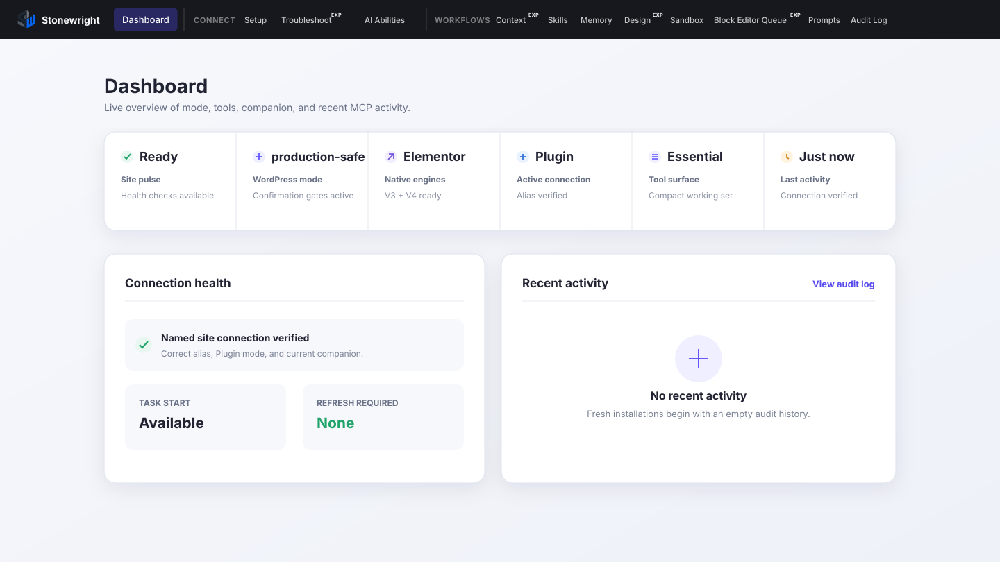
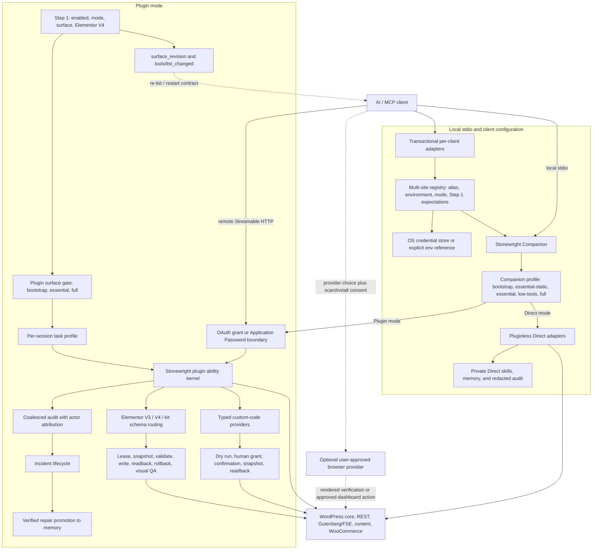

<p align="center">
  
</p>

<h1 align="center">Stonewright</h1>

<p align="center">
  <strong>Your AI does not just change WordPress. Stonewright proves what changed and gives you a way back.</strong><br />
  Guarded, recoverable WordPress and Elementor automation for AI agents.
</p>

<p align="center">
  <a href="https://github.com/cosmincraciun97/stonewright-wp-mcp/releases/latest"></a>
  <a href="https://github.com/cosmincraciun97/stonewright-wp-mcp/actions/workflows/ci.yml"></a>
  <a href="LICENSE"></a>
  <a href="companion/LICENSE"></a>
  
  
</p>

<!-- supported-release:start -->
<p align="center"><strong>Current release: 1.0.0-beta.11 — Public Beta</strong></p>
<p align="center">
  <a href="https://github.com/cosmincraciun97/stonewright-wp-mcp/releases/download/v1.0.0-beta.11/stonewright-1.0.0-beta.11.zip">Download Plugin</a>
  ·
  <a href="docs/installation.md">Installation guide</a>
  ·
  <a href="https://github.com/cosmincraciun97/stonewright-wp-mcp/releases/download/v1.0.0-beta.11/stonewright-companion-1.0.0-beta.11.tgz">Companion</a>
  ·
  <a href="https://github.com/cosmincraciun97/stonewright-wp-mcp/releases/download/v1.0.0-beta.11/SHA256SUMS.txt">Checksums</a>
  ·
  <a href="https://github.com/cosmincraciun97/stonewright-wp-mcp/releases/tag/v1.0.0-beta.11">Release notes</a>
</p>
<p align="center"><sub>Preview builds appear on the complete Releases page and are not recommended by default.</sub></p>
<!-- supported-release:end -->

Stonewright MCP presents a compact, task-aware surface backed by **387 Plugin abilities** and **101 Direct tools**. Elementor is a first-class Plugin surface; Gutenberg, WooCommerce, WordPress REST, and tokenized WP-CLI workflows use the same evidence-oriented operating model.

Stonewright does not promise that automation cannot fail. It adds concrete controls around supported changes: permissions, operating modes, confirmation tokens, pre-write snapshots, validation, typed readback, audit evidence, and restore paths. Use staging and normal infrastructure backups for production work.

<p align="center">
  <a href="https://github.com/cosmincraciun97/stonewright-wp-mcp/releases">Download latest release</a>
  ·
  <a href="docs/installation.md">Installation</a>
  ·
  <a href="docs/install-prompts.md">AI install prompts</a>
  ·
  <a href="SECURITY.md">Security</a>
  ·
  <a href="docs/ability-truth-matrix.md">Capability matrix</a>
  ·
  <a href="docs/direct-mode-e2e.md">Direct mode</a>
  ·
  <a href="docs/woocommerce.md">WooCommerce</a>
  ·
  <a href="DESIGN.md">Design system</a>
  ·
  <a href="CONTRIBUTING.md">Contributing</a>
</p>

<p align="center">
  
</p>

## How it works

**Inspect → plan or dry-run → approve when required → back up → write → read back and verify → audit or restore.**

Not every operation needs every gate. Stonewright selects the controls required by the typed ability, active mode, target surface, and risk. Custom code stops for human approval; supported Elementor and design writes take a snapshot before mutation; destructive production-safe operations require a scoped confirmation token.

## Start in four steps

1. Download the current Plugin ZIP and install it in **Plugins → Add New → Upload Plugin**.
2. Open **Stonewright → Setup**, enable the site, then connect your client using the guided OAuth or Application Password flow. If the client still cannot connect, open **Stonewright → Troubleshoot** and run diagnostics (the page stays put and shows a loading state).
3. Fully restart the client and run the generated connection verification. A saved or parseable config is not runtime proof.
4. Confirm `stonewright-task-start` is visible and call it first with the real task. Use `essential` for normal work; `bootstrap` is startup diagnostics only.

The Setup screen provides client-specific commands and keeps credentials out of copied prompts. [Installation](docs/installation.md) covers the default path; [advanced connection options](docs/install-prompts.md) cover Direct mode, local WP-CLI, remote HTTP, browser consent, profiles, and recovery.

## Common workflows

- **Repair an Elementor page:** read the live control schema, plan one surgical batch, snapshot the document, write once, run post-write verification, then complete the browser recipe. [Elementor closure contract](docs/permanent-remediation-contracts.md#elementor-write-closure)
- **Change custom code:** discover the provider, dry-run the exact target, stop for human approval, apply the approved bytes, read back, and retain rollback evidence. [Custom-code recovery contract](docs/security.md#custom-code-and-theme-file-recovery)
- **Run repeatable local maintenance safely:** save a parameterized WP-CLI recipe once, plan it, approve writes with a one-use hash, and get verified readback on every run. [Command recipes](companion/README.md#command-recipes-local-wp-cli)
- **Stop repeating a failure:** classify the recurrence, surface a ranked incident action, verify the repair against correlated audit events, then promote one reusable lesson. [Verified learning](docs/verified-learning.md)

[Why Stonewright MCP](docs/why-stonewright.md) compares this evidence chain with a generic WordPress API bridge without relying on raw tool counts.

## Capabilities

Counts are derived from `docs/ability-truth-matrix.md` (plugin) and `DIRECT_TOOL_NAMES` (Direct). Do not hand-edit totals without regenerating the matrix.

### Plugin mode — **387** abilities

Counts below are grouped by the `includes/Abilities/` subdirectory each ability
lives in, and sum to the total. Regenerate with `composer docs:matrix`.

| Category | Count | Highlights |
|---|---:|---|
| Elementor widgets (compat) | 94 | Generated per-widget builders |
| Elementor widget builder | 4 | Custom widget project helpers |
| Elementor V3 | 34 | Structure edit, batch-mutate, post-write verification, performance audit, legacy-debt report, kit globals, build-from-spec, transactions |
| Elementor V4 | 14 | Atomic nodes, variables, classes (experimental) |
| Design | 28 | DesignSpec validate/render, native plan, intent, versioned Design Directions, manifests, comparison, guarded kit sync, rendered quality checks |
| Site | 17 | Snapshot, inventory, health, pulse, plugins, theme, shortcodes |
| Gutenberg | 13 | Parse, insert, update, batch-mutate, query-loop, render/apply |
| Finalizer abilities | 6 | Queue, runtime, pending, finalize, cancel, and finalizer URL for static/third-party blocks |
| FSE + patterns | 17 | theme.json, templates, navigation, pattern CRUD |
| Blocks library introspection | 3 | GenerateBlocks / Kadence / Spectra setup, list, and schema |
| Content + media | 16 | Pages/posts, bulk upsert, upload, stock |
| ACF + SEO | 8 | Field groups/values, multi-plugin SEO |
| Comments / users / widgets / settings / themes / theme builder / plugins / revisions | 35 | REST-parity admin ops (themes row excludes chrome) |
| Theme chrome | 2 | Blocksy / Kadence Theme / GeneratePress color, type, header, footer |
| WP-CLI | 6 | Status, discover, run, batch, jobs |
| Memory + skills + expertise + knowledge | 20 | Learning, memory generalization, skills, expertise packs |
| Security + sandbox | 13 | Tokens, one-time links, incident repair receipts, sandbox lifecycle |
| Diagnostics | 3 | OAuth header, form delivery, and object capability diagnostics |
| System | 11 | Task start, native rules, tool profiles, ability list |
| System discover-execute | 3 | Compact catalog, bounded schema, gated execute without the full tool list |
| Menus, blueprints, brand kits, runtime, search, WooCommerce, content model, custom code | 35 | Native Woo catalog CRUD/audit and typed approval-gated code providers; see full [matrix](docs/ability-truth-matrix.md) |

### Direct mode — **101** tools (pluginless)

| Area | Tools (group) | Notes |
|---|---|---|
| Content & Gutenberg | list/get/create/update + compose + **validate** | Round-trip heuristics after writes |
| Elementor (local WP-CLI) | **status / data-get / data-update** | Mandatory file backup; CSS flush best-effort |
| Media, menus, taxonomy, templates, global styles | REST | Core endpoints |
| Comments, users, app passwords, widgets | REST | Write-gated |
| Plugins, themes, settings, health | REST | Destructive confirms |
| WooCommerce | products/orders/sales | Read-only; catalog writes require Plugin mode |
| ACF / SEO | fields get/update, seo-head | REST when plugins expose them |
| Self-improvement | skill-*, memory, verified incident repair, **task-start**, **agents-md-sync** | Private per-site `~/.stonewright/` storage |
| Native rules | **rules-get** | Same shipped registry as Plugin mode; cache by digest |
| WP-CLI | status/discover/run/batch/jobs | Tokenized `execFile` argv |
| Safety | write gating, confirm, audit JSONL, backups | Task-start required before writes (default) |

## What you can do with Stonewright

- Inspect an existing WordPress site before changing it
- Create or update Gutenberg content and block-theme structures (Plugin mode; partial Direct mode for core posts/pages)
- Build and modify Elementor documents through validated DesignSpec workflows (**Plugin mode**)
- Close Elementor writes with post-scoped cache invalidation, CSS regeneration,
  bounded frontend assertions, and an explicit browser verification recipe
- Wire licensed Elementor Loop Grid/Carousel widgets transactionally from an
  existing loop-item template or a validated template spec (**Plugin mode**)
- Manage content, media, navigation, and selected site settings
- Manage WooCommerce products, variations, catalog terms, global attributes,
  and shipping classes through dry-run-first native abilities
- Create snapshots or revisions before supported mutations
- Validate DesignSpec payloads and read back important changes
- Restore supported changes when something goes wrong (**Plugin mode** audit/restore paths)
- Preserve project conventions and learned corrections (**Plugin mode** memory/skills)
- Perform guarded WP-CLI-assisted operations via the companion
- Use core REST workflows without installing the plugin through **Direct mode**

## Why Stonewright

- **Elementor widget and schema intelligence** — live controls and typed writes (Plugin mode)
- **Gutenberg, FSE, templates, patterns, and `theme.json`**
- **Persistent project memory and learned corrections** (Plugin mode)
- **Controlled schema learning** — only verified repairs become active, scoped
  to matching Elementor runtimes
- **Validation and readback** on DesignSpec and major write paths
- **Audit logging and change history** (Plugin mode)
- **Backups and restore workflows** for supported post mutations
- **Tool-surface and token-budget management** (profiles, priorities, client caps)
- **Native WooCommerce catalog workflows** with dry-run, permission,
  production confirmation, audit, and readback gates
- **Plugin-less Direct mode** for core REST and read-only WooCommerce
- **Explicit operating modes** (`development`, `staging`, `production-safe`) and confirmation tokens for destructive work

## Choose your setup

Capabilities differ between modes. Prefer Plugin mode when you need Elementor, blueprints, memory, skills, audit, or full DesignSpec engines.

### Plugin mode — recommended for full capabilities

Install the Stonewright plugin for advanced Elementor workflows, blueprints and brand kits, memory and skills, audit/restore, DesignSpec validation, `php-execute`, and the broader ability surface.

### Direct mode — plugin-less core REST + local Elementor data

The companion authenticates with a WordPress Application Password and exposes **101** tools without installing Stonewright. Elementor documents can be edited **without the Elementor editor** via `stonewright-elementor-data-get` / `data-update` (local WP-CLI preferred; remote Direct falls back to core REST meta when `_elementor_data` is registered, with a file backup under `~/.stonewright/backups/`). This path has no Elementor schema validation — use Plugin mode `elementor-v3-batch-mutate` for production engines. DesignSpec, php-execute, and site-hosted skills remain plugin-only; Direct keeps private local memory and user skills under `~/.stonewright/`. See [docs/direct-mode-e2e.md](docs/direct-mode-e2e.md) and [docs/install-prompts.md](docs/install-prompts.md).

## Advanced connection options

The four-step Plugin path above is the default. The sections below are for local WP-CLI, explicit Application Password configuration, Direct mode, multiple sites, and clients that need manual profile control.

MCP surface modes (`bootstrap` / `essential-static` / `essential` / `full`) control how many abilities appear to clients. Opt-in **`discover-execute`** is a companion profile for catalog + gated execute without the full tool list; auto routing never selects it. `stonewright-php-execute` is **full-profile only**. Known clients normally use the bounded working profile **`essential`**; **`essential-static`** is the safe fallback for an unknown client with stale tool-list behavior. Public ability and Direct-tool contracts live under [docs/contracts/](docs/contracts/). Elementor multi-step edits use the [transaction envelope](docs/transactions.md). The durable audit, OAuth, write-receipt, and diagnostics contract is [documented here](docs/permanent-remediation-contracts.md). Client certification vs compatibility is defined in [docs/releases/client-acceptance-template.md](docs/releases/client-acceptance-template.md).

<details>
<summary>MCP client config (Plugin mode companion)</summary>

Use the versioned installer from the latest
[release](https://github.com/cosmincraciun97/stonewright-wp-mcp/releases).
Because this flow starts from an installed plugin, choose `plugin-only`; it
fails closed instead of silently falling back to Direct mode.

Codex CLI and Codex in ChatGPT Desktop are separate clients (`--client
codex-cli` vs `--client chatgpt-desktop`). `--client codex` still aliases to
CLI. See [getting-started/codex.md](docs/getting-started/codex.md).

```bash
npx -y --package https://github.com/cosmincraciun97/stonewright-wp-mcp/releases/download/vVERSION/stonewright-companion-VERSION.tgz stonewright connect add \
  --alias site-a --url https://site-a.example --username editor \
  --env production --mode plugin-only --client codex-cli \
  --plugin-enabled yes --wp-mode production-safe --wp-surface essential
```

The installer requests the Application Password through a hidden prompt,
stores it in the OS credential store, and writes a collision-safe named client
entry containing `STONEWRIGHT_SITE_ALIAS`, never the password. If the alias is
already registered, reuse its saved credential and switch the existing entry:

```bash
npx -y --package https://github.com/cosmincraciun97/stonewright-wp-mcp/releases/download/vVERSION/stonewright-companion-VERSION.tgz stonewright connect repair site-a --client codex-cli --mode plugin-only
```

Restart the client and run `stonewright connect verify site-a --client codex-cli`.
The receipt must report the requested alias, `configured_mode=plugin-only`,
`active_mode=plugin`, task-start/status availability, the expected companion,
and no required tool refresh. OAuth remote HTTP is a separate connection to
`/wp-json/mcp/stonewright-oauth`; do not combine both transports under one
generic `stonewright` server name.

</details>

<details>
<summary>Direct mode (plugin-less)</summary>

1. Create a WordPress Application Password for an admin user. On plain HTTP local sites, set `WP_ENVIRONMENT_TYPE` to `local` in `wp-config.php` if Application Passwords require it.
2. Register a named site and client from the latest release package. The hidden
   prompt keeps the Application Password out of argv and shell history:

   ```bash
   npx -y --package https://github.com/cosmincraciun97/stonewright-wp-mcp/releases/download/vVERSION/stonewright-companion-VERSION.tgz stonewright connect add \
     --alias site-a --url https://site-a.example --username admin \
     --mode direct-only --client cursor
   ```
3. Restart the client, then run `stonewright connect verify site-a --client
   cursor`. This spawns the saved server entry and requires task-start and status
   to complete; a config-file parse alone is not runtime proof.
4. First in-client call: `stonewright-task-start`. Use `stonewright-site-discover` for
   endpoint and capability details, and `stonewright-setup-profile` for setup
   diagnostics.
5. Read [docs/direct-mode-e2e.md](docs/direct-mode-e2e.md) for the capability matrix and smoke script.

Example env for Direct mode:

```json
{
  "mcpServers": {
    "stonewright": {
      "command": "npx",
      "args": [
        "-y",
        "--package",
        "https://github.com/cosmincraciun97/stonewright-wp-mcp/releases/download/vVERSION/stonewright-companion-VERSION.tgz",
        "stonewright-mcp"
      ],
      "env": {
        "STONEWRIGHT_MODE": "direct",
        "STONEWRIGHT_WP_URL": "http://your-local-site.local",
        "STONEWRIGHT_WP_USERNAME": "admin",
        "STONEWRIGHT_WP_APP_PASSWORD": "xxxx xxxx xxxx xxxx xxxx xxxx",
        "STONEWRIGHT_MCP_TOOL_PROFILE": "essential"
      }
    }
  }
}
```

Replace `VERSION` with the latest release version (the companion is distributed through GitHub Releases, not the npm registry). Direct mode does not write custom PHP/CSS/JS/HTML (no authenticated wp-admin grant boundary).

</details>

### Multiple sites and environments

Each `(canonical URL, environment)` is unique and each site has a stable alias.
`~/.stonewright/sites.json` contains metadata and credential references only;
Application Passwords remain in Keychain, Windows protected storage, Linux
Secret Service, or an explicit `env://` reference. A client entry carries only
`STONEWRIGHT_SITE_ALIAS`, so startup resolves exactly that site without loading
unrelated credentials. The explicit alias is authoritative over inherited
legacy `STONEWRIGHT_WP_*` values. Secure v1 migration collapses duplicate
aliases for the same canonical site/environment to one stable record. The
registry also retains Direct/Plugin policy, WordPress
mode and tool surface, Elementor V4 selection, plus the browser choice and its
separate scan/install consent for each client. See [Installation](docs/installation.md).

Fresh installs start with no user memory, user-created skills, or audit events.
Generic built-in skills and native rules are product assets. Updates preserve
existing plugin and Direct state. See [Updating Stonewright](docs/updates.md)
for the plugin/companion matrix and exact steps.

## How Stonewright makes agent changes safer

Stonewright is designed to make agent-driven WordPress changes safer and more recoverable, not to provide a perfect security sandbox. Most typed mutation workflows pass through combinations of permission checks, operating modes, confirmations, backups, validation, readback, and audit logging.

`stonewright/php-execute` is an advanced full WordPress-runtime capability. It is permission- and mode-gated, audited, and subject to targeted restrictions, but it is not a strict sandbox and does not receive the same structural guarantees as typed DesignSpec or validated mutation workflows.

Typed mutation paths may use combinations of:

- Stonewright operating modes (`development`, `staging`, `production-safe`)
- WordPress permissions and capability checks
- Confirmation tokens for destructive operations in production-safe mode
- Backups or revisions before supported Elementor/theme/content mutations
- Schema and DesignSpec validation before render
- Readback verification on selected write paths
- Audit logging
- Rollback or restore workflows where supported

Not every surface uses every gate. Prefer typed abilities over unrestricted PHP when a typed path exists. Read [SECURITY.md](SECURITY.md) and [docs/security.md](docs/security.md).

### Native rules

Stonewright ships a registry of operating rules that apply to **every** site
rather than to one project's memory. Each record states the rule, why it exists,
its severity, its scope, and how it is enforced:

| Severity | Meaning |
|---|---|
| `hard` | A runtime guard makes the violation fail. `enforcement.guard` names that guard. |
| `strong` | Surfaced in every task payload. Deviation must be justified. Not mechanically checkable, so these never claim a runtime guard. |
| `advisory` | Surfaced on matching tasks only. |

The distinction is deliberate: advertising enforcement that does not exist is
worse than advertising none. Rules that PHP cannot mechanically verify say so.

`stonewright-task-start` returns only the registry **digest** and the name of the
tool that resolves it, because rule bodies would consume most of a compact task
payload. Fetch the bodies once with `stonewright-rules-get`, cache them by digest,
and refetch only when task start reports a different digest. Filter by `severity`
or `scope`; a scoped request still includes the globally scoped rules, since those
apply everywhere. Pass `knownDigest` to get `unchanged: true` with the bodies
omitted.

Both modes serve the same registry: Plugin mode from `plugin/data/global-rules.json`,
Direct mode from the copy shipped with the companion. `stonewright-rules-get`
exists in both, and in Direct mode it is on the bootstrap surface so a cold client
can resolve the digest task start just handed it.

### Cheaper reads

Two optional inputs cut payload without losing precision:

- **`stonewright_fields`** — available on every ability. Give it dot-separated
  response paths, as a list or a comma-separated string
  (`"meta.title, outline.id"`), and the response carries only those branches.
  Unknown paths are ignored rather than raising an error, top-level fields
  required by the ability output schema remain present, and errors come back
  unprojected so you can still see why a call failed.
- **`knownHash`** on `stonewright-elementor-v3-get-page-structure` — pass the
  `hash` a previous read returned. If the document has not moved, the answer is
  `{ post_id, active, hash, unchanged: true }` and no outline or tree is built.
  The hash is taken from the decoded tree, so a re-save that only reorders JSON
  keys does not read as a change, and both response modes report the same value.

## Architecture


```mermaid
flowchart TD
  Client["AI / MCP client"]
  Browser["Optional user-approved browser provider"]

  subgraph Local["Local stdio and client configuration"]
    Adapters["Transactional per-client adapters"]
    Registry["Multi-site registry: alias, environment, mode, Step 1 expectations"]
    Credentials["OS credential store or explicit env reference"]
    Companion["Stonewright Companion"]
    CompFilter["Companion profile: bootstrap, essential-static, essential, low-tools, full"]
    Direct["Pluginless Direct adapters"]
    DirectState["Private Direct skills, memory, and redacted audit"]
  end

  subgraph PluginMode["Plugin mode"]
    Auth["OAuth grant or Application Password boundary"]
    Step1["Step 1: enabled, mode, surface, Elementor V4"]
    Surface["Plugin surface gate: bootstrap, essential, full"]
    Session["Per-session task profile"]
    Revision["surface_revision and tools/list_changed"]
    Plugin["Stonewright plugin ability kernel"]
    Code["Typed custom-code providers"]
    Approval["Dry run, human grant, confirmation, snapshot, readback"]
    Elementor["Elementor V3 / V4 / kit schema routing"]
    Closure["Lease, snapshot, validate, write, readback, rollback, visual QA"]
    Audit["Coalesced audit with actor attribution"]
    Incidents["Incident lifecycle"]
    Memory["Verified repair promotion to memory"]
  end

  WordPress["WordPress core, REST, Gutenberg/FSE, content, WooCommerce"]

  Client -->|"local stdio"| Companion
  Client -->|"remote Streamable HTTP"| Auth
  Client --> Adapters
  Adapters --> Registry
  Registry --> Credentials
  Registry --> Companion
  Companion --> CompFilter
  CompFilter -->|"Plugin mode"| Auth
  CompFilter -->|"Direct mode"| Direct
  Direct --> WordPress
  Direct --> DirectState
  Auth --> Plugin
  Step1 --> Surface --> Session --> Plugin
  Step1 --> Revision -. "re-list / restart contract" .-> Client
  Plugin --> WordPress
  Plugin --> Code --> Approval --> WordPress
  Plugin --> Elementor --> Closure --> WordPress
  Plugin --> Audit --> Incidents --> Memory
  Client -. "provider choice plus scan/install consent" .-> Browser
  Browser -. "rendered verification or approved dashboard action" .-> WordPress
```

Tool visibility is filtered twice before a client sees it: the plugin’s
**surface gate** (`bootstrap`, `essential`, or `full`) and optional per-session
task profile decide which abilities the MCP endpoint exposes, then the
**companion profile filter** (`bootstrap`, `essential-static`, `essential`,
`low-tools`, or `full`) may narrow that set for the client. A monotonic
`surface_revision` on every gateway response drives `tools/list_changed`;
clients that cannot process it use the documented re-list/restart path.
`bootstrap` is diagnostic, while `essential` is the normal bounded working
profile for known clients.

OAuth credentials remain inside the plugin grant/token boundary. Application
Passwords stay in private client configuration or the OS-backed site registry;
paste-to-agent prompts contain placeholders. Direct mode has no plugin approval
boundary, so it cannot write arbitrary PHP, CSS, JavaScript, HTML, WPCode, Code
Snippets, or theme files. Plugin-mode custom-code providers always stop after a
typed dry run until the user issues the exact one-time grant.

Audit success does not erase unrelated failures. Events coalesce noisy OAuth
terminals, preserve the best available actor attribution, and feed an explicit
incident lifecycle. Only a correlated verified repair or user correction may
promote durable guidance into memory.

Browser automation is external and consent-bound. The agent asks once per
site/client whether to use Playwright (recommended), another connected browser,
or none; scanning and installation require separate permission. A browser may
verify output or perform an explicitly approved dashboard interaction, but it
never bypasses custom-code dry-run/approval, backup, permission, or confirmation
gates.

Direct mode has a **smaller** capability surface: core REST, read-only WooCommerce, local Elementor data, and skills/memory across **101 tools**. Plugin mode exposes **387** abilities. Direct mode skips the plugin’s typed schema validator; Elementor writes in both modes pass an integrity gate that blocks double-encoding, mass size-collapse, and `widgetType` remaps. Local Direct Elementor writes invalidate post element/CSS metadata and report browser verification as still required; remote Direct writes cannot claim server-side Elementor cache closure. WooCommerce catalog writes require Plugin mode; see [WooCommerce support](docs/woocommerce.md).

See [docs/install-prompts.md](docs/install-prompts.md) for copy-paste AI client setup (plugin and Direct).

## Connection methods, in plain language

- **Local stdio:** Codex, Claude Code, Grok, or another AI client starts the
  Stonewright companion on your computer and exchanges MCP messages with that
  local process through standard input/output. The companion is required for
  local stdio, pluginless Direct mode, and local WP-CLI.
- **Remote Streamable HTTP:** the AI client connects straight to the
  Stonewright WordPress plugin over HTTPS. No companion process runs on the
  user's computer.

Direct mode is a capability mode inside the companion, not a third transport.
If the plugin is absent and you use Direct mode, you are using local stdio and
therefore need the companion.

## Supported workflows and clients

Stonewright speaks standard MCP (local stdio via the companion, and remote HTTP
MCP when the WordPress MCP adapter is active). Configuration samples in this
repository follow the common MCP server JSON shape used by several clients.

| Area | Status | Notes |
|---|---|---|
| Companion stdio MCP | Documented | Primary install path in docs |
| WordPress MCP endpoint `/wp-json/mcp/stonewright` | Documented | Plugin + MCP adapter |
| Direct mode core REST | Documented + smoke script | [docs/direct-mode-e2e.md](docs/direct-mode-e2e.md) |
| Specific desktop/CLI AI clients | Not uniformly verified | Use generic MCP config; do not assume a client is verified without a dedicated setup doc |

## Admin interface

Plugin mode admin pages include Setup, Troubleshoot, Dashboard (Site Pulse),
Abilities, Prompts, Design, Skills, Memory, Context, Sandbox, and Audit Log. The Audit Log is the single
responsive incident view; Sandbox does not duplicate it. The admin ships one
supported light theme; there is no theme toggle. Its maintained tokens,
component contracts, responsive rules, and page-by-page release checklist live
in [DESIGN.md](DESIGN.md).

The Design Library admin group—Blueprints, Design Studio, and Visual
Workspace—is disabled. Its routes and prompt starters are not registered.
Persistent user data and the typed MCP design/blueprint engines remain intact;
`figma-to-native-pixel` remains the supported evidence-led design workflow.

<!-- Maintainer: add the Dashboard or Site Pulse screenshot here. Do not remove this comment until the asset is available. -->
<!-- Maintainer: add the Audit Log or restore screenshot here. Do not remove this comment until the asset is available. -->
<!-- Maintainer: add an Elementor or Gutenberg agent workflow screenshot here. Do not remove this comment until the asset is available. -->

## Requirements

- WordPress 6.7+ (plugin mode uses `wordpress/mcp-adapter` where applicable)
- PHP 8.1+
- Node.js 20+ for the companion
- Elementor 3.21+ only when using Elementor abilities
- WP-CLI optional for tokenized companion CLI workflows

## Current project status and limitations

Stonewright ships a **public beta**. APIs, tools, configuration, and behavior
may still change before 1.0 stable. Test on staging or local environments first.
Keep site backups independent of Stonewright. Report security issues privately
per [SECURITY.md](SECURITY.md).

This project is **not** marketed as production-ready in the sense of a frozen stable API. Use production-safe mode and review when operating on live sites.

## Documentation

- [Installation](docs/installation.md)
- [Updating Stonewright](docs/updates.md)
- [Direct mode capability matrix](docs/direct-mode-e2e.md)
- [WooCommerce support and safety](docs/woocommerce.md)
- [Companion](docs/companion.md)
- [Security](docs/security.md) · [SECURITY.md](SECURITY.md)
- [Ability truth matrix](docs/ability-truth-matrix.md)
- [Motion and UI excellence](docs/motion-and-ui-excellence.md)
- [Licensing](docs/licensing.md)
- [Upstream code reuse ledger](docs/upstream-code-reuse.md)
- [Release notes](docs/releases/)

## Development and testing

```bash
cd plugin
composer install
composer test
composer phpstan
composer phpcs

cd ../companion
npm install
npm run typecheck
npm test
npm run build
```

## Components and licenses

| Component | Path | License |
|---|---|---|
| Plugin | `plugin/` | [AGPL-3.0-or-later](LICENSE) |
| Visual workspace | `visual/` | [AGPL-3.0-or-later](LICENSE) |
| Companion | `companion/` | [MIT](companion/LICENSE) |
| Skill packs | `skills/` | MIT |
| Documentation | `docs/` | CC BY 4.0 |

See [component licensing](LICENSING.md) for scope and third-party terms.

## Support, security, and contributing

- Bugs and features: [GitHub Issues](https://github.com/cosmincraciun97/stonewright-wp-mcp/issues) using the templates
- Security: [SECURITY.md](SECURITY.md) (private disclosure)
- Support guide: [SUPPORT.md](SUPPORT.md)
- Contributing: [CONTRIBUTING.md](CONTRIBUTING.md)
- Code of conduct: [CODE_OF_CONDUCT.md](CODE_OF_CONDUCT.md)
