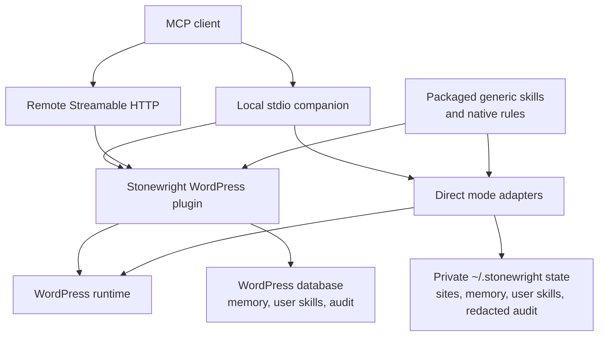

# Architecture

Stonewright has two parts and two supported operating modes:

- `plugin/`: the WordPress source of truth for abilities, permissions, memory,
  skills, Design Spec validation, rendering, backups, and audit logs.
- `companion/`: a Node sidecar for stdio MCP, optional HTTP MCP transport,
  health checks, optional MCP proxying, tokenized WP-CLI, and first-class
  pluginless Direct mode.

Local stdio means the MCP client starts the companion on the user's computer
and communicates through the process's standard input/output streams. Direct
mode lives inside that companion. Remote Streamable HTTP bypasses the companion
and connects straight to the WordPress plugin over HTTPS.

Plugin mode owns the broad guarded write surface. Direct mode is not a fallback:
it owns a documented pluginless surface, local task-start profiles, persistent
private state, and read-only WooCommerce access. Capability differences are
explicit rather than silently emulated.

### Persistent state lifecycle

A fresh plugin installation creates schemas but no user memory, user-created
skills, or audit events. A fresh Direct state directory follows the same rule.
Packaged generic skills and native rules are immutable product assets, so they
are available on first use without becoming site or customer data.

Plugin upgrades run migrations in place. Companion upgrades and Direct restarts
reuse the existing private state directory. Neither path resets memory,
user-created skills, audit history, site configuration, backups, or settings.
Only an explicit user action may remove that state.

Memory, user-created skills, and audit payloads reject or redact credential
material before persistence. Plugin mode stores site state in WordPress. Direct
mode stores private state under `~/.stonewright/` with restrictive permissions
on supported POSIX systems. Release packages never include a runtime
`sites.json`, audit ledger, memory store, or generated customer state.

## WordPress Writes

The plugin owns direct PHP runtime execution, permission checks,
production-safe confirmation tokens, backups, validation, and audit logging.
The companion can write by running tokenized WP-CLI commands requested by the
plugin or MCP client.

Use `stonewright/php-execute` for PHP snippets inside WordPress. WP-CLI
execution is tokenized and runs through `execFile`; WP-CLI PHP and shell entry
points are blocked.

### Audit error codes

An audit row has to distinguish a client that authenticated badly from a server
that broke, because the two lead to opposite remediations. Two rules keep those
apart:

- OAuth protocol codes defined by RFC 6749 and RFC 8628 keep their **exact**
  spelling when the failure originates in the auth surface. Renaming them would
  make audit rows unmatchable against the specs, and against what the client saw.
- Every code Stonewright itself emits is namespaced (`stonewright_`, alongside the
  inherited `rest_`, `oauth_`, `http_` prefixes), so a Stonewright failure can
  never be read as a protocol error.

Origin is decided by the row's `status` when present, and falls back to the
ability name for rows recorded before the `auth` status existed. OAuth dispatch on
`/stonewright/v1/oauth/*` is audited at the REST layer, so a protocol failure is
recorded even when no ability ran.

## Agent Context

Agents must call MCP tool `stonewright-task-start` at the beginning of every
Stonewright task. It issues the same write context token while returning a
compact, task-aware response that includes:

- current instructions
- matched skill playbooks
- relevant memory
- required followups
- MCP tool naming hints
- recommended external MCPs such as Playwright for browser work
- a short-lived context token for write abilities
- the native rule registry **digest** plus the tool that resolves it

Manual edits to skills, memory, or custom instructions persist in WordPress and
are included in future task-start responses. `stonewright-context-bootstrap`
and `stonewright-workflow-preflight` remain compatibility paths.

If neither `stonewright-task-start` nor compatibility
`stonewright-context-bootstrap` is visible in the MCP tool list, the client has
not loaded Stonewright. Agents must stop WordPress work and ask for a client
reload or config fix instead of inspecting private client config files,
creating scratch helper scripts, creating helper JSON argument files, launching
the companion through ad hoc shell scripts, creating action scripts, inspecting
plugin/companion source to reverse-engineer tool schemas, hand-rolling
JSON-RPC, calling the REST ability runner from shell, or running shell `wp ...`
commands.

### Native rules

Operating rules that hold for every site are packaged as data rather than stored
per site. `plugin/data/global-rules.json` is the plugin's copy; the companion
ships an identical registry so Direct mode reports the same rules. Storing them
as data instead of per-site memory means they apply to every project, survive a
memory reset, stay testable, and stay readable by both runtimes.

Each record declares an id, a severity, a scope, the rule, why it exists, and an
`enforcement` block. Severity and enforcement are two different claims, and the
registry keeps them honest:

| Severity | Enforcement | Behaviour |
|---|---|---|
| `hard` | `runtime`, with a named guard | A violation fails. `RuleEnforcer` wires the guard. |
| `strong` | `instruction`, guard empty | Surfaced in every task payload; deviation must be justified. PHP cannot mechanically check these, so they never claim a guard. |
| `advisory` | `instruction` | Surfaced on matching tasks only. |

`GlobalRules` loads, validates, and caches the registry; a record with a missing
or extra key, or a duplicate id, is treated as a registry defect rather than
tolerated. Rule text may not name a host, a URL, or a site-local record id.

Task payloads carry the digest, not the bodies, because rule bodies would consume
most of a compact budget. `stonewright/rules-get` is the other half of that
trade: filter by `severity` or `scope` (a scoped request still includes the
globally scoped rules), cache by digest, and pass `knownDigest` to get
`unchanged: true` with the bodies omitted. The digest covers the **filtered** set,
so a client that cached only the hard rules is never told "unchanged" for a
different slice.

Payload text that restates a rule reads it from the registry rather than
duplicating it. `fast_path.batching_rule_id` is the pattern: compact mode carries
the rule id alone, full mode carries the registry's own sentence, and editing the
JSON changes both.

The registry also carries site-independent repairs learned during real
operations: sequential writes to one Elementor document, one semantic widget
per responsive field, content-model write/readback verification, source-faithful
asset import, non-reentrant query callbacks, temporary-code promotion,
preservation of dynamic templates, and rendered proof for native controls.
Customer names, domains, record IDs, and audit rows never belong in this
registry.

### Response size controls

Two mechanisms trim read cost without weakening any gate:

- **Field projection.** `AbilityRegistry::execute_with_context_guard()` is the
  single seam where a caller's `stonewright_fields` paths are read out of the
  current call's arguments, dropped before `execute()` runs, and applied to the
  result. `ResponseProjection` is pure and stateless because registry ability
  instances are reused across requests — a projection remembered on an instance
  would leak one caller's request into the next caller's response. Projection
  runs *after* the ability has produced its output and always retains top-level
  fields declared required by that ability's output schema. Declared contracts
  therefore remain valid even when the caller requests a smaller payload.
  Projection runs *before* the task-start nudge is attached, so the nudge cannot
  be projected away. Errors pass through unprojected: trimming a `WP_Error`
  would hide why the call failed. The parameter is advertised on every strict
  schema because `additionalProperties: false` would otherwise have the client
  reject it before it reached the seam.
- **Read short-circuit.** `stonewright/elementor-v3-get-page-structure` accepts
  the `hash` it previously returned as `knownHash`. On a match it answers before
  flattening the tree or building the outline. The hash is taken from the decoded
  tree, not the raw `_elementor_data` string, so a re-save that only reorders JSON
  keys or changes escaping does not read as a content change.

## Design Direction

A Design Direction is the persistent, versioned answer to "what should this
site look like". It is stored as a validated contract rather than prose, so
renderers, verification, and the admin UI all read the same locked shape:
identity, tokens, components, dials, guidance, provenance, waivers, and
readiness.

### Two tables

- `{prefix}stonewright_design_directions` holds one row per direction: its
  slug, lifecycle status, current contract, contract hash, source type and
  references, and current revision.
- `{prefix}stonewright_design_direction_versions` holds a complete immutable
  snapshot per revision, unique on `(direction_id, revision)`.

History is append-only. A contract change writes the next revision and its
snapshot; a byte-identical save writes neither, so history never fills with
no-op rows. Restoring an old revision writes a *new* revision carrying the old
contract instead of rewriting the row that was restored.

### Active is a pointer, not a status

Statuses are `draft`, `ready`, `stale`, and `archived`. "Active" is
deliberately not one of them: the active direction is the id held in the
`stonewright_active_design_direction_id` option. One option means exactly one
active direction with no second source of truth for the same fact.

Two invariants follow: only a contract whose `readiness.ready` is true can be
activated, and the active direction cannot be archived — another direction must
be activated first.

### Raw source versus trusted contract

An imported direction document has two halves, and they are trusted
differently.

- The `---` delimited front matter is a machine block: a JSON object that must
  pass `DirectionContractValidator`. Validation is allowlist-only and rejects
  unknown fields rather than stripping them, so nothing unrecognized reaches
  storage.
- The body is human prose and is never trusted. `DirectionImportSanitizer`
  scans it line by line for instruction-shaped content — credential requests,
  tool invocations, permission bypasses, embedded markup, encoded payloads —
  drops every flagged line, reports it as a trust finding, and reduces what
  survives to plain paragraphs.

Contract guidance comes only from the front matter. Imported prose never
becomes agent instructions. The verbatim document is kept in `raw_source` for
audit and export, and is the only field that carries unsanitized input.

### Layering

`DesignDirectionRepository` owns every SQL statement and no rules.
`DesignDirectionService` owns validation, contract hashing, revision decisions,
the active pointer, and the audit payload each write reports. Every write
result carries the contract hash before and after, so an audit trail can prove
what changed. Contracts are encoded in canonical key order, making the hash
depend on content alone rather than on the order a caller supplied.

### Ability surface

Eleven abilities expose the store and its verification loop to MCP clients, all in
the `design` category:

| Ability | R/W | Gates |
|---|---|---|
| `stonewright/design-direction-list` | Read | `Permissions::read()` |
| `stonewright/design-direction-get` | Read | `Permissions::read()` |
| `stonewright/design-direction-brief` | Read | `Permissions::read()` |
| `stonewright/design-direction-save` | Write | `can_manage_design()`, context token, `DirectionContractValidator` |
| `stonewright/design-direction-capture` | Write | `can_manage_design()`, context token, `DirectionContractValidator` |
| `stonewright/design-direction-activate` | Write | `can_manage_design()`, context token, confirmation token |
| `stonewright/design-direction-restore` | Write | `can_manage_design()`, context token, confirmation token |
| `stonewright/design-direction-sync-plan` | Read | `can_manage_design()`, context token |
| `stonewright/design-direction-sync-apply` | Write | `can_manage_design()`, context token, confirmation token, `Backup::snapshot_post()` |
| `stonewright/design-quality-check` | Read, or Write with `persist` | `can_view_design()`; `can_manage_design()` to persist, context token, `QualityEvidenceValidator` |
| `stonewright/design-checkpoint-record` | Read | `can_manage_design()` and `edit_post()`, context token, live section and direction must both resolve |

Activation and restore replace the answer to "what should this site look like"
for every later render, so both carry the destructive envelope: in
production-safe mode the confirmation token must be issued for that exact
direction id — and, for restore, that exact revision — so a token minted for
one direction cannot move another.

Capture is the one path where a contract is produced by machine rather than
authored, so it is gated as a write even when it only previews: a single `save`
flag turns the same call into one. It reads nothing itself — the caller passes
evidence collected with the typed Elementor reads — and it maps that evidence
conservatively. Absent values stay absent, contradictory values keep the first
occurrence and surface a conflict, unsupported or unusable evidence is reported
in `unmapped`, and every mapped token carries provenance naming the kit it came
from. A stored capture is always a draft: capture proposes, and promotion stays
the separately gated decision it is for any other draft.

### Elementor kit synchronization

Sync is the only path where a stored contract changes what the site renders, so
it is split into a dry run and a guarded apply.

`ElementorKitSyncPlanner` is pure: given a contract and a normalized kit, it
returns the exact operations, the values the kit cannot store (`blocked`), and
the design intent the kit has no global for (`warnings`). It owns the CSS value
grammar, so `var(--brand)`, a unitless font size, or a `clamp()` expression is
refused rather than coerced into something Elementor would accept but nobody
asked for. Its `base_hash` fingerprints the live kit — not the contract — and is
order-sensitive, so any change to kit globals invalidates a reviewed plan.

`ElementorKitWriter` owns the kit meta shape, so no sync code handles the
serialized `_elementor_page_settings` array directly. Reads project the kit down
to the colors and typography groups sync understands, tagged with the bucket each
entry lives in. Writes merge: only the planned entry properties are set, and
unknown keys, unknown entry properties, and entry order are written back
untouched. `Backup::snapshot_post()` runs before the mutation, and a kit that
cannot be snapshotted is not written at all.

`sync-apply` requires the dry run's `base_hash`, re-reads and re-plans the kit
itself, and returns `stonewright_direction_sync_stale` when the kit moved since
the review. In production-safe mode its confirmation token is bound to both the
direction id and that `base_hash`, so a token cannot be replayed against a
different plan. Sync covers kit colors and typography; spacing, radii,
elevation, motion, and component styles are reported as warnings rather than
forced into unrelated kit fields.

Each write reads its own effect back before the receipt claims success: save
and restore re-read the stored contract hash, activate re-reads the active
pointer, and sync-apply re-plans the kit and fails when any operation is still
outstanding. A mismatch returns
`stonewright_direction_verification_failed` rather than a successful receipt.
Receipts report `before_sha256`, `after_sha256`, `operation_class`,
`resource_type`, and `verification_status`, which the ability kernel forwards
into the audit record.

The compact brief and the general direction reads ship in the
`elementor-design` tool profile ahead of the builders, because design intent is
read before anything renders. The writes are
intent-gated: they appear only when the task text names design-system work,
and then immediately after the startup tools rather than at the tail, so a low
`max_tools` cap cannot trim the tools the task exists for.

## Rendered design quality

`stonewright/design-quality-check` closes the loop the direction opens: the
direction states intent, the renderers apply it, and this ability reports what
the rendered page actually measures. The agent supplies the measurements; the
plugin owns what they mean.

There is no invented score. A report states how many checks ran, how many could
not run and why, and for each finding the numbers that produced it — `actual`,
`required`, the viewport, the element reference, and a repair hint. Evidence
that was never captured is reported as `not_checked` and counted separately, so
a thin browser session reads as unverified rather than clean. A report with
nothing checked returns `not_checked`; it can never return `pass`.

`QualityEvidenceValidator` holds the trust boundary, because evidence is the
least trusted input in the subsystem: allowlist-only keys, hard bounds on
viewports, elements, string length, and encoded size, and colors resolved to hex
exactly once through the same `BrandKit` math the rest of the plugin uses. A
color the plugin cannot measure — a CSS variable, a named keyword, a partially
transparent value — is refused rather than guessed, because a substituted
backdrop produces a confident wrong contrast ratio. A partially captured
`states` object is preserved rather than filled in: "focus was captured and is
missing" is a defect, while "states were never captured" is unknown, and the two
must not collapse into one another.

Rules split by what they can prove. Objective rules — text and focus contrast,
horizontal overflow, target size, clipped text, a missing focus state — are
errors, because they describe a page that is measurably broken. Rules that
compare the render against the active direction's own token scale are warnings,
because a direction is intent and a designer may deviate deliberately.
Promoting a guidance rule to a hard failure would need a direction field the
locked contract does not have, so guidance stays advisory in this release.
Waivers named by exact rule id downgrade their findings to `info` and carry the
stated reason into the report; the finding stays visible, because a waiver
records an accepted trade-off rather than deleting evidence.

Evaluating supplied evidence writes nothing and gates on
`Permissions::can_view_design()`. `persist: true` stores a compact report and
gates on `can_manage_design()`, is audited, and refuses when the report cannot
be tied to both a post and a direction revision — a stored report that names no
revision cannot be verified later. `QualityReportStore` keeps that ledger in one
post meta row per page, newest first, capped at 20 reports and 200 findings per
report, and accepts only numbers and rule ids: no screenshots, no markup, no
credentials. MCP returns the report id, coverage, the honest total, and the
first 20 findings; the full bounded report stays retrievable by id.

## First-section checkpoint

A build that establishes a new visual direction stops once, after the first
section, and asks. A build that maintains an existing page never stops. That is
the whole gate: `design_scope` declares which of the two is happening, and only
`new_identity`, `replacement`, and `rebrand` are gated. `preserve`, `repair`,
`content_only`, and `responsive_fix` pass straight through, so routine editing
gains no new blocker.

The scope is a caller claim, not a measurement, and Stonewright treats it as
one. An unknown scope fails closed and is gated. An omitted scope is read as
`preserve`, because refusing every build that declares nothing would put a
confirmation in front of ordinary work, and a gate that fires on everything is
a gate agents learn to route around. `stonewright/workflow-preflight` derives
the scope from the task text and returns the verdict in
`fast_path.visual_checkpoint` before the first write, so the agent learns it
will be stopped before it has built anything.

`stonewright/elementor-v3-build-page-from-spec` enforces it. The trigger is the
number of top-level sections the write would leave on the page, not the number
supplied: one section is always allowed, more than one needs a token. That
covers a first single-section write, a first multi-section write, a later append,
and a section replacement without a separate rule for each.

`stonewright/design-checkpoint-record` issues the token, and it refuses any
approval it cannot tie to real state. The section has to exist in the document
as it stands now, and a direction revision has to be in force, because an
approval that names neither cannot be verified afterwards. `approved` has to
arrive as boolean `true`; an omitted flag is not a yes, and neither is a truthy
string. Evidence is optional but linkable: a stored `report_id` from
`stonewright/design-quality-check` ties the approval to the measurements the
user was shown.

The token is an HMAC over the decision, signed with `wp_salt('auth')` plus a
per-site secret, and it binds four things: post, section, direction hash, and
the render hash of the approved section. Verification compares all four with
`hash_equals` and reports which one moved. Editing the approved section, or
activating a different direction, stops the token working — the approval
described a specific render, so it cannot authorize a page that no longer
matches it. It expires (two hours by default, one day maximum) and is bound to
the approving user, so it is not a credential another session can borrow.

It is deliberately not single-use. One approval authorizes the remaining
sections of one page, because the decision the user made was about the visual
direction, not about section two. `checkpoint_token` is in the kernel's default
redaction list, so no ability writes it into an audit row.

## Visual Workspace in wp-admin

`Stonewright Visual` is a browser workspace, and until this release it had no
visible surface: it could be driven by an MCP client and by nothing else. The
Visual Workspace admin page hosts it, so a person can watch the same ladder an
agent walks.

The page owns the chrome and the bundle owns the workspace. PHP renders the
heading, the post it is pointed at, the editor it expects, the canvas, and the
inspector, then hands the bundle three slots to fill: the adapter chip, the
canvas body, and the inspector body. Nothing else in the page is replaced, so
the screen still reads correctly while the bundle is connecting, and it still
reads correctly if the bundle never loads. A missing bundle is stated on the
page, with the command that builds it, rather than producing an empty frame.

What reaches the browser is deliberately thin. The boot payload carries the REST
base, a `wp_rest` nonce, the post id, the requested editor, and the active
direction *row* — identity, revision, and contract hash. The contract itself
stays on the server: the workspace states which direction is in force, it does
not re-derive its rules in JavaScript. The page is gated on `edit_posts` and, for
the post it targets, on `Permissions::can_edit_post()`.

The admin host is not an editor. **Connect editor** opens the real same-origin
Elementor or block editor window after an explicit user gesture, waits for its
runtime, and supplies those globals to the resolver. Detection then walks
Elementor V4 atomic, Elementor V3, and Gutenberg. An editor that is present but
cannot be driven stops the walk instead of falling through. Blocked popups,
closed windows, 60-second runtime timeouts, and unsupported adapters are
reported as connection failures rather than false success.

The write ladder is enforced by the controller, not by the markup: read, then
preview, then an explicit confirmation, then apply, then verify. Every editor
write goes through one private dispatch that refuses to run outside the applying
state. A proposed operation carries both a human-readable diff and the exact
arguments the editor tool will receive, so the confirmation panel shows what a
person needs and the adapter gets what its schema requires — with no second,
looser schema invented in the middle. Applying with no evidence behind it does
not report success: it reports the change as unverified, which is the same
contract `stonewright/design-quality-check` uses on the server.

The bundle is built from `visual/` and staged into `plugin/assets/visual/` at
packaging time; it is not committed. `scripts/package-verify.mjs` warns about a
missing bundle in a source checkout and fails on it under
`--require-visual-bundle`, which CI and the release workflow pass after staging.
The same check rejects Node build inputs from the archive, and the release job
asserts the built zip actually contains the bundle.

Plugin dependencies are also rebuilt from an empty `vendor/` with
`composer install --no-dev --classmap-authoritative`. Jetpack Autoloader is a
production dependency; the plugin loads `vendor/autoload_packages.php` first,
with normal Composer autoload as a compatibility fallback. Packaging fails when
any generated Jetpack manifest references a missing or out-of-root file. This
matters when WooCommerce or another plugin participates in the same package
autoload graph: one stale manifest must not break the entire WordPress runtime.
The CI compatibility job goes one step further: it creates the release ZIP,
extracts it, mounts that extracted plugin beside WooCommerce, and runs the
activation and native catalog gates against the packaged bytes.

### Where each part's authority ends

| Part | Supplies | Does not supply |
|---|---|---|
| Design Direction | Validated design intent, versioned, with provenance | Any claim about what a page currently looks like |
| DesignEvidence | Normalized observations of a source design | Permission to write anything |
| NativePlanner | A mapping from evidence to native Gutenberg/Elementor schemas | A guarantee the mapping is what the user wanted |
| `design-quality-check` | Measurements of a supplied render, with coverage | A score, or a pass for anything unmeasured |
| Visual Workspace | Browser-side evidence and the confirmation gate | Correctness of the design it is showing |
| Typed Elementor abilities | Guarded, backed-up, readback-verified writes | Visual judgement |

No part of this subsystem certifies that a page looks right. Together they make
the intent explicit, the observations measurable, the writes reversible, and the
unverified parts visible as unverified.

## Direct + plugin REST parity surfaces

Plugin abilities and Direct tools cover comments, users (including application passwords), widgets, allowlisted settings, themes, plugin lifecycle, revisions (with restore on the plugin), site health tests, search/oEmbed, and WooCommerce product/order/sales reads. Plugin mode additionally exposes native WooCommerce product, variation, catalog-term, global-attribute, and catalog-audit abilities. Direct mode remains read-only for WooCommerce.

The native rule registry is at parity too. The companion ships a copy of
`plugin/data/global-rules.json` (synced by `npm run sync:rules` at pack time) and
implements the same digest algorithm as `GlobalRules::digest_of()`, so a Direct
client and a plugin client can compare digests directly. Both expose
`stonewright-rules-get` with the same `severity`, `scope`, and `knownDigest`
inputs and return the same records.

The **rules** are at parity; **runtime enforcement** is not. `RuleEnforcer` lives
in the plugin, so a `hard` rule's `enforcement.guard` names a guard that only runs
on the plugin surface. Direct returns the registry record verbatim, guard name
included. On Direct, read `hard` as "this rule is enforceable where the plugin
runs", not as a guarantee the Direct runtime makes.

## MCP tool surface switching (premium finalization)

Profile and surface switching is transport-specific. Agents should treat
`tools_changed` / `re_list_instruction` on ability results as the source of truth.

### HTTP MCP transport (plugin adapter)

- **Admin option** `stonewright_mcp_surface`: `bootstrap` | `essential` | `full`
  controls which abilities the plugin exposes on `tools/list`.
- Each `tools/list` request reads the saved site surface plus an optional,
  expiring profile bound to `Mcp-Session-Id`. Bootstrap task-start activates
  only that session; it never rewrites the site option or another session.
- The vendor initialize payload may not declare `tools.listChanged`. Clients
  must honor `re_list_instruction` in the ability response and call `tools/list`
  again even when no `notifications/tools/list_changed` arrives.
- **OAuth 2.1** for the HTTP transport is planned, not scheduled.

### stdio companion transport

- For normal clients, the companion reads `stonewright_mcp_surface` from the
  plugin and treats the saved Setup value as its initial profile. Explicit
  specialist profiles and `low-tools` remain client overrides. Set
  `STONEWRIGHT_MCP_TOOL_PROFILE_LOCK=1` to force the environment profile.
- `bootstrap` is a real companion profile; it is not coerced to `essential`.
- When a proxied ability result includes `tools_changed: true`, a non-empty
  `re_list_instruction`, **or** a configured profile different from the active
  companion profile, the companion:
  1. Re-fetches `tools/list` from the plugin (schemas for newly visible tools).
  2. Diffs against registered proxy tools (register missing, disable dropped).
  3. Emits `notifications/tools/list_changed` via the MCP protocol server.
- Clients that ignore `list_changed` must still re-call `tools/list` using
  `re_list_instruction`. Older companions that only notify (or neither) need an
  MCP client / companion restart after a profile upgrade.

### Shared ability signals

- **`stonewright-tool-profile` activate**: expands `stonewright_mcp_surface`
  when leaving bootstrap and sets `tools_changed` + `re_list_instruction`.
- **`stonewright-task-start`**: surfaces `configured_mcp_surface` and
  `session_tool_profile`, binds the task profile to the current MCP session,
  and returns `tools_changed` + `re_list_instruction`. The saved Setup
  preference remains unchanged. When the admin surface is already
  essential/full (or the session profile is not bootstrap), task-start still
  sets `tools_changed` so stdio companions that started on env bootstrap
  re-register proxied tools. Companions must also parse ability JSON from
  `content[].text` when transports omit `structuredContent`.
- **Instructions forwarding:** when the companion proxies the WordPress MCP
  server, it captures plugin `initialize.instructions` during remote handshake
  and merges them into the companion MCP server instructions under
  `--- WordPress plugin instructions ---`. Unreachable sites keep companion-only
  text. AI clients that read handshake instructions therefore see plugin
  task-start rules without a separate call.
- **Pre-session read nudge:** until task-start (or compatibility bootstrap /
  preflight) marks the MCP session, read-only ability results may include a
  non-blocking `task_start_hint` string. Writes still hard-require the context
  token; the hint never blocks discovery tools.
- **Bootstrap surface** includes runtime escape hatches (`php-execute`,
  confirmation token, content/Elementor reads, `theme-file-read`) — not only
  four startup tools.
- **Diagnosis**: companion local tool `stonewright-client-surface-check` and
  `stonewright doctor --client-surface` explain profile vs client mismatches
  without REST workarounds.

### Direct/pluginless transport

- Fresh sessions also start on Bootstrap (at most eight Direct tools).
- `stonewright-task-start` selects a compact Direct profile for Elementor,
  Gutenberg, content-model, site-admin, or general work; the companion enables
  only that profile and emits `tools/list_changed`.
- Direct write tools require a prior `stonewright-task-start` for the target
  site (30-minute TTL, re-arms after expiry). Opt out with
  `STONEWRIGHT_DIRECT_REQUIRE_TASK_START=off`.
- Pre-session Direct reads attach the same non-blocking `task_start_hint`.
- `stonewright-rules-get` is on the Direct bootstrap surface: Direct task start
  hands out a rule digest, so the tool that resolves it has to be reachable before
  profile expansion. `stonewright-skill-list` left the cold surface to keep it
  small — Direct task start already returns the matched skill slugs, and the tool
  returns as soon as the profile expands.
- Full remains an explicit diagnostic/specialist choice, never the default.
