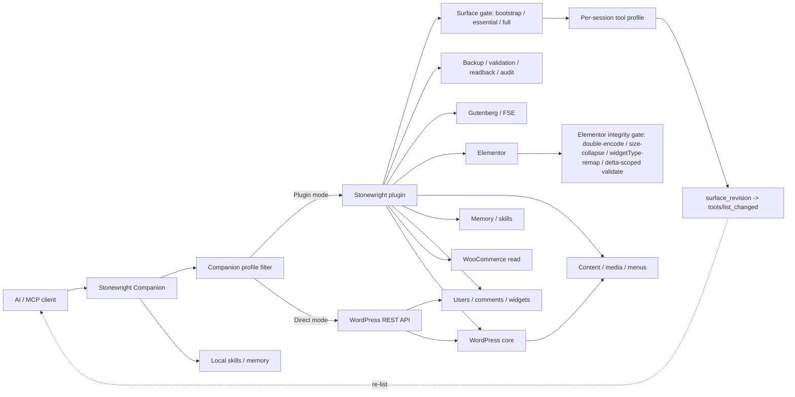

# Tool Surface Pipeline Hardening Implementation Plan

> **For agentic workers:** REQUIRED SUB-SKILL: Use superpowers:subagent-driven-development (recommended) or superpowers:executing-plans to implement this plan task-by-task. Steps use checkbox (`- [ ]`) syntax for tracking.

**Goal:** Make the plugin→companion→client tool-surface pipeline honest and self-healing — and keep Elementor writes from dead-locking on pre-existing document dirt — so an agent on **any** MCP client, IDE, or agentic app (any LLM), in **both** plugin-proxy and Direct/no-plugin mode, can always reach the write abilities a task needs, is never locked out of gateway tools, learns immediately when the operator changes the tool surface, and always gets truthful diagnostics.

**Architecture:** The plugin's session tool profile (per-`Mcp-Session-Id` transient) is the single mid-session expansion mechanism — written by both `task-start` and `tool-profile activate`, and unioned with (never narrowing) the operator-configured surface. A monotonic **surface-revision** integer, bumped on every surface/session change and echoed as a top-level field on every gateway response, gives any client a transport-agnostic "your tool list is stale, re-list now" signal — closing the gap where an operator flips the admin surface to FULL and the running session never finds out. The companion stops trusting advisory tool hints for removals: it only disables proxied tools after an authoritative plugin re-resolve, never disables gateway tools, re-lists on revision mismatch, and exposes live registration state. Profile tool ordering puts write-critical tools first so a capped client never loses a write tool, any truncation is reported by name, and a real external cap is honored via env (rather than blindly raising the default and flooding small clients). On the Elementor side, surgical writes stop re-policing pre-existing, untouched document state: the validator accepts Elementor's own cleared/empty control shapes, merge-patch edits preserve legacy keys instead of failing on them, whole-tree validation is delta-scoped to touched nodes, the V3/V4 architecture gate is subtree-aware (a V3 edit is not blocked by an unrelated atomic node elsewhere), and a typed `elementor-v3-repair-document` ability gives agents an auditable one-call way to normalize a dirty document instead of full-tree rewrites or raw `php-execute` meta writes.

**Tech Stack:** PHP 8.1+ (WordPress plugin, PHPUnit via `composer test`), TypeScript (Node companion, Vitest via `npm test`).

**Modes covered:** Every fix states its mode applicability. Tool-surface + propagation fixes apply to **both** plugin-proxy and Direct/no-plugin mode. Elementor document-integrity fixes are **plugin-mode by nature** — the typed Elementor abilities only exist when the plugin is loaded; Direct/no-plugin mode has no typed Elementor mutation path, so the deadlock cannot arise there. The one true push-notification limit (an idle client with zero further calls) lives in the vendored `wordpress/mcp-adapter` transport and is documented, not silently left broken (Task 21).

---

## Context: the failure this fixes

A live session (one AI client, plugin-proxy mode, Elementor task) failed to reach Elementor/theme write tools for the whole session. **The observed "~50 tool" ceiling was Stonewright's own default, not a client limit:** `ToolProfile::activate` defaults `max_tools` to `50` ([ToolProfile.php:303](../../plugin/includes/Abilities/System/ToolProfile.php)) and front-slices the profile there, so `elementor-design` (59 tools) lost its tail before any client cap applied. Do not attribute any of the below to a specific client, LLM, or IDE — every root cause is Stonewright-side and reproduces on any MCP client. Verified in source at commit `06ffa86` (1.0.0-alpha.78):

1. **Session profile never applies on non-bootstrap surfaces.** `WorkflowPreflight::execute()` ([plugin/includes/Abilities/System/WorkflowPreflight.php:207-216](../../plugin/includes/Abilities/System/WorkflowPreflight.php)) only writes the session transient when `mcp_surface() === 'bootstrap'`. On an `essential` surface, the suggested task profile (`elementor-design`, 59 tools) is computed and then discarded; `session_profile_applied` is always `false` and tools like `stonewright/theme-file-patch` (absent from the 29-name essential list) never become visible.
2. **`tool-profile activate` never writes the session transient at all.** Only `WorkflowPreflight` calls `AbilityRegistry::set_session_tool_profile()`. The activate path only calls `ToolProfile::expand_mcp_surface_for_profile()` ([ToolProfile.php:468-481](../../plugin/includes/Abilities/System/ToolProfile.php)), which early-returns unless the surface is `bootstrap` — so `activate full` on an essential surface is a silent no-op.
3. **Session transient can narrow the surface.** `AbilityRegistry::public_classes()` ([AbilityRegistry.php:1134-1193](../../plugin/includes/Core/AbilityRegistry.php)) returns only `bootstrap ∪ session ∪ extras` when a session transient exists — on a `full` or `essential` surface this *hides* tools the operator already exposed.
4. **Companion lockout (`-32602 Tool ... disabled`).** `handleToolsChangedResponse` ([companion/src/wordpress-mcp.ts:901-1004](../../companion/src/wordpress-mcp.ts)) treats `recommended_mcp_tools` from any structured result as the *complete* desired set. Task-start returns a short advisory list (~6-15 names), so every other registered tool — including `stonewright-tool-profile` itself — gets `.disable()`d (line 958). The MCP SDK then rejects calls to disabled handles with `-32602`, and there is no recovery path because the recovery tools are the ones disabled.
5. **Truncation drops write tools silently.** `ToolProfile` front-slices the declaration-ordered profile list at `max_tools` ([ToolProfile.php:332](../../plugin/includes/Abilities/System/ToolProfile.php), [:402](../../plugin/includes/Abilities/System/ToolProfile.php)). For `elementor-design` (59 names) at the default cap of 50, the dropped tail includes `design-validate-spec`, kit color/typography updates, `elementor-v3-apply-bundle`, and all WP-CLI tools; `theme-file-patch` survives at position 50 by coincidence. Nothing in the response names the dropped tools; `ok` stays `true`.
6. **Stale companion diagnostics.** `wpMcpStatus` in [companion/src/mcp-server.ts:176-204](../../companion/src/mcp-server.ts) is written once at startup. Mid-session profile refreshes never update it, so `wordpress-mcp-status` / `client-surface-check` report the cold-start picture ("bootstrap, 12 proxied") forever.
7. **Architecture gate dead-ends.** `ArchitectureRouter::describe()` ([plugin/includes/Elementor/ArchitectureRouter.php:50-53](../../plugin/includes/Elementor/ArchitectureRouter.php)) blocks Elementor-4-runtime + unknown-document as ambiguous but the reason text never tells the agent the cheapest unblock: pass `post_id` so the document architecture is auto-detected.
8. **php-execute parse failures are opaque.** `eval` `ParseError`s fall into the generic `Throwable` catch ([plugin/includes/Abilities/Runtime/PhpExecute.php:179-204](../../plugin/includes/Abilities/Runtime/PhpExecute.php)) as `stonewright_php_execute_failed`; `RemediationHints` has no entry for that code, so agents get the generic hint recommending `dry_run:true` — a parameter php-execute does not have.

### Verdicts on the failure report's suggestions (tool-surface report)

- **Adopted:** re-list/self-heal after activation (via session transient + authoritative companion refresh), never-disable pin set for gateway tools, named truncation reporting, prioritized profile ordering, architecture-gate UX (pass `post_id`), php-execute parse-error hint, live surface diagnostics, capped-client documentation (client-agnostic).
- **Rejected:** flipping `ok:false` on over-cap profiles (breaks response contract; a `degraded` flag + named drops is strictly better), a brand-new `recover-surface` tool (the fixed refresh path + live `client-surface-check` covers it with zero new surface), plugin-side client canaries (the plugin cannot see the client's registry; the companion's live state is the right layer).
- **Revised:** the original plan called client caps "external, don't raise them." That was wrong — the truncation that bit us was Stonewright's **own** default `max_tools=50`. Rather than blindly raise the default (which floods small clients), Task 4 reorders each built-in profile write-critical-first so the cap never drops a write tool, and Task 5 names every dropped tool and sets `degraded`; a real external cap is still honored via env.
- **Out of repo scope:** client-specific re-list quirks and third-party browser/console noise — covered by docs/runbook only, never named as a product in tracked files.

### Verdicts on the second report ("Flipbox Task + Expanded Write Blockers")

- **Adopted (with an independent, hard-rule-compliant design):**
  - *Empty/dirty responsive-slider blocker.* The report was right that cleared breakpoints (`{unit:'%', size:'', sizes:[]}`) block writes with `invalid_shape`. Fix is to **accept** that shape as a legitimately-empty control value in the validator (Task 11) — **not** to strip it (the repo's hard rule forbids stripping to pass validation).
  - *Legacy keys (`_title`,`_z_index`,`width`) fail one-key patches.* Correct and reproduced. Fix: merge-patch edits validate with `preserve_unknown=true` + `require_render_settings=false`, matching the write-time tree guard's own leniency (Task 12).
  - *A dirty node elsewhere in the tree blocks an unrelated surgical edit.* Correct. Fix: delta-scope whole-tree settings/shape/condition validation to touched nodes; structural + document-integrity checks still run over the whole tree (Task 13).
  - *Give agents a repair path.* Adopted as a typed `elementor-v3-repair-document` ability — snapshot-first and idempotent, decoding double-encoded meta and re-indexing duplicate/missing ids, re-persisting through the integrity gate; never converts `widgetType` or strips settings (Task 17).
  - *Mixed V3/V4 over-blocking.* Correct. Fix: subtree-aware architecture gate — a V3 op is blocked only if it targets an atomic node, not because an atomic node exists somewhere (Task 15).
  - *Honest write-blockers at task-start.* Correct. Fix: `ArchitectureRouter`/task-start distinguish `not_inspected` from "clean" and name `repair_tools` when a write is blocked (Task 16).
  - *Admin FULL toggle "saved but the agent never knew".* Reproduced — persistence is fine, **propagation** is the bug. Fix: monotonic `surface_revision` counter + `stonewright_tool_surface_changed` hook on `set_mcp_surface`, echoed on every gateway response, companion re-lists on mismatch (Tasks 19–20).
- **Rejected / re-scoped:**
  - *Auto-convert `widgetType` (e.g. `e-paragraph`→`text-editor`) or auto-migrate mixed docs to pass validation.* Rejected — violates the repo hard rules (never remap widgetType without explicit intent; never full-tree rewrite). The repair ability normalizes double-encoding and ids only and leaves node types + settings untouched.
  - *Loosen the `php-execute` raw-write guard so agents can hand-fix `_elementor_data`.* Rejected — the guard is a security control. The typed repair ability is the sanctioned path (it satisfies backup/validator/token/permission gates that a raw write bypasses).
  - *A true server-push so an idle client updates with zero further calls.* Re-scoped, not adopted now: the push channel (`listChanged` capability + SSE) lives in the vendored `wordpress/mcp-adapter`. Task 21 documents the limit and keeps the reliable pull path (`re_list_instruction` + `surface_revision` + always-fresh `public_classes()`); forking the vendor for real push is a separately-scoped follow-up.
- **Independent additions (not in either report, found during source review):**
  - `ElementorTransactionRunner` has a raw `update_post_meta` fallback that bypasses `DocumentIntegrityGate` + `SettingsValidator` when `ElementorData::write()` fails — labeled "for unit stubs" but unguarded in production. Task 14 closes it.
  - `AddWidget`/`RemoveElement` do not run the architecture gate that `BatchMutate` runs. Not changed here: they act on an explicit parent, and the post-write `validate_tree()` structural checks + `DocumentIntegrityGate` + readback still catch a genuinely mixed result. A per-op architecture gate on those abilities is a documented follow-up, not part of this plan.

### Executor ground rules

- Repo state when this plan was written: `main` at `06ffa86` (1.0.0-alpha.78). **Re-verify line numbers before editing** — use the quoted anchor code, not the line number, as truth.
- Never weaken permission, backup, validation, confirmation-token, or audit gates.
- Plugin checks: `cd plugin && composer test && composer phpstan && composer phpcs`. Companion checks: `cd companion && npm test && npm run typecheck && npm run build`.
- The forbidden competitor codename named in the repo's standing constraints (see `CLAUDE.md` — "Public commits, changelogs, docs, skills, and UI copy must not name third-party competitor products") must not appear in any tracked file, including this plan.
- Every task's test goes in the same commit as the change it covers.

---

## Phase 1 — Plugin: session profile activation that actually works

### Task 1: `WorkflowPreflight` writes the session transient on essential surfaces and explains itself

**Files:**
- Modify: `plugin/includes/Abilities/System/WorkflowPreflight.php:207-216` (anchor: `$configured_surface = AbilityRegistry::mcp_surface();`)
- Test: `plugin/tests/Unit/WorkflowPreflightSessionProfileTest.php` (create)

Current behavior: session transient written only when surface is `bootstrap`; on `essential` the suggested task profile is discarded and `$session_profile` is set to the surface name itself.

- [x] **Step 1: Write the failing test**

Create `plugin/tests/Unit/WorkflowPreflightSessionProfileTest.php`. Mirror the harness conventions used by `plugin/tests/Unit/Core/AbilityRegistryBootstrapModeTest.php` (plain `PHPUnit\Framework\TestCase`, `$GLOBALS['stonewright_test_options']` / `$GLOBALS['stonewright_test_transients']` shims, `$_SERVER['HTTP_MCP_SESSION_ID']`) and by the existing preflight tests in `plugin/tests/Unit/WorkflowEfficiencyAbilitiesTest.php` (how they call `( new WorkflowPreflight() )->execute( [...] )` — copy any extra setUp those tests need, e.g. registered abilities or context shims):

```php
<?php
declare( strict_types=1 );

namespace Stonewright\WpMcp\Tests\Unit;

use PHPUnit\Framework\TestCase;
use Stonewright\WpMcp\Abilities\System\WorkflowPreflight;
use Stonewright\WpMcp\Core\AbilityRegistry;

/**
 * @covers \Stonewright\WpMcp\Abilities\System\WorkflowPreflight
 */
final class WorkflowPreflightSessionProfileTest extends TestCase {

	protected function setUp(): void {
		$GLOBALS['stonewright_test_transients'] = [];
		$GLOBALS['stonewright_test_options']    = [
			'stonewright_disabled_abilities'        => [],
			'stonewright_essential_extra_abilities' => [],
			'stonewright_mcp_surface'               => 'essential',
			'stonewright_essential_tools_mode'      => true,
		];
		$_SERVER['HTTP_MCP_SESSION_ID']         = 'preflight-session-test';
	}

	protected function tearDown(): void {
		unset( $_SERVER['HTTP_MCP_SESSION_ID'] );
		$GLOBALS['stonewright_test_transients'] = [];
		$GLOBALS['stonewright_test_options']    = [];
	}

	public function test_essential_surface_applies_suggested_task_profile_to_session(): void {
		$result = ( new WorkflowPreflight() )->execute(
			[
				'task'    => 'Rebuild the timeline section of the careers page in Elementor',
				'surface' => 'elementor',
				'intent'  => 'write',
			]
		);

		self::assertIsArray( $result );
		self::assertSame( 'elementor-design', $result['session_tool_profile'] );
		self::assertTrue( $result['session_profile_applied'] );
		self::assertSame( 'session_transient_written', $result['session_profile_reason'] );
		self::assertTrue( $result['tools_changed'] );

		$session = AbilityRegistry::session_tool_profile();
		self::assertIsArray( $session );
		self::assertSame( 'elementor-design', $session['profile'] );
		self::assertContains( 'stonewright/theme-file-patch', $session['ability_names'] );
	}

	public function test_full_surface_skips_transient_and_reports_reason(): void {
		$GLOBALS['stonewright_test_options']['stonewright_mcp_surface'] = 'full';

		$result = ( new WorkflowPreflight() )->execute(
			[
				'task'    => 'Rebuild the timeline section of the careers page in Elementor',
				'surface' => 'elementor',
				'intent'  => 'write',
			]
		);

		self::assertIsArray( $result );
		self::assertSame( 'full', $result['session_tool_profile'] );
		self::assertFalse( $result['session_profile_applied'] );
		self::assertSame( 'surface_full_already_exposes_all_tools', $result['session_profile_reason'] );
		self::assertNull( AbilityRegistry::session_tool_profile() );
	}

	public function test_missing_session_header_reports_reason(): void {
		unset( $_SERVER['HTTP_MCP_SESSION_ID'] );

		$result = ( new WorkflowPreflight() )->execute(
			[
				'task'    => 'Rebuild the timeline section of the careers page in Elementor',
				'surface' => 'elementor',
				'intent'  => 'write',
			]
		);

		self::assertIsArray( $result );
		self::assertFalse( $result['session_profile_applied'] );
		self::assertSame( 'missing_or_invalid_mcp_session_id_header', $result['session_profile_reason'] );
	}
}
```

- [x] **Step 2: Run the test to verify it fails**

Run: `cd plugin && vendor/bin/phpunit --filter WorkflowPreflightSessionProfileTest`
Expected: FAIL — `session_tool_profile` is `'essential'` (surface name, not suggested profile) and `session_profile_reason` key is undefined.

- [x] **Step 3: Implement**

In `plugin/includes/Abilities/System/WorkflowPreflight.php`, replace this block (currently at :207-216):

```php
		$configured_surface = AbilityRegistry::mcp_surface();
		$suggested_profile  = (string) ( $tool_profile['suggested_profile'] ?? $tool_profile['profile'] ?? 'essential' );
		$session_profile    = 'bootstrap' === $configured_surface ? $suggested_profile : $configured_surface;
		$session_applied    = false;
		if ( 'bootstrap' === $configured_surface && 'bootstrap' !== $session_profile ) {
			$session_applied = AbilityRegistry::set_session_tool_profile(
				$session_profile,
				ToolProfile::profile_tools( $session_profile )
			);
		}
```

with:

```php
		$configured_surface = AbilityRegistry::mcp_surface();
		$suggested_profile  = (string) ( $tool_profile['suggested_profile'] ?? $tool_profile['profile'] ?? 'essential' );
		// The session transient only ever ADDS tools on top of the configured
		// surface (see AbilityRegistry::public_classes()), so any non-full
		// surface benefits from the suggested task profile — not just bootstrap.
		$session_profile = 'full' === $configured_surface ? 'full' : $suggested_profile;
		$session_applied = false;
		$session_reason  = 'surface_full_already_exposes_all_tools';
		if ( 'full' !== $configured_surface && 'bootstrap' !== $session_profile ) {
			$session_applied = AbilityRegistry::set_session_tool_profile(
				$session_profile,
				ToolProfile::profile_tools( $session_profile )
			);
			$session_reason  = $session_applied
				? 'session_transient_written'
				: 'missing_or_invalid_mcp_session_id_header';
		} elseif ( 'bootstrap' === $session_profile ) {
			$session_reason = 'bootstrap_profile_needs_no_expansion';
		}
```

Then add the reason to both response payloads. In the `$fast_path['tool_profile']` assignments (anchor: `$fast_path['tool_profile']['session_profile_applied'] = $session_applied;`), add directly below it:

```php
		$fast_path['tool_profile']['session_profile_reason']  = $session_reason;
```

In the top-level `$response` array (anchor: `'session_profile_applied' => $session_applied,`), add directly below it:

```php
			'session_profile_reason'  => $session_reason,
```

- [x] **Step 4: Run the test to verify it passes**

Run: `cd plugin && vendor/bin/phpunit --filter WorkflowPreflightSessionProfileTest`
Expected: PASS (3 tests). If `test_essential_surface_applies_suggested_task_profile_to_session` fails because `suggest_profile` picks a different profile for the sample task, adjust the task string until `ToolProfile::suggest_profile()` returns `elementor-design` (an Elementor + write task must map there; if it does not, that is a real routing bug — stop and report it instead of loosening the assertion).

- [x] **Step 5: Run the full plugin suite and static analysis**

Run: `cd plugin && composer test && composer phpstan`
Expected: PASS. Existing preflight tests asserting `session_profile_applied === false` on essential surfaces will now fail — update those assertions to the new truthful behavior (`true` + reason), they were codifying the bug.

- [x] **Step 6: Commit**

```bash
git add plugin/includes/Abilities/System/WorkflowPreflight.php plugin/tests/Unit/WorkflowPreflightSessionProfileTest.php plugin/tests/Unit/WorkflowEfficiencyAbilitiesTest.php
git commit -m "fix: apply suggested session tool profile on essential surfaces"
```

(Include `WorkflowEfficiencyAbilitiesTest.php` only if Step 5 required updating it.)

---

### Task 2: `public_classes()` unions the session profile with the configured surface (never narrows)

**Files:**
- Modify: `plugin/includes/Core/AbilityRegistry.php:1134-1163` (anchor: `private static function public_classes(): array {`)
- Test: `plugin/tests/Unit/Core/AbilityRegistrySessionUnionTest.php` (create)

Current behavior: when a session transient exists, visibility is `bootstrap ∪ session ∪ extras` — dropping essential-surface tools not in the profile, and narrowing a `full` surface.

- [x] **Step 1: Write the failing test**

Create `plugin/tests/Unit/Core/AbilityRegistrySessionUnionTest.php`:

```php
<?php
declare( strict_types=1 );

namespace Stonewright\WpMcp\Tests\Unit\Core;

use PHPUnit\Framework\TestCase;
use Stonewright\WpMcp\Core\AbilityRegistry;

/**
 * @covers \Stonewright\WpMcp\Core\AbilityRegistry
 */
final class AbilityRegistrySessionUnionTest extends TestCase {

	protected function setUp(): void {
		$GLOBALS['stonewright_test_transients'] = [];
		$GLOBALS['stonewright_test_options']    = [
			'stonewright_disabled_abilities'        => [],
			'stonewright_essential_tools_mode'      => true,
			'stonewright_essential_extra_abilities' => [],
		];
		$_SERVER['HTTP_MCP_SESSION_ID']         = 'union-session-test';
	}

	protected function tearDown(): void {
		unset( $_SERVER['HTTP_MCP_SESSION_ID'] );
		$GLOBALS['stonewright_test_transients'] = [];
		$GLOBALS['stonewright_test_options']    = [];
	}

	public function test_session_profile_on_essential_surface_keeps_essential_base_visible(): void {
		$GLOBALS['stonewright_test_options']['stonewright_mcp_surface'] = 'essential';

		AbilityRegistry::set_session_tool_profile(
			'elementor-design',
			[ 'stonewright/theme-custom-css' ]
		);

		$names = array_column( AbilityRegistry::enabled_abilities(), 'name' );

		// Session tool becomes visible…
		self::assertContains( 'stonewright/theme-custom-css', $names );
		// …and essential-surface tools NOT in the session list stay visible.
		self::assertContains( 'stonewright/site-pulse', $names );
		self::assertContains( 'stonewright/learning-record', $names );
	}

	public function test_session_profile_never_narrows_full_surface(): void {
		$GLOBALS['stonewright_test_options']['stonewright_mcp_surface'] = 'full';

		AbilityRegistry::set_session_tool_profile(
			'elementor-design',
			[ 'stonewright/theme-custom-css' ]
		);

		$names = array_column( AbilityRegistry::enabled_abilities(), 'name' );

		// Full surface stays full even with a narrower session transient present.
		self::assertContains( 'stonewright/wp-cli-run', $names );
	}

	public function test_session_full_profile_exposes_everything_on_essential_surface(): void {
		$GLOBALS['stonewright_test_options']['stonewright_mcp_surface'] = 'essential';

		AbilityRegistry::set_session_tool_profile( 'full', [] );

		$names = array_column( AbilityRegistry::enabled_abilities(), 'name' );
		self::assertContains( 'stonewright/wp-cli-run', $names );
	}
}
```

If `stonewright/wp-cli-run` is not registered in the unit harness, pick any ability that `AbilityRegistryBootstrapModeTest` proves exists but is outside both bootstrap and essential lists (e.g. `stonewright/sandbox-write` is asserted NotContains there, so it is registered — check its default-disabled state first with `AbilityRegistry::all_abilities()` in the test and choose a name that is enabled by default).

- [x] **Step 2: Run the test to verify it fails**

Run: `cd plugin && vendor/bin/phpunit --filter AbilityRegistrySessionUnionTest`
Expected: FAIL on `keeps_essential_base_visible` (site-pulse/learning-record hidden) and on `never_narrows_full_surface`.

- [x] **Step 3: Implement**

In `plugin/includes/Core/AbilityRegistry.php`, replace the session branch of `public_classes()` (anchor block starting `$session = self::session_tool_profile();` down to the closing of its `return array_values(...)`) with:

```php
		$session = self::session_tool_profile();
		$surface = self::mcp_surface();
		if ( 'full' === $surface ) {
			// Operator-selected full surface is never narrowed by a session profile.
			return $classes;
		}
		if ( is_array( $session ) ) {
			if ( 'full' === $session['profile'] ) {
				return $classes;
			}
			// Session profiles only ever ADD tools on top of the configured surface.
			$base    = 'essential' === $surface ? self::essential_ability_names() : self::bootstrap_ability_names();
			$allowed = array_fill_keys(
				array_merge(
					self::bootstrap_ability_names(),
					$base,
					$session['ability_names'],
					self::essential_extra_ability_names()
				),
				true
			);

			return array_values(
				array_filter(
					$classes,
					static function ( string $class ) use ( $allowed ): bool {
						if ( ! class_exists( $class ) ) {
							return false;
						}
						/** @var Ability $ability */
						$ability = new $class();
						return isset( $allowed[ $ability->name() ] );
					}
				)
			);
		}
```

Keep the existing no-session fallthrough below it unchanged, but delete its now-duplicated `$surface = self::mcp_surface();` line and its `if ( 'full' === $surface ) { return $classes; }` block (the full check now happens once at the top).

- [x] **Step 4: Run tests**

Run: `cd plugin && vendor/bin/phpunit --filter "AbilityRegistrySessionUnionTest|AbilityRegistryBootstrapModeTest"`
Expected: PASS — including the existing `test_session_profile_expands_only_the_current_mcp_session` (bootstrap surface base = bootstrap names, so behavior there is unchanged).

- [x] **Step 5: Full suite + static analysis, then commit**

Run: `cd plugin && composer test && composer phpstan && composer phpcs`
Expected: PASS.

```bash
git add plugin/includes/Core/AbilityRegistry.php plugin/tests/Unit/Core/AbilityRegistrySessionUnionTest.php
git commit -m "fix: session tool profile unions with configured surface instead of narrowing it"
```

---

### Task 3: `tool-profile activate` writes the session transient

**Files:**
- Modify: `plugin/includes/Abilities/System/ToolProfile.php:362-458` (activate path) and `:461-481` (`expand_mcp_surface_for_profile` doc comment)
- Test: `plugin/tests/Unit/Abilities/System/ToolProfileActivateSessionTest.php` (create)

Current behavior: activate updates `stonewright_last_tool_profile`, maybe expands the surface option (bootstrap only), and returns recommendations — but never writes the session transient, so on an essential surface nothing actually becomes callable.

- [x] **Step 1: Write the failing test**

Create `plugin/tests/Unit/Abilities/System/ToolProfileActivateSessionTest.php` (mirror setup shims from `plugin/tests/Unit/Abilities/System/ToolProfileResolveTest.php` if that file registers abilities in setUp — copy its setUp/tearDown verbatim, then add):

```php
<?php
declare( strict_types=1 );

namespace Stonewright\WpMcp\Tests\Unit\Abilities\System;

use PHPUnit\Framework\TestCase;
use Stonewright\WpMcp\Abilities\System\ToolProfile;
use Stonewright\WpMcp\Core\AbilityRegistry;

/**
 * @covers \Stonewright\WpMcp\Abilities\System\ToolProfile
 */
final class ToolProfileActivateSessionTest extends TestCase {

	protected function setUp(): void {
		$GLOBALS['stonewright_test_transients'] = [];
		$GLOBALS['stonewright_test_options']    = [
			'stonewright_disabled_abilities'        => [],
			'stonewright_essential_tools_mode'      => true,
			'stonewright_essential_extra_abilities' => [],
			'stonewright_mcp_surface'               => 'essential',
			'stonewright_last_tool_profile'         => '',
		];
		$_SERVER['HTTP_MCP_SESSION_ID']         = 'activate-session-test';
	}

	protected function tearDown(): void {
		unset( $_SERVER['HTTP_MCP_SESSION_ID'] );
		$GLOBALS['stonewright_test_transients'] = [];
		$GLOBALS['stonewright_test_options']    = [];
	}

	public function test_activate_task_profile_writes_session_transient(): void {
		$result = ( new ToolProfile() )->execute(
			[
				'action'  => 'activate',
				'profile' => 'elementor-design',
			]
		);

		self::assertIsArray( $result );
		self::assertTrue( $result['session_profile_applied'] );
		self::assertSame( 'session_transient_written', $result['session_profile_reason'] );
		self::assertTrue( $result['tools_changed'] );

		$session = AbilityRegistry::session_tool_profile();
		self::assertIsArray( $session );
		self::assertSame( 'elementor-design', $session['profile'] );
		self::assertContains( 'stonewright/theme-file-patch', $session['ability_names'] );
	}

	public function test_activate_full_writes_full_session_profile_on_essential_surface(): void {
		$result = ( new ToolProfile() )->execute(
			[
				'action'  => 'activate',
				'profile' => 'full',
			]
		);

		self::assertIsArray( $result );
		self::assertTrue( $result['session_profile_applied'] );

		$session = AbilityRegistry::session_tool_profile();
		self::assertIsArray( $session );
		self::assertSame( 'full', $session['profile'] );
		// Essential option surface untouched — expansion is per-session.
		self::assertSame( 'essential', AbilityRegistry::mcp_surface() );
	}

	public function test_activate_without_session_header_reports_reason(): void {
		unset( $_SERVER['HTTP_MCP_SESSION_ID'] );

		$result = ( new ToolProfile() )->execute(
			[
				'action'  => 'activate',
				'profile' => 'elementor-design',
			]
		);

		self::assertIsArray( $result );
		self::assertFalse( $result['session_profile_applied'] );
		self::assertSame( 'missing_or_invalid_mcp_session_id_header', $result['session_profile_reason'] );
	}
}
```

- [x] **Step 2: Run the test to verify it fails**

Run: `cd plugin && vendor/bin/phpunit --filter ToolProfileActivateSessionTest`
Expected: FAIL — `session_profile_applied` key undefined in the activate response.

- [x] **Step 3: Implement**

In `plugin/includes/Abilities/System/ToolProfile.php`, inside `execute()`, directly after the `tools_changed` block (anchor: the closing `}` of `if ( $tools_changed ) { ... self::expand_mcp_surface_for_profile( $profile ); }`), insert:

```php
		// Activation must actually change what this session can call. The option
		// surface stays operator-controlled; per-session expansion rides the
		// Mcp-Session-Id transient (see AbilityRegistry::public_classes()).
		$session_applied = false;
		$session_reason  = 'surface_full_already_exposes_all_tools';
		if ( 'full' !== AbilityRegistry::mcp_surface() && 'bootstrap' !== $profile ) {
			$session_applied = AbilityRegistry::set_session_tool_profile(
				$profile,
				'full' === $profile ? [] : self::profile_tools( $profile )
			);
			$session_reason  = $session_applied
				? 'session_transient_written'
				: 'missing_or_invalid_mcp_session_id_header';
		} elseif ( 'bootstrap' === $profile ) {
			$session_reason = 'bootstrap_profile_needs_no_expansion';
		}
		$tools_changed = $tools_changed || $session_applied;
```

Then in the activate return array (anchor: `'tools_changed'         => $tools_changed,`), add directly below it:

```php
			'session_profile_applied' => $session_applied,
			'session_profile_reason'  => $session_reason,
```

Finally update the `expand_mcp_surface_for_profile()` doc comment (:461-467) to state the division of labor — replace the existing comment block with:

```php
	/**
	 * Expand stonewright_mcp_surface when leaving the bootstrap cold-start set.
	 *
	 * This only widens the PERSISTENT option surface from bootstrap (the
	 * operator opted into progressive discovery). Essential surfaces are never
	 * silently promoted to full here — per-session expansion beyond the option
	 * surface is handled by the Mcp-Session-Id transient written in execute().
	 */
```

The function body stays unchanged.

- [x] **Step 4: Run tests**

Run: `cd plugin && vendor/bin/phpunit --filter "ToolProfileActivateSessionTest|ToolProfileResolveTest"`
Expected: PASS. Note `$tools_changed = $tools_changed || $session_applied;` must come AFTER the existing `update_option( 'stonewright_last_tool_profile', ... )` block so option writes still only happen on real profile switches.

- [x] **Step 5: Full suite, then commit**

Run: `cd plugin && composer test && composer phpstan && composer phpcs`
Expected: PASS.

```bash
git add plugin/includes/Abilities/System/ToolProfile.php plugin/tests/Unit/Abilities/System/ToolProfileActivateSessionTest.php
git commit -m "feat: tool-profile activate applies the profile to the MCP session transient"
```

---

## Phase 2 — Plugin: truncation that never eats write tools, and says what it dropped

### Task 4: Reorder `elementor-design` profile — write-critical first, diagnostics last

**Files:**
- Modify: `plugin/includes/Abilities/System/ToolProfile.php:618-667` (the `'elementor-design' =>` match arm)
- Test: `plugin/tests/Unit/Abilities/System/ToolProfileOrderingTest.php` (create)

The list keeps the exact same 48 names — only the order changes. With the 11 startup+blueprint names in front, positions 1-50 of the 59-name profile must contain every write/validation tool; the 9 names past position 50 (default `max_tools`) must all be diagnostics/discovery.

- [x] **Step 1: Write the failing test**

Create `plugin/tests/Unit/Abilities/System/ToolProfileOrderingTest.php`:

```php
<?php
declare( strict_types=1 );

namespace Stonewright\WpMcp\Tests\Unit\Abilities\System;

use PHPUnit\Framework\TestCase;
use Stonewright\WpMcp\Abilities\System\ToolProfile;

/**
 * @covers \Stonewright\WpMcp\Abilities\System\ToolProfile
 */
final class ToolProfileOrderingTest extends TestCase {

	public function test_elementor_design_write_tools_survive_default_cap(): void {
		$first_fifty = array_slice( ToolProfile::profile_tools( 'elementor-design' ), 0, 50 );

		$write_critical = [
			'stonewright/security-issue-confirmation-token',
			'stonewright/design-validate-spec',
			'stonewright/elementor-v3-build-page-from-spec',
			'stonewright/elementor-v3-batch-mutate',
			'stonewright/elementor-v3-apply-bundle',
			'stonewright/elementor-v4-read-atomic-tree',
			'stonewright/elementor-v4-update-node',
			'stonewright/theme-file-read',
			'stonewright/theme-file-patch',
			'stonewright/theme-custom-css',
			'stonewright/elementor-v3-update-page-settings',
			'stonewright/elementor-v3-update-kit-colors',
			'stonewright/elementor-v3-update-kit-typography',
			'stonewright/elementor-page-digest',
			'stonewright/gutenberg-apply-to-post',
		];
		foreach ( $write_critical as $name ) {
			self::assertContains( $name, $first_fifty, "Write-critical {$name} must survive max_tools=50." );
		}
	}

	public function test_elementor_design_set_is_unchanged_by_reorder(): void {
		$names = ToolProfile::profile_tools( 'elementor-design' );

		self::assertCount( 59, $names );
		self::assertSame( $names, array_values( array_unique( $names ) ) );
	}
}
```

- [x] **Step 2: Run the test to verify it fails**

Run: `cd plugin && vendor/bin/phpunit --filter ToolProfileOrderingTest`
Expected: FAIL — `design-validate-spec`, `apply-bundle`, kit updates are currently past position 50.

- [x] **Step 3: Implement**

In `plugin/includes/Abilities/System/ToolProfile.php`, replace the entire `'elementor-design' => [ ... ]` match arm with (same 48 names, reordered):

```php
			'elementor-design' => [
				// Write-critical path first: capped clients (max_tools ~50) must
				// always keep confirmation, validation, and every write ability.
				'stonewright/security-issue-confirmation-token',
				'stonewright/design-validate-spec',
				'stonewright/elementor-v3-build-page-from-spec',
				'stonewright/theme-builder-apply-template',
				'stonewright/elementor-v3-batch-mutate',
				'stonewright/elementor-v3-apply-bundle',
				'stonewright/elementor-page-digest',
				'stonewright/elementor-build-tree',
				'stonewright/elementor-v4-read-atomic-tree',
				'stonewright/elementor-v4-update-node',
				'stonewright/theme-file-read',
				'stonewright/theme-file-patch',
				'stonewright/theme-custom-css',
				'stonewright/elementor-v3-update-page-settings',
				'stonewright/elementor-v3-update-kit-colors',
				'stonewright/elementor-v3-update-kit-typography',
				'stonewright/elementor-v3-get-kit-globals',
				'stonewright/gutenberg-apply-to-post',
				'stonewright/content-create-page',
				'stonewright/content-update-page',
				'stonewright/content-get-page',
				'stonewright/media-list',
				'stonewright/media-upload-batch',
				'stonewright/stock-image-search',
				'stonewright/stock-image-import',
				'stonewright/content-bulk-upsert-posts',
				'stonewright/content-model-loop-grid-flow',
				'stonewright/design-native-plan',
				'stonewright/design-implementation-contract',
				'stonewright/widget-intent-resolve',
				'stonewright/elementor-widget-implementation-guide',
				'stonewright/site-info',
				'stonewright/security-create-one-time-link',
				'stonewright/knowledge-candidate-record',
				// Discovery / diagnostics tail: first candidates to drop under low caps.
				'stonewright/elementor-schema',
				'stonewright/elementor-describe-widget',
				'stonewright/elementor-v3-list-widgets',
				'stonewright/elementor-v3-container-schema',
				'stonewright/elementor-v3-status',
				'stonewright/elementor-v3-capabilities-summary',
				'stonewright/elementor-v4-status',
				'stonewright/elementor-v4-list-variables',
				'stonewright/elementor-v4-list-classes',
				'stonewright/elementor-v4-list-atomic-node-types',
				'stonewright/site-plugins-list',
				'stonewright/wp-cli-status',
				'stonewright/wp-cli-discover',
				'stonewright/wp-cli-batch-run',
			],
```

- [x] **Step 4: Run tests**

Run: `cd plugin && vendor/bin/phpunit --filter "ToolProfileOrderingTest|ToolProfileResolveTest"`
Expected: PASS. If other tests assert specific positions in this profile, update them — the SET is identical, only order changed.

- [x] **Step 5: Regenerate the ability matrix if it encodes ordering, run docs freshness, commit**

Run: `cd plugin && composer test && cd .. && composer --working-dir=plugin docs:matrix 2>/dev/null || (cd plugin && composer docs:matrix)`
Then: `node scripts/check-docs-freshness.mjs`
Expected: both pass (matrix regeneration is a no-op if it doesn't encode profile order).

```bash
git add plugin/includes/Abilities/System/ToolProfile.php plugin/tests/Unit/Abilities/System/ToolProfileOrderingTest.php docs/ability-truth-matrix.md
git commit -m "fix: order elementor-design profile write-critical-first for capped clients"
```

---

### Task 5: Name what truncation drops — `truncated_tools` + `degraded` in resolve and activate

**Files:**
- Modify: `plugin/includes/Abilities/System/ToolProfile.php` — resolve path (anchor: `$ordered_abilities = array_slice( $ordered_abilities, 0, $max_tools );`) and activate path (anchor: `$limited_names      = array_slice( $names, 0, $max_tools );`)
- Test: `plugin/tests/Unit/Abilities/System/ToolProfileTruncationTest.php` (create)

Contract decision: `ok` stays `true` (an over-cap profile is a degraded success, not a failure — flipping it would break every existing consumer). New fields: `degraded` (bool), `truncated_tools` (ability names), `truncated_mcp_tools` (MCP names), plus a `truncation_hint` string when non-empty.

- [x] **Step 1: Write the failing test**

Create `plugin/tests/Unit/Abilities/System/ToolProfileTruncationTest.php` (copy setUp/tearDown from `ToolProfileResolveTest.php` so ability registration matches that harness):

```php
<?php
declare( strict_types=1 );

namespace Stonewright\WpMcp\Tests\Unit\Abilities\System;

use PHPUnit\Framework\TestCase;
use Stonewright\WpMcp\Abilities\System\ToolProfile;

/**
 * @covers \Stonewright\WpMcp\Abilities\System\ToolProfile
 */
final class ToolProfileTruncationTest extends TestCase {

	// setUp/tearDown: copy verbatim from ToolProfileResolveTest.php so the
	// registry contains the same abilities that test relies on.

	public function test_resolve_names_dropped_tools_when_over_cap(): void {
		$result = ( new ToolProfile() )->execute(
			[
				'action'    => 'resolve',
				'profile'   => 'elementor-design',
				'max_tools' => 12,
			]
		);

		self::assertIsArray( $result );
		self::assertTrue( $result['ok'] );
		self::assertTrue( $result['degraded'] );
		self::assertCount( 12, $result['tools'] );
		self::assertNotEmpty( $result['truncated_tools'] );
		self::assertNotEmpty( $result['truncation_hint'] );
		// Returned + truncated must reassemble the full visible profile with no overlap.
		self::assertSame(
			$result['profile_tool_count'],
			count( $result['recommended_tools'] ) + count( $result['truncated_tools'] )
		);
		self::assertSame(
			[],
			array_intersect( $result['recommended_tools'], $result['truncated_tools'] )
		);
	}

	public function test_resolve_under_cap_is_not_degraded(): void {
		$result = ( new ToolProfile() )->execute(
			[
				'action'    => 'resolve',
				'profile'   => 'elementor-design',
				'max_tools' => 200,
			]
		);

		self::assertIsArray( $result );
		self::assertFalse( $result['degraded'] );
		self::assertSame( [], $result['truncated_tools'] );
		self::assertSame( '', $result['truncation_hint'] );
	}
}
```

- [x] **Step 2: Run the test to verify it fails**

Run: `cd plugin && vendor/bin/phpunit --filter ToolProfileTruncationTest`
Expected: FAIL — `degraded` key undefined.

- [x] **Step 3: Implement (resolve path)**

In the resolve branch, replace:

```php
			$profile_count     = count( $ordered_abilities );
			$ordered_abilities = array_slice( $ordered_abilities, 0, $max_tools );
```

with:

```php
			$profile_count     = count( $ordered_abilities );
			$dropped_names     = array_slice( $ordered_abilities, $max_tools );
			$ordered_abilities = array_slice( $ordered_abilities, 0, $max_tools );
```

and add to the resolve return array (anchor: `'under_limit'          => $profile_count <= $max_tools,`), directly below it:

```php
				'degraded'             => [] !== $dropped_names,
				'truncated_tools'      => $dropped_names,
				'truncated_mcp_tools'  => array_map( [ AbilityRegistry::class, 'mcp_tool_name' ], $dropped_names ),
				'truncation_hint'      => self::truncation_hint( $dropped_names, $max_tools ),
```

- [x] **Step 4: Implement (activate path)**

Replace:

```php
		$profile_tool_count = count( $names );
		$limited_names      = array_slice( $names, 0, $max_tools );
```

with:

```php
		$profile_tool_count = count( $names );
		$dropped_names      = array_slice( $names, $max_tools );
		$limited_names      = array_slice( $names, 0, $max_tools );
```

and add to the activate return array (anchor: `'under_limit'           => $profile_tool_count <= $max_tools,`), directly below it:

```php
			'degraded'              => [] !== $dropped_names,
			'truncated_tools'       => $dropped_names,
			'truncated_mcp_tools'   => array_map( [ AbilityRegistry::class, 'mcp_tool_name' ], $dropped_names ),
			'truncation_hint'       => self::truncation_hint( $dropped_names, $max_tools ),
```

Then add the private helper next to `recovery_hints()`:

```php
	/**
	 * Human/agent-readable summary of what the max_tools cap dropped.
	 *
	 * @param list<string> $dropped_names
	 */
	private static function truncation_hint( array $dropped_names, int $max_tools ): string {
		if ( [] === $dropped_names ) {
			return '';
		}

		return sprintf(
			'%d profile tools were dropped from this list by max_tools=%d: %s. They stay callable once the session profile is active even when your client does not list them; re-run with a higher max_tools to see the full ordered list.',
			count( $dropped_names ),
			$max_tools,
			implode( ', ', array_map( [ AbilityRegistry::class, 'mcp_tool_name' ], $dropped_names ) )
		);
	}
```

- [x] **Step 5: Run tests, full suite, commit**

Run: `cd plugin && vendor/bin/phpunit --filter ToolProfileTruncationTest && composer test && composer phpstan && composer phpcs`
Expected: PASS.

```bash
git add plugin/includes/Abilities/System/ToolProfile.php plugin/tests/Unit/Abilities/System/ToolProfileTruncationTest.php
git commit -m "feat: report tool-profile truncation by name with degraded flag"
```

---

### Task 6: Add `theme-file-patch` to the essential surface

**Files:**
- Modify: `plugin/includes/Core/AbilityRegistry.php:1257-1294` (`essential_ability_names()`)
- Modify: `plugin/tests/Unit/Core/AbilityRegistryEssentialModeTest.php`

The essential list has 29 names; `TokenSurfaceBudgets::ESSENTIAL_MAX_TOOLS` is 30, so exactly one slot is free. `theme-file-patch` is the one write tool the failure session actually needed and could not see (bootstrap already carries `theme-file-read`/`theme-custom-css` via its `$pick`). Everything else rides the session profile from Tasks 1-3.

- [x] **Step 1: Write the failing test**

In `plugin/tests/Unit/Core/AbilityRegistryEssentialModeTest.php`, add:

```php
	public function test_essential_surface_includes_theme_file_patch_within_budget(): void {
		$names = AbilityRegistry::essential_ability_names_for_test();

		self::assertContains( 'stonewright/theme-file-patch', $names );
		self::assertLessThanOrEqual(
			\Stonewright\WpMcp\Support\TokenSurfaceBudgets::ESSENTIAL_MAX_TOOLS,
			count( $names )
		);
	}
```

- [x] **Step 2: Run the test to verify it fails**

Run: `cd plugin && vendor/bin/phpunit --filter test_essential_surface_includes_theme_file_patch_within_budget`
Expected: FAIL — name not in list.

- [x] **Step 3: Implement**

In `essential_ability_names()`, after the line `'stonewright/gutenberg-apply-to-post',` add:

```php
			// Theme CSS write path (theme-file-read lives in bootstrap; the patch
			// side must be reachable on essential without a session profile).
			'stonewright/theme-file-patch',
```

- [x] **Step 4: Run tests, full suite, commit**

Run: `cd plugin && composer test && composer phpstan`
Expected: PASS (if a budget snapshot test asserts the exact essential count, update it from 29 to 30).

```bash
git add plugin/includes/Core/AbilityRegistry.php plugin/tests/Unit/Core/AbilityRegistryEssentialModeTest.php
git commit -m "feat: expose theme-file-patch on the essential surface"
```

---

## Phase 3 — Companion: no lockouts, live diagnostics

### Task 7: Never disable gateway tools; advisory hints only ever add

**Files:**
- Modify: `companion/src/wordpress-mcp.ts:901-1004` (`handleToolsChangedResponse`) and the registration trim site (anchor: `trimToolsToMax` inside `registerWordPressMcpTools`, around :616-627)
- Test: `companion/tests/tools-changed.test.ts` (extend)

Design: a refresh always re-resolves against the plugin (`resolvePluginProxyToolNames`). Only a plugin-sourced resolve (`source === 'plugin'`, or the full-profile remote-list fallback) is *authoritative* and may disable tools. Structured `recommended_mcp_tools` are advisory: they merge in additively and never justify a disable. A pinned gateway set is never disabled by anyone.

- [x] **Step 1: Write the failing tests**

In `companion/tests/tools-changed.test.ts`, add to the `handleToolsChangedResponse` describe block (reuse the file's existing mock patterns; note `client.callTool` is what `resolvePluginProxyToolNames` invokes — mock it to return a structured tool-profile resolve payload):

```ts
	const makeHandle = () => {
		const handle = {
			enabled: true,
			enable: vi.fn(function (this: void) { handle.enabled = true; }),
			disable: vi.fn(function (this: void) { handle.enabled = false; }),
		};
		return handle;
	};

	it('never disables pinned gateway tools even when an authoritative resolve omits them', async () => {
		const server = { server: { sendToolListChanged: vi.fn() } } as unknown as McpServer;
		const toolProfileHandle = makeHandle();
		const phpExecuteHandle = makeHandle();
		const digestHandle = makeHandle();
		const registered = new Map([
			['stonewright-tool-profile', { handle: toolProfileHandle, tool: { name: 'stonewright-tool-profile' } }],
			['stonewright-php-execute', { handle: phpExecuteHandle, tool: { name: 'stonewright-php-execute' } }],
			['stonewright-elementor-page-digest', { handle: digestHandle, tool: { name: 'stonewright-elementor-page-digest' } }],
		]);

		const result = await handleToolsChangedResponse({
			server,
			client: {
				listTools: vi.fn(() => Promise.resolve([
					{ name: 'stonewright-tool-profile' },
					{ name: 'stonewright-php-execute' },
					{ name: 'stonewright-elementor-v3-batch-mutate' },
				])),
				// Authoritative plugin resolve that (pathologically) omits the gateways.
				callTool: vi.fn(() => Promise.resolve({
					structuredContent: {
						ok: true,
						source: 'plugin',
						tools: ['stonewright-elementor-v3-batch-mutate'],
					},
				})),
			},
			structured: { tools_changed: true, session_tool_profile: 'essential' },
			activeProfile: 'bootstrap',
			maxTools: null,
			registered,
			registerProxyTool: vi.fn(),
		});

		expect(toolProfileHandle.disable).not.toHaveBeenCalled();
		expect(phpExecuteHandle.disable).not.toHaveBeenCalled();
		// Non-pinned tool outside the authoritative set IS disabled.
		expect(digestHandle.disable).toHaveBeenCalledOnce();
		expect(result.removed).toEqual(['stonewright-elementor-page-digest']);
	});

	it('treats advisory recommended_mcp_tools as additive and disables nothing without an authoritative resolve', async () => {
		const server = { server: { sendToolListChanged: vi.fn() } } as unknown as McpServer;
		const digestHandle = makeHandle();
		const registered = new Map([
			['stonewright-elementor-page-digest', { handle: digestHandle, tool: { name: 'stonewright-elementor-page-digest' } }],
		]);

		const result = await handleToolsChangedResponse({
			server,
			client: {
				listTools: vi.fn(() => Promise.resolve([
					{ name: 'stonewright-elementor-page-digest' },
					{ name: 'stonewright-elementor-v3-batch-mutate' },
				])),
				// Plugin unreachable → resolvePluginProxyToolNames falls back (source: 'fallback').
				callTool: vi.fn(() => Promise.reject(new Error('unreachable'))),
			},
			structured: {
				tools_changed: true,
				recommended_mcp_tools: ['stonewright-elementor-v3-batch-mutate'],
			},
			activeProfile: 'essential',
			maxTools: null,
			registered,
			registerProxyTool: vi.fn(),
		});

		// Lockout regression: a short advisory list must not nuke the registry.
		expect(digestHandle.disable).not.toHaveBeenCalled();
		expect(result.removed).toEqual([]);
		expect(result.added).toContain('stonewright-elementor-v3-batch-mutate');
	});
```

- [x] **Step 2: Run tests to verify they fail**

Run: `cd companion && npx vitest run tests/tools-changed.test.ts`
Expected: the two new tests FAIL (current code disables everything outside the advisory list).

- [x] **Step 3: Implement**

In `companion/src/wordpress-mcp.ts`, add next to `COMPANION_OWNED_TOOL_NAMES` (:86):

```ts
/**
 * Gateway tools that must survive every refresh: they are the only path back
 * to a working surface, so no profile switch may ever disable them.
 */
export const NEVER_DISABLE_TOOL_NAMES = new Set([
	'stonewright-task-start',
	'stonewright-context-bootstrap',
	'stonewright-workflow-preflight',
	'stonewright-tool-profile',
	'stonewright-php-execute',
	'stonewright-wordpress-mcp-status',
]);
```

Replace the body of `handleToolsChangedResponse` from `let desiredNames = mcpToolNamesFromStructured(structured);` through the `const desiredSet = new Set(kept);` line with:

```ts
	const hintedNames = mcpToolNamesFromStructured(structured);

	try {
		const remoteTools = await client.listTools();
		const byName = new Map(remoteTools.map((t) => [t.name, t]));

		const resolved = await resolvePluginProxyToolNames(client, activeProfile, maxTools);
		let desiredNames = resolved.tools;
		// Only a live plugin answer may shrink the surface. Static fallbacks and
		// advisory hints (task-start recommended_mcp_tools) only ever ADD tools.
		let authoritative = resolved.source === 'plugin';

		if (activeProfile === 'full' && desiredNames.length === 0) {
			desiredNames = remoteTools
				.map((t) => t.name)
				.filter((name) => Boolean(name)
					&& !name.startsWith('companion_')
					&& !COMPANION_OWNED_TOOL_NAMES.has(name));
			authoritative = authoritative || desiredNames.length > 0;
		} else if (desiredNames.length === 0) {
			desiredNames = proxyToolNamesForProfile(activeProfile);
			authoritative = false;
		}

		const merged = [...desiredNames];
		for (const name of hintedNames) {
			if (!merged.includes(name)) merged.push(name);
		}
		for (const name of NEVER_DISABLE_TOOL_NAMES) {
			if (byName.has(name) && !merged.includes(name)) merged.push(name);
		}
		const { kept } = trimToolsToMax(merged, maxTools);
		const desiredSet = new Set(kept);
		for (const name of NEVER_DISABLE_TOOL_NAMES) {
			// Pins survive even the maxTools trim.
			if (byName.has(name)) desiredSet.add(name);
		}
```

Then change the disable loop to:

```ts
		const added: string[] = [];
		const removed: string[] = [];

		for (const [name, entry] of registered) {
			if (!authoritative) break;
			if (NEVER_DISABLE_TOOL_NAMES.has(name)) continue;
			if (!desiredSet.has(name)) {
				if (entry.handle.enabled) {
					entry.handle.disable();
					removed.push(name);
				}
			}
		}
```

And change the enable/register loop to iterate `desiredSet` instead of `kept`:

```ts
		for (const name of desiredSet) {
```

(body unchanged). Keep the outer `try/catch` fallback exactly as it is.

Also apply the pin at initial registration: inside `registerWordPressMcpTools`, after the existing `trimToolsToMax` call site (anchor: the destructured `kept`/trim logging around :616-627), append pinned names that the remote actually offers:

```ts
	for (const name of NEVER_DISABLE_TOOL_NAMES) {
		if (!keptNames.includes(name) && remoteByName.has(name)) {
			keptNames.push(name);
		}
	}
```

(Adapt the two identifier names to the actual local variables at that site — the kept-array variable and the remote-tools-by-name map; if no by-name map exists there, build one from the fetched remote tool list.)

- [x] **Step 4: Run tests**

Run: `cd companion && npx vitest run tests/tools-changed.test.ts`
Expected: PASS, including the pre-existing cases. The existing test `prefers the session task profile over the saved bootstrap surface` exercises a fallback resolve (its `callTool` mock returns undefined) — with the new semantics it must see `removed: []`; update its expectations if they asserted disables.

- [x] **Step 5: Full companion suite, then commit**

Run: `cd companion && npm test && npm run typecheck && npm run build`
Expected: PASS.

```bash
git add companion/src/wordpress-mcp.ts companion/tests/tools-changed.test.ts
git commit -m "fix: pin gateway tools and make advisory tool hints additive-only"
```

---

### Task 8: Live registration state for `wordpress-mcp-status` and `client-surface-check`

**Files:**
- Modify: `companion/src/wordpress-mcp.ts` (registration return + refresh hook)
- Modify: `companion/src/mcp-server.ts` (status/surface-check read live state; anchor: the `wpMcpStatus` assignments around :176-204 and the `client-surface-check` handler around :468-576)
- Test: `companion/tests/tools-changed.test.ts` (extend)

`wpMcpStatus` is a startup snapshot; after any mid-session refresh it lies. Fix: the registration result carries a mutable `liveState` object updated on every refresh; the two diagnostics tools read it at call time.

- [x] **Step 1: Write the failing test**

Export a pure helper so the update logic is unit-testable. In `companion/tests/tools-changed.test.ts` add:

```ts
	it('applyRefreshToLiveState reflects the post-refresh registry', () => {
		const enabled = { enabled: true, enable: () => {}, disable: () => {} };
		const disabled = { enabled: false, enable: () => {}, disable: () => {} };
		const registered = new Map([
			['stonewright-tool-profile', { handle: enabled, tool: { name: 'stonewright-tool-profile' } }],
			['stonewright-elementor-page-digest', { handle: disabled, tool: { name: 'stonewright-elementor-page-digest' } }],
		]);
		const liveState = {
			profile: 'bootstrap' as const,
			enabledToolNames: [] as string[],
			registeredToolCount: 0,
			lastRefreshAt: null as string | null,
			lastRefresh: null as ToolsChangedRefreshResult | null,
		};
		const refresh: ToolsChangedRefreshResult = {
			notified: true,
			refreshed: true,
			added: [],
			removed: ['stonewright-elementor-page-digest'],
			profile: 'essential',
			desiredCount: 1,
		};

		applyRefreshToLiveState(liveState, refresh, registered);

		expect(liveState.profile).toBe('essential');
		expect(liveState.enabledToolNames).toEqual(['stonewright-tool-profile']);
		expect(liveState.registeredToolCount).toBe(2);
		expect(liveState.lastRefreshAt).toBeTruthy();
		expect(liveState.lastRefresh).toBe(refresh);
	});
```

Add `applyRefreshToLiveState` and `ToolsChangedRefreshResult` to the file's import list from `../src/wordpress-mcp.js`.

- [x] **Step 2: Run to verify it fails**

Run: `cd companion && npx vitest run tests/tools-changed.test.ts`
Expected: FAIL — `applyRefreshToLiveState` is not exported.

- [x] **Step 3: Implement in wordpress-mcp.ts**

Add near `ToolsChangedRefreshResult`:

```ts
export interface WordPressProxyLiveState {
	profile: ProxyToolProfile;
	enabledToolNames: string[];
	registeredToolCount: number;
	lastRefreshAt: string | null;
	lastRefresh: ToolsChangedRefreshResult | null;
}

/** Sync the mutable live-state snapshot after a tools_changed refresh. */
export function applyRefreshToLiveState(
	liveState: WordPressProxyLiveState,
	refresh: ToolsChangedRefreshResult,
	registered: Map<string, { handle: { enabled: boolean }; tool: { name: string } }>,
): void {
	liveState.profile = refresh.profile;
	liveState.registeredToolCount = registered.size;
	liveState.enabledToolNames = [...registered.entries()]
		.filter(([, entry]) => entry.handle.enabled)
		.map(([name]) => name)
		.sort();
	liveState.lastRefreshAt = new Date().toISOString();
	liveState.lastRefresh = refresh;
}
```

Inside `registerWordPressMcpTools`, create the object after `activeProfile` is initialized:

```ts
	const liveState: WordPressProxyLiveState = {
		profile: activeProfile,
		enabledToolNames: [],
		registeredToolCount: 0,
		lastRefreshAt: null,
		lastRefresh: null,
	};
```

In `handleProxyCall`, where the refresh result from `handleToolsChangedResponse` is applied (anchor: where `activeProfile` is reassigned from the refresh result), add:

```ts
			applyRefreshToLiveState(liveState, refresh, registered);
```

(using the local name the refresh result is bound to). After the initial registration loop completes (just before the `return` object), seed it once:

```ts
	liveState.registeredToolCount = registered.size;
	liveState.enabledToolNames = [...registered.keys()].sort();
```

Add `liveState` to the returned object (anchor: the `return { profile, remoteTools, registeredTools, ... }` at the end of `registerWordPressMcpTools`).

- [x] **Step 4: Implement in mcp-server.ts**

Where the registration result is consumed and `wpMcpStatus` is populated (:176-204), keep the startup snapshot fields but attach the live reference:

```ts
	wpMcpStatus.live = registration.liveState;
```

(add `live` to the `wpMcpStatus` object's type/initializer — it starts as `null`). Then:

- In the `wordpress-mcp-status` tool handler (wherever `wpMcpStatus` is serialized into the response), add a computed block so callers see current truth next to the startup snapshot:

```ts
	const live = wpMcpStatus.live;
	const liveBlock = live
		? {
			live_tool_profile: live.profile,
			live_enabled_tool_count: live.enabledToolNames.length,
			live_enabled_tool_names: live.enabledToolNames,
			last_refresh_at: live.lastRefreshAt,
			last_refresh_added: live.lastRefresh?.added ?? [],
			last_refresh_removed: live.lastRefresh?.removed ?? [],
		}
		: { live_tool_profile: null };
```

and spread `...liveBlock` into the response payload.

- In the `client-surface-check` handler (:468-576): wherever it reads the startup profile / proxied counts for its diagnosis, prefer `wpMcpStatus.live` when non-null (fall back to the startup snapshot in Direct mode). Update the diagnosis string builder so a session that expanded mid-flight reports the expanded profile, and add to its response: `live_enabled_tool_count` and `stale_startup_snapshot: live !== null && live.lastRefreshAt !== null`.

- [x] **Step 5: Run tests and full companion suite**

Run: `cd companion && npm test && npm run typecheck && npm run build`
Expected: PASS. If `mcp-server.ts` types `wpMcpStatus` strictly, extend its interface with `live: WordPressProxyLiveState | null` (import the type from `./wordpress-mcp.js`).

- [x] **Step 6: Commit**

```bash
git add companion/src/wordpress-mcp.ts companion/src/mcp-server.ts companion/tests/tools-changed.test.ts
git commit -m "feat: live proxy registration state in companion status and surface-check"
```

---

## Phase 4 — Guardrail UX

### Task 9: Architecture-ambiguous block tells the agent to pass `post_id`

**Files:**
- Modify: `plugin/includes/Elementor/ArchitectureRouter.php:50-53`
- Test: `plugin/tests/Unit/Elementor/ArchitectureRouterTest.php` (create)

- [x] **Step 1: Write the failing test**

Create `plugin/tests/Unit/Elementor/ArchitectureRouterTest.php`. The existing architecture tests in `plugin/tests/Unit/WorkflowEfficiencyAbilitiesTest.php` (around :350-385) already force the Elementor version via the `stonewright_elementor_version` filter — copy their exact filter mechanism (add_filter shim or `$GLOBALS` filter table) into this file's setUp:

```php
<?php
declare( strict_types=1 );

namespace Stonewright\WpMcp\Tests\Unit\Elementor;

use PHPUnit\Framework\TestCase;
use Stonewright\WpMcp\Elementor\ArchitectureRouter;

/**
 * @covers \Stonewright\WpMcp\Elementor\ArchitectureRouter
 */
final class ArchitectureRouterTest extends TestCase {

	// setUp/tearDown: copy the stonewright_elementor_version filter fixture
	// from WorkflowEfficiencyAbilitiesTest's architecture tests, pinned to '4.1.0'.

	public function test_ambiguous_block_instructs_agent_to_pass_post_id(): void {
		$out = ArchitectureRouter::describe( 0, 'auto' );

		self::assertTrue( $out['write_blocked'] );
		self::assertSame( 'none', $out['write_target'] );
		self::assertStringContainsString( 'post_id', $out['reason'] );
		self::assertStringContainsString( 'task-start', $out['reason'] );
	}

	public function test_explicit_v3_request_stays_unblocked_on_v4_runtime(): void {
		$out = ArchitectureRouter::describe( 0, 'v3' );

		self::assertFalse( $out['write_blocked'] );
		self::assertSame( 'v3', $out['write_target'] );
	}
}
```

- [x] **Step 2: Run to verify it fails**

Run: `cd plugin && vendor/bin/phpunit --filter ArchitectureRouterTest`
Expected: `test_ambiguous_block_instructs_agent_to_pass_post_id` FAILS on the `post_id` assertion; the v3 test passes (guards against regressions while editing).

- [x] **Step 3: Implement**

In `ArchitectureRouter::describe()`, replace:

```php
		} elseif ( $site_v4 ) {
			$target  = 'none';
			$blocked = true;
			$reason  = 'Elementor 4 runtime with an empty or unspecified document is architecture-ambiguous. Select target_architecture=v3 explicitly or use a production-ready V4 editor adapter.';
		}
```

with:

```php
		} elseif ( $site_v4 ) {
			$target  = 'none';
			$blocked = true;
			$reason  = 'Elementor 4 runtime with an empty or unspecified document is architecture-ambiguous. Cheapest unblock: re-run stonewright/task-start (or workflow-preflight) with post_id set to the post you will edit — the document architecture is then detected automatically. Alternatively select target_architecture=v3 explicitly for a new V3 document.';
		}
```

- [x] **Step 4: Run tests, full suite, commit**

Run: `cd plugin && vendor/bin/phpunit --filter "ArchitectureRouterTest|WorkflowEfficiencyAbilitiesTest" && composer test`
Expected: PASS. If `WorkflowEfficiencyAbilitiesTest` asserts the old reason string verbatim, update that assertion.

```bash
git add plugin/includes/Elementor/ArchitectureRouter.php plugin/tests/Unit/Elementor/ArchitectureRouterTest.php
git commit -m "fix: architecture-ambiguous gate names post_id as the unblock path"
```

---

### Task 10: php-execute parse errors get their own code and a real remediation hint

**Files:**
- Modify: `plugin/includes/Abilities/Runtime/PhpExecute.php:176-204` (catch chain) and the `code` input schema description (:45-49)
- Modify: `plugin/includes/Security/RemediationHints.php` (CODE_HINTS)
- Test: `plugin/tests/Unit/Abilities/Runtime/PhpExecuteParseErrorTest.php` (create; if a PhpExecute test file already exists under `plugin/tests/`, add these cases there instead — find it with `grep -rl "PhpExecute" plugin/tests/`)

- [x] **Step 1: Write the failing test**

```php
<?php
declare( strict_types=1 );

namespace Stonewright\WpMcp\Tests\Unit\Abilities\Runtime;

use PHPUnit\Framework\TestCase;
use Stonewright\WpMcp\Security\RemediationHints;

/**
 * @covers \Stonewright\WpMcp\Abilities\Runtime\PhpExecute
 * @covers \Stonewright\WpMcp\Security\RemediationHints
 */
final class PhpExecuteParseErrorTest extends TestCase {

	// setUp/tearDown + any permission/user shims: copy from the existing
	// PhpExecute test file located via: grep -rl "PhpExecute" plugin/tests/

	public function test_parse_error_returns_dedicated_code_with_transport_guidance(): void {
		$result = ( new \Stonewright\WpMcp\Abilities\Runtime\PhpExecute() )->execute(
			[ 'code' => 'if (' ]
		);

		self::assertInstanceOf( \WP_Error::class, $result );
		self::assertSame( 'stonewright_php_parse_error', $result->get_error_code() );
		self::assertStringContainsString( 'heredoc', $result->get_error_message() );
	}

	public function test_remediation_hint_for_parse_error_never_mentions_dry_run(): void {
		$hint = RemediationHints::for_code( 'stonewright_php_parse_error', 'stonewright/php-execute' );

		self::assertStringContainsString( 'heredoc', $hint );
		self::assertStringNotContainsString( 'dry_run:true', $hint );
	}

	public function test_generic_execute_failure_hint_exists(): void {
		$hint = RemediationHints::for_code( 'stonewright_php_execute_failed', 'stonewright/php-execute' );

		self::assertStringContainsString( 'exception_class', $hint );
		self::assertStringContainsString( 'no dry_run', $hint );
	}
}
```

If `PhpExecute::execute()` cannot run in the unit harness because of its permission/token wiring, test `execute_code` indirectly the same way the existing PhpExecute tests do — reuse their exact invocation pattern and only assert the error code and message.

- [x] **Step 2: Run to verify it fails**

Run: `cd plugin && vendor/bin/phpunit --filter PhpExecuteParseErrorTest`
Expected: FAIL — error code is `stonewright_php_execute_failed`, hints are generic.

- [x] **Step 3: Implement PhpExecute catch**

In `execute_code()`, insert a `\ParseError` catch BEFORE the existing `catch ( \Throwable $throwable )`:

```php
		} catch ( \ParseError $parse_error ) {
			$stdout         = self::close_execution_buffers( $buffer_level );
			$stdout_payload = self::limit_string( $stdout, $max_output_bytes );

			return $this->error(
				'php_parse_error',
				sprintf(
					/* translators: %s: PHP parse error message. */
					__( 'PHP snippet failed to parse: %s. This is usually a transport/quoting problem — resend the code as a plain multi-line JSON string without shell heredoc markers.', 'stonewright' ),
					$parse_error->getMessage()
				),
				[
					'status'           => 400,
					'exception_class'  => \ParseError::class,
					'exception_line'   => $parse_error->getLine(),
					'stdout'           => $stdout_payload['value'],
					'stdout_bytes'     => $stdout_payload['bytes'],
					'stdout_truncated' => $stdout_payload['truncated'],
					'result_bytes'     => 0,
					'result_truncated' => false,
					'elapsed_ms'       => self::elapsed_ms( $started_ns ),
					'timeout_seconds'  => $timeout_seconds,
					'read_only'        => $read_only,
				]
			);
		} catch ( \Throwable $throwable ) {
```

Append to the `code` parameter's schema description (:45-49) — keep the existing text and add one sentence:

```
Multi-line PHP is supported: send it as a normal JSON string. Do not wrap the code in shell heredocs (<<<PHP) or base64.
```

- [x] **Step 4: Implement RemediationHints**

In `RemediationHints::CODE_HINTS`, after the `'stonewright_php_elementor_raw_write_blocked'` entry, add:

```php
		'stonewright_php_parse_error'                => 'The PHP snippet failed to parse — a transport/quoting problem, not a WordPress error. Resend the code as a plain multi-line JSON string with no shell heredoc markers (<<<PHP) and no base64 wrapping. php-execute has no dry_run parameter; fix the syntax and retry once.',
		'stonewright_php_execute_failed'             => 'Read exception_class and exception_line in the error data, fix the snippet, and retry once — php-execute has no dry_run parameter. For Elementor document changes use the typed elementor-v3/v4 abilities instead of raw meta writes.',
```

- [x] **Step 5: Run tests, full suite, commit**

Run: `cd plugin && vendor/bin/phpunit --filter PhpExecuteParseErrorTest && composer test && composer phpstan && composer phpcs`
Expected: PASS.

```bash
git add plugin/includes/Abilities/Runtime/PhpExecute.php plugin/includes/Security/RemediationHints.php plugin/tests/Unit/Abilities/Runtime/PhpExecuteParseErrorTest.php
git commit -m "feat: dedicated parse-error code and remediation hints for php-execute"
```

---

## Phase 5 — Elementor write path: unblock legitimate edits without weakening integrity

**Why this phase exists.** The reported failures (flipbox edit refused, "write blockers")
are a *deadlock*, not a corruption guard doing its job. Three independent gates each
reject a legitimate surgical edit:

1. A cleared responsive slider is stored by Elementor as `{unit:'%', size:'', sizes:[]}`.
   `SettingsValidator::validate_value()` rejects it with `invalid_shape` because
   `is_numeric('')` is false. Any page that has *one* cleared slider anywhere then fails
   every readback-then-write — even edits that never touch that slider.
2. `UpdateElement` merges the full existing settings with the incoming patch and
   re-validates the whole blob in *strict* mode (`preserve_unknown=false`). Pre-existing
   Pro/runtime keys the live schema does not know then fail `unknown_setting`, so a valid
   one-field patch is rejected because of a key the agent never sent.
3. `ElementorData::write()` runs `SettingsValidator::validate_tree()` over the **entire**
   document on every write. Pre-existing dirt in an *untouched* node (a stale option
   value, a legacy control) blocks a surgical edit to an unrelated node — the exact
   "full-tree rewrite to fix one control" the hard rules forbid, inverted into a
   full-tree *veto*.

The fixes below make Stonewright accept what Elementor legitimately stores and validate
**what the write actually touches**, while keeping structural integrity (ids, duplicate
ids, elType, double-encode, size-collapse, widgetType-remap), backup, permission,
confirmation-token, and audit gates **whole-tree and unchanged**. No unknown key is ever
stripped; no `widgetType` is ever converted; no whole tree is ever rewritten to fix one
node.

**Mode applicability.** Tasks 11–17 are **plugin-mode** (plugin-proxy + plugin-direct
MCP): `SettingsValidator`, `ElementorData`, `UpdateElement`, `BatchMutate`, and
`ArchitectureRouter` are core plugin classes. Companion **Direct mode** (no plugin) never
runs the typed schema validator — its Elementor writes go through
`stonewright-elementor-data-get/update`, gated by `companion/src/direct/elementor-integrity.ts`
(structure + double-encode + size-collapse + widgetType-remap only). It therefore cannot
hit the schema deadlock, but Task 18 adds a Direct-mode regression proving a legitimate
surgical edit still passes that gate, so both topologies are covered.

### Task 11: Accept the empty/cleared responsive-slider sentinel

**Files:**
- Modify: `plugin/includes/Elementor/Schema/SettingsValidator.php:308-319`
- Modify test fixture + Test: `plugin/tests/Unit/Elementor/Schema/WidgetSchemaRepositoryTest.php`

- [x] **Step 1: Add a `slider` control to the live fixture, then write the failing test**

In `WidgetSchemaRepositoryTest.php`, add a slider control to `LiveThirdPartyWidget::get_controls()`
(it lives near the bottom of the file, after the `spacing` dimensions control):

```php
'gap'     => [ 'type' => 'slider', 'label' => 'Gap', 'tab' => 'content', 'section' => 'content', 'responsive' => true ],
```

Then add this test method to `WidgetSchemaRepositoryTest`:

```php
public function test_empty_responsive_slider_sentinel_is_accepted(): void {
	// Elementor stores a cleared responsive slider as {unit, size:'', sizes:[]}.
	// That sentinel must validate or every readback-then-write of a page that has
	// any cleared slider deadlocks. Never strip it to pass — accept the shape.
	$result = SettingsValidator::validate(
		'third-party-card',
		[ 'gap' => [ 'unit' => '%', 'size' => '', 'sizes' => [] ] ],
		false
	);

	self::assertIsArray( $result, 'empty slider sentinel must not be rejected' );
	self::assertSame(
		[ 'unit' => '%', 'size' => '', 'sizes' => [] ],
		$result['settings']['gap']
	);
}

public function test_slider_still_rejects_non_slider_garbage(): void {
	$result = SettingsValidator::validate(
		'third-party-card',
		[ 'gap' => [ 'not_a_slider_key' => 'x' ] ],
		false
	);

	self::assertInstanceOf( \WP_Error::class, $result );
	self::assertSame( 'invalid_shape', $result->get_error_data()['violations'][0]['code'] );
}
```

- [x] **Step 2: Run it and watch it fail**

Run: `cd plugin && vendor/bin/phpunit --filter test_empty_responsive_slider_sentinel_is_accepted`
Expected: FAIL — `validate()` returns a `WP_Error` (`invalid_shape`), so `assertIsArray` fails.

- [x] **Step 3: Replace the slider arm with a shape-aware helper**

In `SettingsValidator.php`, change the `number`/`slider` arm of the `match` (line 309) from:

```php
'number', 'slider'                         => is_numeric( $value ) || ( is_array( $value ) && isset( $value['size'] ) && is_numeric( $value['size'] ) ),
```

to:

```php
'number', 'slider'                         => self::valid_number_or_slider( $value ),
```

Then add this private helper next to `valid_url_value()` (after line 355):

```php
/**
 * Numbers and Elementor slider objects, including the cleared sentinel.
 *
 * Elementor persists a cleared/empty slider as {size:'', sizes:[]} (optionally
 * with a unit). That is legitimate stored state, never corruption, so it must
 * validate. A numeric `size`, an empty-string/null `size`, or a `sizes` list
 * are all valid; an object with neither key is not a slider value.
 */
private static function valid_number_or_slider( mixed $value ): bool {
	if ( is_numeric( $value ) ) {
		return true;
	}
	if ( ! is_array( $value ) ) {
		return false;
	}
	if ( array_key_exists( 'size', $value ) ) {
		$size = $value['size'];
		return is_numeric( $size ) || '' === $size || null === $size;
	}
	return array_key_exists( 'sizes', $value ) && is_array( $value['sizes'] );
}
```

- [x] **Step 4: Run both tests to verify they pass**

Run: `cd plugin && vendor/bin/phpunit --filter 'test_empty_responsive_slider_sentinel_is_accepted|test_slider_still_rejects_non_slider_garbage'`
Expected: PASS (2 tests).

Then run the whole schema suite to prove the fixture change broke nothing:
Run: `vendor/bin/phpunit tests/Unit/Elementor/Schema/WidgetSchemaRepositoryTest.php`
Expected: PASS (all).

- [x] **Step 5: Commit**

```bash
git add plugin/includes/Elementor/Schema/SettingsValidator.php plugin/tests/Unit/Elementor/Schema/WidgetSchemaRepositoryTest.php
git commit -m "fix: accept cleared Elementor slider sentinel in settings validation"
```

---

### Task 12: `update-element` merge/replace preserves unknown keys instead of rejecting them

**Files:**
- Modify: `plugin/includes/Abilities/ElementorV3/UpdateElement.php:90-103`
- Test: `plugin/tests/Unit/ElementorV3/UpdateElementTest.php`

- [x] **Step 1: Write the failing test**

Add to `UpdateElementTest.php` (it drives the ability directly through
`$GLOBALS['stonewright_test_posts']`; follow the existing setUp pattern in that file for
seeding the post and the Elementor widget stub):

```php
public function test_merge_patch_preserves_preexisting_unknown_pro_key(): void {
	// Existing element already carries a Pro/runtime key the live V3 schema does
	// not know. A one-field patch must not be rejected because of a key the agent
	// never sent, and the unknown key must survive the write untouched.
	$existing_tree = [
		[
			'id'         => 'card1',
			'elType'     => 'widget',
			'widgetType' => 'third-party-card',
			'settings'   => [ 'title' => 'Old', 'pro_ribbon' => 'sale' ],
			'elements'   => [],
		],
	];
	$this->seed_post( 321, $existing_tree ); // helper already used by this test file

	$result = ( new UpdateElement() )->execute(
		[
			'post_id'    => 321,
			'element_id' => 'card1',
			'mode'       => 'merge',
			'settings'   => [ 'title' => 'New' ],
		]
	);

	self::assertIsArray( $result );
	$written = $this->read_post_tree( 321 ); // helper already used by this test file
	self::assertSame( 'New', $written[0]['settings']['title'] );
	self::assertSame( 'sale', $written[0]['settings']['pro_ribbon'] );
}
```

> If `UpdateElementTest.php` does not yet expose `seed_post()` / `read_post_tree()`
> helpers, inline the equivalent `$GLOBALS['stonewright_test_posts'][321] = (object) [...]`
> seeding and `ElementorData::read( 321 )` readback the other tests in the file use —
> do not invent new global names.

- [x] **Step 2: Run it and watch it fail**

Run: `cd plugin && vendor/bin/phpunit --filter test_merge_patch_preserves_preexisting_unknown_pro_key`
Expected: FAIL — strict `validate()` returns `unknown_setting` for `pro_ribbon`, so the
ability returns a `WP_Error` and `assertIsArray` fails.

- [x] **Step 3: Make the merge path lenient, matching the tree path**

In `UpdateElement.php`, the container arm (line 92) and widget arm (line 98) both call the
validator in strict mode. A merge/replace re-validates a *full merged blob* that includes
pre-existing keys, so it must use the same contract `validate_tree()` already uses for
persisted documents: no required-render enforcement, no condition enforcement,
`preserve_unknown=true`.

Change line 92 from:

```php
$validated = SettingsValidator::validate_container( $next, $element_type );
```

to:

```php
$validated = SettingsValidator::validate_container( $next, $element_type, false, true );
```

Change line 98 from:

```php
$validated = SettingsValidator::validate( (string) ( $existing['widgetType'] ?? '' ), $next );
```

to:

```php
$validated = SettingsValidator::validate( (string) ( $existing['widgetType'] ?? '' ), $next, false, false, true );
```

(`validate_container` signature: `(settings, element_type, enforce_conditions, preserve_unknown)`;
`validate` signature: `(widget_type, settings, require_render_settings, enforce_conditions, preserve_unknown)`.)

- [x] **Step 4: Run to verify it passes**

Run: `cd plugin && vendor/bin/phpunit --filter test_merge_patch_preserves_preexisting_unknown_pro_key`
Expected: PASS.

Then run the ability's whole suite to confirm no regression:
Run: `vendor/bin/phpunit tests/Unit/ElementorV3/UpdateElementTest.php`
Expected: PASS (all).

- [x] **Step 5: Commit**

```bash
git add plugin/includes/Abilities/ElementorV3/UpdateElement.php plugin/tests/Unit/ElementorV3/UpdateElementTest.php
git commit -m "fix: update-element merge preserves unknown Elementor settings"
```

---

### Task 13: Delta-scope per-node settings validation to the nodes the write touched

**Files:**
- Modify: `plugin/includes/Elementor/Schema/SettingsValidator.php:144-216`
- Modify: `plugin/includes/Support/ElementorData.php:77-97`
- Modify: `plugin/includes/Abilities/ElementorV3/UpdateElement.php:107-111`
- Test: `plugin/tests/Unit/Elementor/Schema/WidgetSchemaRepositoryTest.php`

**Design.** `validate_tree()` runs two kinds of check per node: *structural* (id present,
unique, elType present, children is a list) and *content* (text-integrity + per-control
settings-schema). Structural checks must stay whole-tree — they catch corruption this
write would persist. Content checks are what deadlock a surgical edit when an *untouched*
node is dirty. So `validate_tree()` gains an optional `?array $touched_ids`: when `null`
(create / full render — the current behavior), every node is content-validated; when a
list of ids is passed, only nodes whose `id` is in that set are content-validated, while
**all** nodes are still structurally validated. `ElementorData::write()` accepts
`$options['touched_ids']` and forwards it. Callers that mutate a known set of nodes
(`UpdateElement`, and `BatchMutate` in Task 15) pass exactly the ids they wrote.

- [x] **Step 1: Write the failing test**

Add to `WidgetSchemaRepositoryTest.php`:

```php
public function test_validate_tree_scopes_content_checks_to_touched_ids(): void {
	// A surgical edit to one clean node must not be vetoed by pre-existing dirt in
	// an untouched node. Structural integrity still covers the whole tree.
	$tree = [
		[
			'id'         => 'clean1',
			'elType'     => 'widget',
			'widgetType' => 'third-party-card',
			'settings'   => [ 'title' => 'Edited' ],
			'elements'   => [],
		],
		[
			'id'       => 'dirty1',
			'elType'   => 'container',
			// container_type is a live select with options flex|grid; 'legacy_mode'
			// is not an option, so full-tree content validation would reject it.
			'settings' => [ 'container_type' => 'legacy_mode' ],
			'elements' => [],
		],
	];

	// Whole-tree (null) still rejects the dirty untouched node.
	self::assertFalse( SettingsValidator::validate_tree( $tree ) );
	self::assertSame(
		'stonewright_elementor_settings_invalid',
		SettingsValidator::last_error()?->get_error_code()
	);

	// Scoped to the touched node only: the dirty untouched node is not content-checked.
	self::assertTrue( SettingsValidator::validate_tree( $tree, [ 'clean1' ] ) );

	// Structural integrity is still whole-tree even when scoped: a duplicate id in an
	// untouched node is rejected regardless of touched_ids.
	$dup = [
		[ 'id' => 'clean1', 'elType' => 'widget', 'widgetType' => 'third-party-card', 'settings' => [ 'title' => 'A' ], 'elements' => [] ],
		[ 'id' => 'clean1', 'elType' => 'container', 'settings' => [], 'elements' => [] ],
	];
	self::assertFalse( SettingsValidator::validate_tree( $dup, [ 'clean1' ] ) );
	self::assertSame( 'duplicate_id', SettingsValidator::last_error()?->get_error_data()['violations'][0]['code'] );
}
```

- [x] **Step 2: Run it and watch it fail**

Run: `cd plugin && vendor/bin/phpunit --filter test_validate_tree_scopes_content_checks_to_touched_ids`
Expected: FAIL — `validate_tree( $tree, [ 'clean1' ] )` currently ignores the second
argument (it does not exist), so the dirty node is still content-validated and the call
returns `false`.

- [x] **Step 3: Thread `touched_ids` through the validator**

In `SettingsValidator.php`, change `validate_tree()` (line 144) from:

```php
public static function validate_tree( array $tree ): bool {
	self::$last_error = null;
	$seen_ids         = [];
	return self::validate_tree_nodes( $tree, 'root', $seen_ids );
}
```

to:

```php
/**
 * @param array<int, mixed> $tree
 * @param list<string>|null $touched_ids When a list, only nodes whose id is in it
 *                                        get content (settings/text) validation;
 *                                        structural checks stay whole-tree. Null =
 *                                        validate content on every node (create/full render).
 */
public static function validate_tree( array $tree, ?array $touched_ids = null ): bool {
	self::$last_error = null;
	$seen_ids         = [];
	$scope            = null === $touched_ids ? null : array_fill_keys( array_map( 'strval', $touched_ids ), true );
	return self::validate_tree_nodes( $tree, 'root', $seen_ids, $scope );
}
```

Change the `validate_tree_nodes()` signature (line 154) to carry the scope:

```php
/**
 * @param array<int, mixed>        $tree
 * @param array<string, true>      $seen_ids
 * @param array<string, true>|null $scope Touched-id set, or null to validate all content.
 */
private static function validate_tree_nodes( array $tree, string $path, array &$seen_ids, ?array $scope = null ): bool {
```

Inside the loop, after `$seen_ids[ $id ] = true;` (line 167) but before the `$element_type`
content checks, gate the content block on the scope. Wrap the widget/container content
validation (current lines 173-206) so it only runs when the node is in scope. Concretely,
replace the opening of the content block:

```php
			$element_type = (string) ( $element['elType'] ?? '' );
			if ( '' === $element_type ) {
				return self::tree_error( $element_path . '.elType', 'missing_element_type', 'a non-empty Elementor element type', null );
			}
			if ( 'widget' === $element_type ) {
```

with an early skip when the node is out of scope (structural checks above already ran):

```php
			$element_type = (string) ( $element['elType'] ?? '' );
			if ( '' === $element_type ) {
				return self::tree_error( $element_path . '.elType', 'missing_element_type', 'a non-empty Elementor element type', null );
			}
			$in_scope = null === $scope || isset( $scope[ $id ] );
			if ( $in_scope && 'widget' === $element_type ) {
```

Change the `elseif ( in_array( $element_type, [ 'container', 'section', 'column' ], true ) )`
that opens the container content block (line 195) to also require scope:

```php
			} elseif ( $in_scope && in_array( $element_type, [ 'container', 'section', 'column' ], true ) ) {
```

Finally, forward the scope into the recursion. Change line 211 from:

```php
			if ( ! self::validate_tree_nodes( $children, $element_path . '.elements', $seen_ids ) ) {
```

to:

```php
			if ( ! self::validate_tree_nodes( $children, $element_path . '.elements', $seen_ids, $scope ) ) {
```

(The `missing_widget_type` / `missing_element_type` / `invalid_children` structural checks
stay outside the scope gate, so they run on every node.)

- [x] **Step 4: Run to verify it passes**

Run: `cd plugin && vendor/bin/phpunit --filter test_validate_tree_scopes_content_checks_to_touched_ids`
Expected: PASS.

- [x] **Step 5: Forward `touched_ids` from `ElementorData::write()` and its callers**

In `ElementorData.php`, change the `validate_tree` call in `write()` (line 89) from:

```php
		if ( ! SettingsValidator::validate_tree( $tree ) ) {
```

to:

```php
		$touched_ids = isset( $options['touched_ids'] ) && is_array( $options['touched_ids'] )
			? array_values( array_map( 'strval', $options['touched_ids'] ) )
			: null;
		if ( ! SettingsValidator::validate_tree( $tree, $touched_ids ) ) {
```

Also document the new key: extend the `@param` on `write()` (line 75) to list
`touched_ids?` alongside `force_destructive?`, `skip_integrity?`.

In `UpdateElement.php`, pass the edited id when writing. Change line 109 from:

```php
			if ( ! ElementorData::write( $post_id, $new_tree ) ) {
```

to:

```php
			if ( ! ElementorData::write( $post_id, $new_tree, [ 'touched_ids' => [ (string) $args['element_id'] ] ] ) ) {
```

- [x] **Step 6: Regression run**

Run: `cd plugin && vendor/bin/phpunit tests/Unit/Elementor tests/Unit/ElementorV3 tests/Unit/Support`
Expected: PASS (all). The `write()` tests that pass no `touched_ids` keep the old
whole-tree behavior (`$touched_ids === null`), so nothing regresses.

- [x] **Step 7: Commit**

```bash
git add plugin/includes/Elementor/Schema/SettingsValidator.php plugin/includes/Support/ElementorData.php plugin/includes/Abilities/ElementorV3/UpdateElement.php plugin/tests/Unit/Elementor/Schema/WidgetSchemaRepositoryTest.php
git commit -m "fix: scope Elementor content validation to touched nodes, keep structural checks whole-tree"
```

---

### Task 14: Close the raw-meta fallback in `ElementorTransactionRunner`

**Files:**
- Modify: `plugin/includes/Elementor/ElementorTransactionRunner.php:66-84`
- Test: `plugin/tests/Unit/Elementor/ElementorTransactionRunnerTest.php` (create if absent)

**Why.** When `ElementorData::write()` fails, the runner currently writes `_elementor_data`
directly with `update_post_meta`, bypassing `DocumentIntegrityGate` **and**
`SettingsValidator`. That is a hole in the hard-rule chain: a double-encoded or
integrity-failing tree can reach the database through this path. The comment blames "unit
stubs without full schema", but the right fix is to make the stubs pass the gate, not to
smuggle writes past it. Tasks 11–13 already make legitimate trees pass, so the fallback is
now both unsafe and unnecessary.

- [x] **Step 1: Write the failing test**

Create/extend `ElementorTransactionRunnerTest.php`:

```php
public function test_runner_does_not_raw_write_when_integrity_gate_rejects(): void {
	// A double-encoded incoming tree must never reach post meta, and the runner must
	// roll back to the snapshot instead of smuggling it in via update_post_meta.
	$post_id = 654;
	$GLOBALS['stonewright_test_posts'][ $post_id ] = (object) [
		'ID'   => $post_id,
		'meta' => [ '_elementor_data' => '[]', '_elementor_edit_mode' => 'builder' ],
	];
	$GLOBALS['stonewright_test_post_meta_calls'] = [];

	// A root that is a single JSON string == the double-encode signature the gate blocks.
	$double_encoded = [ wp_json_encode( [ [ 'id' => 'x', 'elType' => 'container', 'settings' => [], 'elements' => [] ] ] ) ];

	$result = ElementorTransactionRunner::run( $post_id, $double_encoded );

	self::assertInstanceOf( \WP_Error::class, $result );
	// No _elementor_data meta write happened at all.
	$data_writes = array_filter(
		$GLOBALS['stonewright_test_post_meta_calls'],
		static fn( array $call ): bool => '_elementor_data' === ( $call['key'] ?? '' )
	);
	self::assertSame( [], $data_writes, 'runner must not raw-write _elementor_data past the gate' );
}
```

> Match the real `ElementorTransactionRunner::run()` signature and any read-override hooks
> the existing runner tests use; if a test double for `TreeHasher`/readback is already set
> up in a sibling test, reuse it rather than introducing a new stub shape.

- [x] **Step 2: Run it and watch it fail**

Run: `cd plugin && vendor/bin/phpunit --filter test_runner_does_not_raw_write_when_integrity_gate_rejects`
Expected: FAIL — the fallback raw-writes `_elementor_data`, so `$data_writes` is non-empty.

- [x] **Step 3: Delete the fallback; roll back and surface the real error**

In `ElementorTransactionRunner.php`, replace the fallback block (lines 66-84) from:

```php
		$written = ElementorData::write( $post_id, $tree );
		if ( ! $written ) {
			// Fallback: raw meta write when SettingsValidator rejects in unit stubs without full schema.
			$json = wp_json_encode( $tree, JSON_UNESCAPED_SLASHES | JSON_UNESCAPED_UNICODE );
			if ( false === $json ) {
				if ( $rollback_on_error ) {
					Backup::restore( $post_id, $snapshot_id );
				}
				return new \WP_Error(
					'stonewright_json_encode_failed',
					'Failed to JSON-encode the Elementor tree.',
					[ 'status' => 500, 'snapshot_id' => $snapshot_id, 'rolled_back' => $rollback_on_error ]
				);
			}
			update_post_meta( $post_id, '_elementor_data', wp_slash( $json ) );
			update_post_meta( $post_id, '_elementor_edit_mode', 'builder' );
			$elementor_version = defined( 'ELEMENTOR_VERSION' ) ? (string) constant( 'ELEMENTOR_VERSION' ) : '3.0.0';
			update_post_meta( $post_id, '_elementor_version', $elementor_version );
		}
```

with a version that never bypasses the gate:

```php
		$written = ElementorData::write( $post_id, $tree );
		if ( ! $written ) {
			// No raw-meta bypass: DocumentIntegrityGate + SettingsValidator are the only
			// path to _elementor_data. Roll back to the snapshot and surface the reason.
			$gate_error = ElementorData::last_write_error();
			if ( $rollback_on_error ) {
				Backup::restore( $post_id, $snapshot_id );
			}
			return $gate_error instanceof \WP_Error
				? $gate_error
				: new \WP_Error(
					'stonewright_transaction_write_rejected',
					__( 'Elementor full-tree write was rejected by the integrity gate or schema validator.', 'stonewright' ),
					[ 'status' => 400, 'snapshot_id' => $snapshot_id, 'rolled_back' => $rollback_on_error ]
				);
		}
```

- [x] **Step 4: Run to verify it passes**

Run: `cd plugin && vendor/bin/phpunit --filter test_runner_does_not_raw_write_when_integrity_gate_rejects`
Expected: PASS.

Then run the whole Elementor suite; fix any pre-existing runner test that relied on the
fallback by seeding a schema stub so `write()` succeeds legitimately (the setUp in
`WidgetSchemaRepositoryTest.php` shows the `\Elementor\Plugin::$instance` stub pattern):
Run: `vendor/bin/phpunit tests/Unit/Elementor`
Expected: PASS (all).

- [x] **Step 5: Commit**

```bash
git add plugin/includes/Elementor/ElementorTransactionRunner.php plugin/tests/Unit/Elementor/ElementorTransactionRunnerTest.php
git commit -m "fix: remove raw-meta fallback that bypassed Elementor integrity gate"
```

---

### Task 15: Subtree-aware architecture gate in `elementor-v3-batch-mutate`

**Files:**
- Modify: `plugin/includes/Elementor/V4/AtomicTreeInspector.php` (add `subtree_architecture()`)
- Modify: `plugin/includes/Abilities/ElementorV3/BatchMutate.php:182-198`
- Test: `plugin/tests/Unit/ElementorV3/BatchMutateTest.php`

**Why.** `BatchMutate` inspects the **whole** document and blocks V3 mutation when *any*
node anywhere is atomic (`v4`/`mixed`). A page with a single `e-heading` in the header
then refuses every surgical V3 edit to an unrelated V3 section. The gate should block only
when the operations actually reach into an atomic/mixed subtree — never when the touched
nodes are pure V3. It must still never convert `widgetType`.

- [x] **Step 1: Write the failing test**

Add to `BatchMutateTest.php`:

```php
public function test_v3_edit_allowed_when_touched_subtree_is_pure_v3_despite_atomic_elsewhere(): void {
	// Document mixes a pure-V3 container and a standalone atomic e-heading. A V3
	// update to a child of the V3 container must be allowed; the atomic node elsewhere
	// is not part of what this batch touches.
	$tree = [
		[
			'id' => 'sect1', 'elType' => 'container', 'settings' => [], 'elements' => [
				[ 'id' => 'txt1', 'elType' => 'widget', 'widgetType' => 'third-party-card', 'settings' => [ 'title' => 'Old' ], 'elements' => [] ],
			],
		],
		[ 'id' => 'atom1', 'elType' => 'widget', 'widgetType' => 'e-heading', 'settings' => [], 'elements' => [] ],
	];
	$this->seed_post( 777, $tree );

	$result = ( new BatchMutate() )->execute(
		[
			'post_id'    => 777,
			'operations' => [
				[ 'action' => 'update_element', 'element_id' => 'txt1', 'settings' => [ 'title' => 'New' ] ],
			],
		]
	);

	self::assertIsArray( $result );
	self::assertArrayNotHasKey( 'code', $result ); // not a WP_Error shape
}

public function test_v3_edit_still_blocked_when_operation_targets_atomic_node(): void {
	$tree = [
		[ 'id' => 'atom1', 'elType' => 'widget', 'widgetType' => 'e-heading', 'settings' => [], 'elements' => [] ],
	];
	$this->seed_post( 778, $tree );

	$result = ( new BatchMutate() )->execute(
		[
			'post_id'    => 778,
			'operations' => [
				[ 'action' => 'update_element', 'element_id' => 'atom1', 'settings' => [ 'title' => 'x' ] ],
			],
		]
	);

	self::assertInstanceOf( \WP_Error::class, $result );
	self::assertSame( 'stonewright_v3_architecture_mismatch', $result->get_error_code() );
}
```

> Use whatever post-seeding helper `BatchMutateTest.php` already defines; if none, inline
> the `$GLOBALS['stonewright_test_posts']` seeding the file's other tests use.

- [x] **Step 2: Run and watch it fail**

Run: `cd plugin && vendor/bin/phpunit --filter 'test_v3_edit_allowed_when_touched_subtree_is_pure_v3_despite_atomic_elsewhere|test_v3_edit_still_blocked_when_operation_targets_atomic_node'`
Expected: the first test FAILS (whole-tree gate blocks because `atom1` exists anywhere);
the second already passes.

- [x] **Step 3: Add a subtree classifier to `AtomicTreeInspector`**

Append to `AtomicTreeInspector.php` (before the closing brace):

```php
	/**
	 * Architecture of just the subtree rooted at $element_id: 'v3' | 'v4' | 'mixed'
	 * | 'empty' | 'not_found'. Reuses inspect() so classification stays identical.
	 *
	 * @param array<int, mixed> $tree
	 */
	public static function subtree_architecture( array $tree, string $element_id ): string {
		$node = self::find_node( $tree, $element_id );
		if ( null === $node ) {
			return 'not_found';
		}
		return (string) self::inspect( [ $node ] )['architecture'];
	}

	/**
	 * @param array<int, mixed> $tree
	 * @return array<string, mixed>|null
	 */
	private static function find_node( array $tree, string $element_id ): ?array {
		foreach ( $tree as $element ) {
			if ( ! is_array( $element ) ) {
				continue;
			}
			if ( isset( $element['id'] ) && (string) $element['id'] === $element_id ) {
				return $element;
			}
			$children = isset( $element['elements'] ) && is_array( $element['elements'] ) ? $element['elements'] : [];
			$found    = self::find_node( $children, $element_id );
			if ( null !== $found ) {
				return $found;
			}
		}
		return null;
	}
```

- [x] **Step 4: Make the `BatchMutate` gate subtree-aware**

In `BatchMutate.php`, replace the whole-tree gate (lines 186-198) from:

```php
					$architecture = (string) ( AtomicTreeInspector::inspect( $tree )['architecture'] ?? 'empty' );
					if ( in_array( $architecture, [ 'v4', 'mixed' ], true ) ) {
						return $this->error(
							'v3_architecture_mismatch',
							__( 'This document contains Elementor V4 Atomic nodes. V3 batch mutation is blocked to prevent a mixed tree.', 'stonewright' ),
							[
								'status'       => 409,
								'architecture' => $architecture,
								'before_hash'  => $before_hash,
								'repair'       => RemediationHints::for_code( 'stonewright_v3_architecture_mismatch', $this->name() ),
							]
						);
					}
```

with a gate that blocks only when a touched subtree crosses into atomic territory:

```php
					$architecture = (string) ( AtomicTreeInspector::inspect( $tree )['architecture'] ?? 'empty' );
					$targeted_ids = self::operation_target_ids( $operations );
					$blocking     = [];
					foreach ( $targeted_ids as $target_id ) {
						$subtree = AtomicTreeInspector::subtree_architecture( $tree, $target_id );
						if ( in_array( $subtree, [ 'v4', 'mixed' ], true ) ) {
							$blocking[ $target_id ] = $subtree;
						}
					}
					if ( [] !== $blocking ) {
						return $this->error(
							'v3_architecture_mismatch',
							__( 'A targeted Elementor element is (or contains) V4 Atomic nodes. V3 batch mutation of that element is blocked to prevent a mixed tree.', 'stonewright' ),
							[
								'status'         => 409,
								'architecture'   => $architecture,
								'blocked_targets' => $blocking,
								'before_hash'    => $before_hash,
								'repair'         => RemediationHints::for_code( 'stonewright_v3_architecture_mismatch', $this->name() ),
							]
						);
					}
```

Add a private helper to `BatchMutate` that collects the element ids an operation set
touches (target of update/move/delete, and the parent a new node is added into). Place it
near the other private helpers:

```php
	/**
	 * Element ids a batch operation set touches: explicit targets plus insertion parents.
	 * These are the only subtrees whose architecture can gate a V3 write.
	 *
	 * @param array<int, mixed> $operations
	 * @return list<string>
	 */
	private static function operation_target_ids( array $operations ): array {
		$ids = [];
		foreach ( $operations as $operation ) {
			if ( ! is_array( $operation ) ) {
				continue;
			}
			foreach ( [ 'element_id', 'target_id', 'parent_id', 'container_id', 'reference_id' ] as $key ) {
				if ( isset( $operation[ $key ] ) && is_scalar( $operation[ $key ] ) ) {
					$value = trim( (string) $operation[ $key ] );
					if ( '' !== $value ) {
						$ids[] = $value;
					}
				}
			}
		}
		return array_values( array_unique( $ids ) );
	}
```

> Adding a widget that would place an atomic node under a V3 parent (or vice versa) is
> still caught: after the operation, `ElementorData::write()` runs `validate_tree()` whose
> structural checks and the post-op read-back catch a genuinely mixed result. The gate
> here only decides whether to *start* the V3 batch; it must not block on atomic nodes the
> batch never touches. Never convert `widgetType` to make a target "pass".

- [x] **Step 5: Run to verify both tests pass**

Run: `cd plugin && vendor/bin/phpunit --filter 'test_v3_edit_allowed_when_touched_subtree_is_pure_v3_despite_atomic_elsewhere|test_v3_edit_still_blocked_when_operation_targets_atomic_node'`
Expected: PASS (2).

Then the full batch suite:
Run: `vendor/bin/phpunit tests/Unit/ElementorV3/BatchMutateTest.php`
Expected: PASS (all).

- [x] **Step 6: Commit**

```bash
git add plugin/includes/Elementor/V4/AtomicTreeInspector.php plugin/includes/Abilities/ElementorV3/BatchMutate.php plugin/tests/Unit/ElementorV3/BatchMutateTest.php
git commit -m "fix: subtree-aware V3 architecture gate so atomic nodes elsewhere don't block surgical edits"
```

---

## Phase 6 — Elementor recovery + architecture clarity (both modes)

### Task 16: `ArchitectureRouter` reports `not_inspected` and repair tools when no `post_id`

**Files:**
- Modify: `plugin/includes/Elementor/ArchitectureRouter.php:13-65`
- Test: `plugin/tests/Unit/Elementor/ArchitectureRouterTest.php` (create if absent)

**Why.** When `post_id === 0` the router leaves `document_architecture = 'unknown'` and, if
the caller requested `v3`, returns `write_blocked = false` with a reassuring reason — even
though nothing was inspected. The agent believes the document is safe V3 when the router
simply never looked. The router should say so (`document_inspected = false`,
`document_architecture = 'not_inspected'`) and, when it blocks, name the concrete repair
tools instead of leaving the agent to guess.

- [x] **Step 1: Write the failing test**

```php
public function test_router_marks_document_not_inspected_without_post_id(): void {
	$out = ArchitectureRouter::describe( 0, 'v3' );

	self::assertFalse( $out['document_inspected'] );
	self::assertSame( 'not_inspected', $out['document_architecture'] );
	self::assertStringContainsString( 'post_id', (string) $out['reason'] );
}

public function test_router_names_repair_tools_when_blocked(): void {
	// Simulate a V4 runtime with an empty/unspecified target -> ambiguous block.
	add_filter( 'stonewright_elementor_version', static fn (): string => '4.1.0' );
	$out = ArchitectureRouter::describe( 0, 'auto' );
	remove_all_filters( 'stonewright_elementor_version' );

	self::assertTrue( $out['write_blocked'] );
	self::assertContains( 'stonewright/elementor-v3-repair-document', $out['repair_tools'] );
}
```

- [x] **Step 2: Run and watch it fail**

Run: `cd plugin && vendor/bin/phpunit --filter 'test_router_marks_document_not_inspected_without_post_id|test_router_names_repair_tools_when_blocked'`
Expected: FAIL — `document_inspected` / `repair_tools` keys do not exist; architecture is
`'unknown'`.

- [x] **Step 3: Distinguish "not inspected" from "inspected empty", add repair tools**

In `ArchitectureRouter.php`, change the inspection block (lines 17-20) from:

```php
		$document        = 'unknown';
		if ( $post_id > 0 && get_post( $post_id ) ) {
			$document = (string) ( AtomicTreeInspector::inspect( ElementorData::read( $post_id ) )['architecture'] ?? 'unknown' );
		}
```

to:

```php
		$inspected = $post_id > 0 && (bool) get_post( $post_id );
		$document  = $inspected
			? (string) ( AtomicTreeInspector::inspect( ElementorData::read( $post_id ) )['architecture'] ?? 'unknown' )
			: 'not_inspected';
```

Update the ambiguous-block reason (line 51) so it is honest about *why* it is ambiguous
when nothing was inspected, and add a `repair_tools` list plus `document_inspected` to the
returned array. Replace the `return [ ... ]` (lines 54-64) with:

```php
		$repair_tools = $blocked
			? [
				'stonewright/elementor-v3-repair-document',
				'stonewright/task-start',
			]
			: [];

		return [
			'elementor_version'      => $version,
			'site_v4'                => $site_v4,
			'post_id'                => $post_id,
			'document_inspected'     => $inspected,
			'document_architecture'  => $document,
			'requested_architecture' => $requested,
			'write_target'           => $target,
			'write_blocked'          => $blocked,
			'reason'                 => $reason,
			'repair_tools'           => $repair_tools,
			'implicit_conversion'    => false,
		];
```

Because `$document` is now `'not_inspected'` (not `'unknown'`) when `$post_id === 0`, the
existing `elseif ( 'v3' === $requested )` branch (line 41) still fires for an explicit V3
request, but its reason should stop implying the document was examined. Change line 43
from:

```php
			$reason = 'Caller explicitly selected a legacy V3 document for an empty or unknown target.';
```

to:

```php
			$reason = 'No post_id was inspected; proceeding on the caller-selected V3 target. Pass post_id to detect the real document architecture before writing.';
```

- [x] **Step 4: Run to verify it passes**

Run: `cd plugin && vendor/bin/phpunit --filter 'test_router_marks_document_not_inspected_without_post_id|test_router_names_repair_tools_when_blocked'`
Expected: PASS (2).

Then run any callers' tests that assert on router output (grep first):
Run: `grep -rl "document_architecture\|write_blocked" tests/ && vendor/bin/phpunit tests/Unit/Abilities/System tests/Unit/Elementor`
Expected: PASS. If `WorkflowPreflight`/fast-path tests assert `document_architecture === 'unknown'`, update them to `'not_inspected'` for the no-post_id case.

- [x] **Step 5: Commit**

```bash
git add plugin/includes/Elementor/ArchitectureRouter.php plugin/tests/Unit/Elementor/ArchitectureRouterTest.php
git commit -m "feat: architecture router distinguishes not-inspected and names repair tools"
```

---

### Task 17: Typed `stonewright/elementor-v3-repair-document` recovery ability

**Files:**
- Create: `plugin/includes/Abilities/ElementorV3/RepairDocument.php`
- Modify: `plugin/includes/Core/AbilityRegistry.php` (register the class in the ElementorV3 list)
- Test: `plugin/tests/Unit/ElementorV3/RepairDocumentTest.php`

**Why.** When a document is already broken (double-encoded meta, or a tree that fails the
integrity gate) the only recovery today is `php-execute` raw-meta surgery — exactly what
the hard rules push agents away from. A typed, idempotent, backup-first repair ability
gives every client a safe recovery path. It **decodes** a double-encoded root, **re-indexes
duplicate/missing ids**, and re-persists through `ElementorData::write()` (so the integrity
gate and validator still run). It never converts `widgetType`, never strips unknown
settings, and never touches node content beyond ids.

- [x] **Step 1: Write the failing test**

```php
public function test_repair_decodes_double_encoded_root_and_persists_through_gate(): void {
	$inner   = [ [ 'id' => 'a1', 'elType' => 'container', 'settings' => [], 'elements' => [] ] ];
	$post_id = 900;
	$GLOBALS['stonewright_test_posts'][ $post_id ] = (object) [
		'ID'   => $post_id,
		'meta' => [
			// Double-encoded: meta is a JSON string of a JSON string.
			'_elementor_data'      => wp_json_encode( wp_json_encode( $inner ) ),
			'_elementor_edit_mode' => 'builder',
		],
	];

	$result = ( new RepairDocument() )->execute( [ 'post_id' => $post_id ] );

	self::assertIsArray( $result );
	self::assertTrue( $result['repaired'] );
	self::assertContains( 'double_encoded_root', $result['fixes_applied'] );
	self::assertNotSame( '', (string) $result['snapshot_id'] );

	// Re-persisted meta decodes exactly once to the inner tree.
	$stored = stripslashes( (string) $GLOBALS['stonewright_test_posts'][ $post_id ]->meta['_elementor_data'] );
	self::assertSame( $inner, json_decode( $stored, true ) );
}

public function test_repair_reindexes_duplicate_ids_without_touching_content(): void {
	$post_id = 901;
	$GLOBALS['stonewright_test_posts'][ $post_id ] = (object) [
		'ID'   => $post_id,
		'meta' => [
			'_elementor_data' => wp_json_encode(
				[
					[ 'id' => 'dup', 'elType' => 'container', 'settings' => [ 'x' => 1 ], 'elements' => [] ],
					[ 'id' => 'dup', 'elType' => 'container', 'settings' => [ 'y' => 2 ], 'elements' => [] ],
				]
			),
			'_elementor_edit_mode' => 'builder',
		],
	];

	$result = ( new RepairDocument() )->execute( [ 'post_id' => $post_id ] );

	self::assertIsArray( $result );
	self::assertContains( 'duplicate_ids', $result['fixes_applied'] );
	$stored = json_decode( stripslashes( (string) $GLOBALS['stonewright_test_posts'][ $post_id ]->meta['_elementor_data'] ), true );
	self::assertNotSame( $stored[0]['id'], $stored[1]['id'] );
	// Settings untouched.
	self::assertSame( [ 'x' => 1 ], $stored[0]['settings'] );
	self::assertSame( [ 'y' => 2 ], $stored[1]['settings'] );
}
```

- [x] **Step 2: Run and watch it fail**

Run: `cd plugin && vendor/bin/phpunit --filter 'RepairDocumentTest'`
Expected: FAIL — class `RepairDocument` does not exist.

- [x] **Step 3: Implement the ability**

Create `plugin/includes/Abilities/ElementorV3/RepairDocument.php`. Follow the shape of a
sibling ability (open `UpdateElement.php` for the base class, `name()`, `register()`,
permission-callback, and `$this->error()` conventions — reuse them verbatim). The write
uses `skip_integrity` only for the *decode* step (the gate would otherwise reject the
double-encoded input we are fixing), and always re-runs the validator via
`validate_tree()` on the decoded tree before persisting:

```php
<?php
declare( strict_types=1 );

namespace Stonewright\WpMcp\Abilities\ElementorV3;

use Stonewright\WpMcp\Elementor\Schema\SettingsValidator;
use Stonewright\WpMcp\Security\Backup;
use Stonewright\WpMcp\Security\Permissions;
use Stonewright\WpMcp\Support\ElementorData;

/**
 * Idempotent, backup-first recovery for a corrupt Elementor document.
 *
 * Fixes only transport/structural corruption — double-encoded meta and
 * duplicate/missing element ids. Never converts widgetType, never strips
 * unknown settings, never edits node content. Re-persists through
 * ElementorData::write() so the integrity gate + validator run on the result.
 */
final class RepairDocument extends AbstractElementorAbility { // match the real base class used by siblings

	public function name(): string {
		return 'stonewright/elementor-v3-repair-document';
	}

	// register()/permission wiring: copy the pattern from UpdateElement::register(),
	// gating writes through Permissions (never __return_true), honoring the
	// confirmation-token contract in production-safe mode.

	/**
	 * @param array<string, mixed> $args
	 * @return array<string, mixed>|\WP_Error
	 */
	public function execute( array $args ) {
		$post_id = isset( $args['post_id'] ) ? (int) $args['post_id'] : 0;
		if ( $post_id <= 0 || ! get_post( $post_id ) ) {
			return $this->error( 'not_found', __( 'Post not found.', 'stonewright' ) );
		}

		$snapshot_id = Backup::snapshot_post( $post_id );

		$raw   = (string) get_post_meta( $post_id, '_elementor_data', true );
		$fixes = [];
		$tree  = ElementorData::read( $post_id );

		// Detect the double-encoded root: meta decodes to a single JSON string.
		$decoded = json_decode( $raw, true );
		if ( is_string( $decoded ) ) {
			$inner = json_decode( $decoded, true );
			if ( is_array( $inner ) ) {
				$tree    = $inner;
				$fixes[] = 'double_encoded_root';
			}
		}

		$reindexed = self::reindex_ids( $tree, $changed );
		if ( $changed ) {
			$tree    = $reindexed;
			$fixes[] = 'duplicate_ids';
		}

		if ( [] === $fixes ) {
			return [
				'post_id'       => $post_id,
				'repaired'      => false,
				'fixes_applied' => [],
				'snapshot_id'   => $snapshot_id,
				'message'       => 'No transport/structural corruption detected.',
			];
		}

		if ( ! SettingsValidator::validate_tree( $tree ) ) {
			return SettingsValidator::last_error() ?? $this->error( 'repair_validation_failed', __( 'Repaired tree still failed validation; restore from a snapshot.', 'stonewright' ) );
		}

		// Fresh gate runs inside write(); skip_integrity only bypasses the double-encode
		// *input* check we just fixed, not the validator.
		if ( ! ElementorData::write( $post_id, $tree, [ 'skip_integrity' => true ] ) ) {
			return ElementorData::write_error_for_ability();
		}

		return [
			'post_id'       => $post_id,
			'repaired'      => true,
			'fixes_applied' => $fixes,
			'snapshot_id'   => $snapshot_id,
		];
	}

	/**
	 * Assign a fresh id to any node whose id is empty or already seen. Content untouched.
	 *
	 * @param array<int, mixed> $tree
	 * @return array<int, mixed>
	 */
	private static function reindex_ids( array $tree, ?bool &$changed = null ): array {
		$changed = false;
		$seen    = [];
		$counter = 0;
		$walk = static function ( array $nodes ) use ( &$walk, &$seen, &$counter, &$changed ): array {
			$out = [];
			foreach ( $nodes as $node ) {
				if ( ! is_array( $node ) ) {
					continue;
				}
				$id = isset( $node['id'] ) && is_scalar( $node['id'] ) ? trim( (string) $node['id'] ) : '';
				if ( '' === $id || isset( $seen[ $id ] ) ) {
					do {
						++$counter;
						$id = 'sw' . dechex( $counter ) . substr( md5( (string) $counter ), 0, 4 );
					} while ( isset( $seen[ $id ] ) );
					$node['id'] = $id;
					$changed    = true;
				}
				$seen[ $id ] = true;
				if ( isset( $node['elements'] ) && is_array( $node['elements'] ) ) {
					$node['elements'] = $walk( $node['elements'] );
				}
				$out[] = $node;
			}
			return $out;
		};
		return $walk( $tree );
	}
}
```

> Confirm the real base class name and permission/registration pattern by reading a
> sibling in `plugin/includes/Abilities/ElementorV3/`; do not guess `AbstractElementorAbility`
> if the siblings use a different base. The id generator must avoid `Math.random`-style
> nondeterminism so tests are stable — the counter+md5 scheme above is deterministic per
> tree.

- [x] **Step 4: Register the ability**

In `AbilityRegistry.php`, add `RepairDocument::class` to the ElementorV3 ability list
(grep for `UpdateElement::class` to find the array). Add it to the `elementor-design`
profile ordering in `ToolProfile` **after** the write-critical tools (diagnostics/recovery
tier), consistent with Task 4.

- [x] **Step 5: Run to verify it passes**

Run: `cd plugin && vendor/bin/phpunit --filter 'RepairDocumentTest'`
Expected: PASS (2).

- [x] **Step 6: Commit**

```bash
git add plugin/includes/Abilities/ElementorV3/RepairDocument.php plugin/includes/Core/AbilityRegistry.php plugin/includes/Abilities/System/ToolProfile.php plugin/tests/Unit/ElementorV3/RepairDocumentTest.php
git commit -m "feat: typed elementor-v3-repair-document recovery ability"
```

---

### Task 18: Direct-mode Elementor gate parity regression

**Files:**
- Modify: `companion/src/direct/elementor-integrity.ts` (only if the regression exposes a false block)
- Test: `companion/tests/elementor-integrity.test.ts`

**Why.** The user requires the fixes to hold in **plugin and Direct (no-plugin)** modes.
Direct mode has no schema validator, so it cannot hit Tasks 11–13, but it must not have an
equivalent false block: a legitimate surgical edit (e.g., the flipbox-style change that
slightly shrinks the document) must pass the JS integrity gate, while genuine corruption
(double-encode, mass size-collapse, widgetType remap) still fails.

- [x] **Step 1: Write the regression test**

Add to `companion/tests/elementor-integrity.test.ts`:

```ts
import { describe, expect, it } from 'vitest';
import { assertElementorWriteAllowed } from '../src/direct/elementor-integrity'; // match the real export name

describe('direct-mode Elementor gate parity', () => {
	it('allows a legitimate surgical edit that only lightly shrinks the document', () => {
		const previous = [
			{ id: 'a', elType: 'container', settings: { title: 'Hello world header text' }, elements: [
				{ id: 'b', elType: 'widget', widgetType: 'flip-box', settings: { text: 'front and back copy here' }, elements: [] },
			] },
		];
		const incoming = [
			{ id: 'a', elType: 'container', settings: { title: 'Hello world header text' }, elements: [
				{ id: 'b', elType: 'widget', widgetType: 'flip-box', settings: { text: 'front copy' }, elements: [] },
			] },
		];

		const result = assertElementorWriteAllowed(incoming, previous);
		expect(result.ok).toBe(true);
	});

	it('still blocks a widgetType remap', () => {
		const previous = [{ id: 'b', elType: 'widget', widgetType: 'flip-box', settings: {}, elements: [] }];
		const incoming = [{ id: 'b', elType: 'widget', widgetType: 'text-editor', settings: {}, elements: [] }];

		const result = assertElementorWriteAllowed(incoming, previous);
		expect(result.ok).toBe(false);
		expect(result.error_code).toBe('stonewright_elementor_widget_type_remap_blocked');
	});
});
```

> Match the real exported function/return shape in `elementor-integrity.ts` (the grep in
> Phase 5's intro shows it returns `{ error_code, message }` on failure). Adjust the
> assertions to the actual API — do not invent `assertElementorWriteAllowed` if the module
> exports a differently named guard.

- [x] **Step 2: Run it**

Run: `cd companion && npx vitest run tests/elementor-integrity.test.ts`
Expected: the remap test passes; the surgical-edit test tells you whether the gate false-blocks.

- [x] **Step 3: Fix only if it false-blocks**

If the surgical-edit case fails on `stonewright_elementor_size_collapse`, the
`MIN_SIZE_RATIO` is too aggressive for small legitimate shrinks. Do **not** disable the
check — make it apply only when the shrink is large in absolute terms too (e.g., ignore
size-collapse when the incoming tree still has the same node count and the byte delta is
under a small floor). Keep the remap/double-encode blocks untouched. If the test passes as
written, this task is a pure regression guard — no source change, just the committed test.

- [x] **Step 4: Run to verify**

Run: `cd companion && npx vitest run tests/elementor-integrity.test.ts`
Expected: PASS (both).

- [x] **Step 5: Commit**

```bash
git add companion/src/direct/elementor-integrity.ts companion/tests/elementor-integrity.test.ts
git commit -m "test: Direct-mode Elementor gate allows surgical edits, still blocks remap"
```

---

## Phase 7 — Surface propagation: client-agnostic, both modes

**The reported bug (screenshot).** The operator picks **FULL** in admin, clicks Apply, the
option persists — but the running agent's client never re-lists, so it has no idea the
surface changed. Persistence is solid; **propagation** is missing. There is no signal a
client of any kind can poll to notice "the surface changed since I last listed." The fix is
a monotonic `surface_revision` that (a) bumps whenever the site surface or a session
profile changes, (b) rides on every gateway response, and (c) drives the companion to emit
`notifications/tools/list_changed`. This is transport-agnostic: it works for any LLM/agent/
IDE, in plugin-proxy, plugin-direct, and Direct modes, because it piggybacks on calls the
client already makes (`task-start`, `tool-profile`, `wordpress-mcp-status`) rather than on
any one client's cache semantics.

### Task 19: `surface_revision` counter + change hook in the plugin

**Files:**
- Modify: `plugin/includes/Core/AbilityRegistry.php:1055-1098` (bump on change) + add accessor
- Modify: `plugin/includes/Abilities/System/ToolProfile.php:336-360, 417-448` (emit on resolve + activate)
- Modify: `plugin/includes/Admin/ConfigurationPage.php:58-65` (report new revision)
- Modify: `plugin/includes/Abilities/System/*` task-start + `wordpress-mcp-status` + `client-surface-check` responses (grep for the ability that returns `mcp_surface`)
- Test: `plugin/tests/Unit/Core/AbilityRegistrySurfaceRevisionTest.php` (create)

- [x] **Step 1: Write the failing test**

```php
public function test_surface_revision_bumps_on_surface_change_and_fires_hook(): void {
	$GLOBALS['stonewright_test_options'] = [];
	$fired = [];
	add_action( 'stonewright_tool_surface_changed', static function ( int $rev ) use ( &$fired ): void {
		$fired[] = $rev;
	} );

	$start = AbilityRegistry::surface_revision();
	AbilityRegistry::set_mcp_surface( 'full' );
	$after = AbilityRegistry::surface_revision();

	self::assertGreaterThan( $start, $after );
	self::assertSame( [ $after ], $fired );

	// Idempotent: setting the same surface again does not bump.
	AbilityRegistry::set_mcp_surface( 'full' );
	self::assertSame( $after, AbilityRegistry::surface_revision() );

	remove_all_actions( 'stonewright_tool_surface_changed' );
}
```

- [x] **Step 2: Run and watch it fail**

Run: `cd plugin && vendor/bin/phpunit --filter test_surface_revision_bumps_on_surface_change_and_fires_hook`
Expected: FAIL — `surface_revision()` does not exist.

- [x] **Step 3: Add the counter + hook to `AbilityRegistry`**

Add these methods near `mcp_surface()`:

```php
	/** Monotonic counter; changes whenever the visible tool surface changes. */
	public static function surface_revision(): int {
		return (int) get_option( 'stonewright_surface_revision', 0 );
	}

	/**
	 * Bump the surface revision and fire the change hook. Transport-agnostic signal:
	 * any client re-lists when it sees a revision newer than its last snapshot.
	 */
	public static function bump_surface_revision(): int {
		$next = self::surface_revision() + 1;
		update_option( 'stonewright_surface_revision', $next, false );
		/**
		 * Fires when the MCP tool surface changes (site surface or session profile).
		 *
		 * @param int $next New monotonic surface revision.
		 */
		do_action( 'stonewright_tool_surface_changed', $next );
		return $next;
	}
```

In `set_mcp_surface()`, bump only on an actual change. Change the body (lines 1055-1065)
so it compares first:

```php
	public static function set_mcp_surface( string $surface ): string {
		$surface = strtolower( trim( $surface ) );
		if ( ! in_array( $surface, [ 'bootstrap', 'essential', 'full' ], true ) ) {
			$surface = 'essential';
		}

		$previous = self::mcp_surface();
		update_option( 'stonewright_mcp_surface', $surface, false );
		update_option( 'stonewright_essential_tools_mode', 'full' !== $surface, false );

		$now = self::mcp_surface();
		if ( $now !== $previous ) {
			self::bump_surface_revision();
		}

		return $now;
	}
```

In `set_session_tool_profile()`, bump on a successful transient write. Change the final
`return set_transient( ... );` (lines 1090-1097) to:

```php
		$ok = set_transient(
			$key,
			[
				'profile'       => '' !== $profile ? $profile : 'essential',
				'ability_names' => $names,
			],
			self::SESSION_PROFILE_TTL
		);
		if ( $ok ) {
			self::bump_surface_revision();
		}
		return $ok;
```

- [x] **Step 4: Run to verify it passes**

Run: `cd plugin && vendor/bin/phpunit --filter test_surface_revision_bumps_on_surface_change_and_fires_hook`
Expected: PASS.

- [x] **Step 5: Surface the revision on every gateway response**

Add `'surface_revision' => AbilityRegistry::surface_revision(),` to:
- the `ToolProfile` resolve return (after line 358, next to `tools_changed`),
- the `ToolProfile` activate return (after line 447, next to `tools_changed_at`),
- the `task-start` / `context-bootstrap` / `workflow-preflight` structured response (grep
  `'mcp_surface'` in `plugin/includes/Abilities/System/` and add the field beside it),
- the `wordpress-mcp-status` and `client-surface-check` responses (same grep).

Add a focused assertion to `tool-profile`'s existing test file:

```php
public function test_activate_response_includes_surface_revision(): void {
	$out = ( new ToolProfile() )->execute( [ 'action' => 'activate', 'profile' => 'elementor-design' ] );
	self::assertArrayHasKey( 'surface_revision', $out );
	self::assertIsInt( $out['surface_revision'] );
}
```

- [x] **Step 6: Report the new revision from the admin Apply handler**

In `ConfigurationPage::handle_apply_mcp_surface()`, add the revision to the success payload
so the admin UI (and anyone tailing it) can show it. Change the `wp_send_json_success([...])`
(lines 58-65) to include:

```php
			'surface_revision' => \Stonewright\WpMcp\Core\AbilityRegistry::surface_revision(),
```

and tighten `transport_truth` to name the signal:

```php
			'transport_truth' => __( 'Surface revision bumped. HTTP clients pick this up on their next tools/list; companion sessions re-list automatically on the next task-start or tool-profile response when they see the new surface_revision. Older companions need a client restart.', 'stonewright' ),
```

- [x] **Step 7: Full plugin gate**

Run: `cd plugin && vendor/bin/phpunit && composer phpstan && composer phpcs`
Expected: PASS. Fix any test that snapshots a gateway response shape to include the new key.

- [x] **Step 8: Commit**

```bash
git add plugin/includes/Core/AbilityRegistry.php plugin/includes/Abilities/System/ plugin/includes/Admin/ConfigurationPage.php plugin/tests/
git commit -m "feat: surface_revision counter and change hook propagate surface changes to any client"
```

---

### Task 20: Companion reacts to `surface_revision` and adds Direct-mode tool-profile awareness

**Files:**
- Modify: `companion/src/wordpress-mcp.ts` (revision extractor + re-list trigger; ~lines 802-930)
- Modify: `companion/src/mcp-server.ts:176-204` (live `wpMcpStatus`)
- Modify: `companion/src/direct/registry.ts:434-462, 1575-1600` (revision-aware activate)
- Test: `companion/tests/tools-changed.test.ts`, `companion/tests/mcp-server.test.ts`

**Why.** The plugin now emits a `surface_revision`. The companion must re-register and fire
`notifications/tools/list_changed` when the revision it sees is newer than the last one —
even when a response has no explicit `tools_changed:true` (the admin-toggle case). In
Direct mode (no plugin), the companion owns the surface itself, so it tracks its own
revision and fires the same notification on profile activation.

- [x] **Step 1: Write the failing test**

Add to `companion/tests/tools-changed.test.ts`:

```ts
import { describe, expect, it } from 'vitest';
import { structuredIndicatesToolsChanged, surfaceRevisionFromStructured } from '../src/wordpress-mcp';

describe('surface_revision propagation', () => {
	it('extracts surface_revision from a structured gateway result', () => {
		expect(surfaceRevisionFromStructured({ surface_revision: 7 })).toBe(7);
		expect(surfaceRevisionFromStructured({})).toBeNull();
		expect(surfaceRevisionFromStructured(null)).toBeNull();
	});

	it('treats a newer revision as a tools-changed signal even without the flag', () => {
		// lastSeen = 3, response carries 5 -> changed.
		expect(structuredIndicatesToolsChanged({ surface_revision: 5 }, 3)).toBe(true);
		// same revision, no flag -> not changed.
		expect(structuredIndicatesToolsChanged({ surface_revision: 5 }, 5)).toBe(false);
		// explicit flag still wins regardless of revision.
		expect(structuredIndicatesToolsChanged({ tools_changed: true }, 5)).toBe(true);
	});
});
```

- [x] **Step 2: Run and watch it fail**

Run: `cd companion && npx vitest run tests/tools-changed.test.ts`
Expected: FAIL — `surfaceRevisionFromStructured` is not exported and
`structuredIndicatesToolsChanged` takes one argument.

- [x] **Step 3: Add the extractor and extend the change signal**

In `wordpress-mcp.ts`, add near `profileHintFromStructured` (line 802):

```ts
/**
 * Extract the plugin's monotonic surface_revision from a gateway result, or null.
 */
export function surfaceRevisionFromStructured(
	structured: Record<string, unknown> | null | undefined,
): number | null {
	if (!structured) return null;
	const value = structured['surface_revision'];
	return typeof value === 'number' && Number.isFinite(value) ? value : null;
}
```

Extend `structuredIndicatesToolsChanged` (line 821) to accept the last-seen revision:

```ts
export function structuredIndicatesToolsChanged(
	structured: Record<string, unknown> | null | undefined,
	lastSeenRevision: number | null = null,
): boolean {
	if (!structured) return false;
	if (structured['tools_changed'] === true) return true;
	const reList = structured['re_list_instruction'];
	if (typeof reList === 'string' && reList.trim() !== '') return true;
	const revision = surfaceRevisionFromStructured(structured);
	return revision !== null && lastSeenRevision !== null && revision > lastSeenRevision;
}
```

In the proxy call path (`handleProxyCall`, ~lines 646-683, and wherever
`structuredIndicatesToolsChanged` is invoked), keep a module/closure-scoped
`lastSeenSurfaceRevision` (initialized `null`), pass it into the call, and after any result
update it via `surfaceRevisionFromStructured` (only ever move it forward). When the check
returns true, the existing `handleToolsChangedResponse` + `emitToolListChanged` flow runs
unchanged.

- [x] **Step 4: Live `wpMcpStatus` + Direct-mode revision**

- `mcp-server.ts` (lines 176-204): `wpMcpStatus` is written once at startup. Store the
  latest `surface_revision`/`live_tool_profile` on the same mutable status object whenever a
  gateway response carries them (reuse the Task 8 live-status object), and include
  `surface_revision` in the `wordpress-mcp-status` tool output.
- `direct/registry.ts`: give the Direct server its own monotonic `directSurfaceRevision`
  (a closure counter, incremented inside `activateProfile` when `added.length || removed.length`).
  Expose it in the `stonewright-task-start` / `stonewright-tool-profile` Direct responses so
  a Direct-mode client gets the same `surface_revision` contract. `activateProfile` already
  calls `sendToolListChanged()`; no new notification path is needed — just the counter and
  the field.

Add to `companion/tests/mcp-server.test.ts`:

```ts
it('wordpress-mcp-status reports the last seen surface_revision', async () => {
	// Drive a gateway response carrying surface_revision:9 through the status updater,
	// then assert the status tool echoes 9. (Use the same harness the existing
	// mcp-server tests use to invoke tools.)
});
```

> Fill the test body with the file's existing tool-invocation harness; do not invent a new
> server bootstrap.

- [x] **Step 5: Run to verify**

Run: `cd companion && npx vitest run tests/tools-changed.test.ts tests/mcp-server.test.ts && npm run typecheck`
Expected: PASS.

- [x] **Step 6: Commit**

```bash
git add companion/src/wordpress-mcp.ts companion/src/mcp-server.ts companion/src/direct/registry.ts companion/tests/
git commit -m "feat: companion re-lists on surface_revision change; Direct mode exposes the same contract"
```

---

### Task 21: Document the vendored MCP-adapter push limit (do not fork)

**Files:**
- Create: `docs/knowledge/notes/mcp-adapter-listchanged-limit.md` (hand-authored note; **not** an imported/generated doc)
- Modify: `plugin/vendor/wordpress/mcp-adapter/includes/Handlers/Initialize/InitializeHandler.php` (comment marker only — no behavior change)

**Why.** The plugin-direct MCP endpoint cannot *push* `notifications/tools/list_changed`:
`InitializeHandler` advertises `capabilities.tools` as an empty object with no
`listChanged: true`, and the SSE handler is a 405 stub. That is vendored third-party code
under its own SPDX header; per the reuse rules we do not silently fork it. The companion's
PULL-on-revision (Task 20) is the propagation path for plugin-direct clients. This task
records the limitation so nobody "rediscovers" it as a bug.

- [x] **Step 1: Write the note**

Create `docs/knowledge/notes/mcp-adapter-listchanged-limit.md`:

```markdown
# MCP adapter: no server-push of tools/list_changed (plugin-direct)

## What
The vendored WordPress MCP adapter does not push `notifications/tools/list_changed`:
- `Initialize/InitializeHandler.php` returns `capabilities.tools` as an empty object,
  without `listChanged: true`.
- The SSE request path is a 405 stub, so there is no server→client event stream.

## Consequence
A **plugin-direct** MCP client (no companion) will not receive an automatic re-list when
the operator changes the site surface in admin. It only re-lists when it calls a gateway
tool again and observes a newer `surface_revision`, or when the user restarts the client.

## Why we do not patch it here
The adapter is third-party code under its own SPDX header (see
`docs/upstream-code-reuse.md`). Editing its behavior would fork upstream. The supported
propagation path is:
- **plugin-proxy / Direct mode:** the companion emits `tools/list_changed` on
  `surface_revision` change (see companion `handleToolsChangedResponse`).
- **plugin-direct:** poll-on-next-call via `surface_revision` on every gateway response.

## If upstream gains listChanged
Re-evaluate: advertise `capabilities.tools.listChanged` and wire a push from
`stonewright_tool_surface_changed`. Track the upstream version in
`docs/upstream-code-reuse.md` before adopting.
```

- [x] **Step 2: Add a non-behavioral marker comment in the vendored handler**

In `InitializeHandler.php`, above the `capabilities.tools` assignment, add a comment
(no code change) so a future reader is pointed at the note. Preserve the existing SPDX
header untouched:

```php
		// Stonewright note: tools.listChanged is intentionally not advertised here.
		// Server-push is unavailable in this vendored adapter; see
		// docs/knowledge/notes/mcp-adapter-listchanged-limit.md. Do not fork upstream —
		// propagation is handled companion-side via surface_revision.
```

- [x] **Step 3: Freshness gate**

Run: `cd .. && node scripts/check-docs-freshness.mjs && git diff --check`
Expected: exit 0 both. (The note is hand-authored under `docs/knowledge/notes/`, which is
not the importer-managed `docs/knowledge/` source tree — confirm the freshness script does
not flag it; if it does, place the note under `docs/runbooks/` instead and link it from the
recovery runbook.)

- [x] **Step 4: Commit**

```bash
git add docs/knowledge/notes/mcp-adapter-listchanged-limit.md plugin/vendor/wordpress/mcp-adapter/includes/Handlers/Initialize/InitializeHandler.php
git commit -m "docs: record vendored MCP-adapter tools/list_changed push limitation"
```

---

## Phase 8 — Documentation, runbook, release hygiene

### Task 22: Recovery runbook, capped-client guidance, README diagram, changelogs

**Files:**
- Create: `docs/runbooks/tool-surface-recovery.md`
- Modify: `docs/install-prompts.md` (capped-client env guidance), `companion/README.md` (env var table), `plugin/CHANGELOG.md`, `companion/CHANGELOG.md`
- Modify: `skills/` — the Elementor/task-start skill pack that describes calling `stonewright-task-start` (find it with `grep -rl "task-start" skills/`); add the `post_id` guidance sentence.

- [x] **Step 1: Write the runbook**

Create `docs/runbooks/tool-surface-recovery.md`:

```markdown
# Tool surface recovery runbook

When an AI client cannot see or call Stonewright tools mid-session, walk this
table top-down. `stonewright-task-start` is the canonical first call of every
task; everything below assumes it ran at least once.

| Symptom | Meaning | Action |
| --- | --- | --- |
| `-32602 Tool <name> disabled` | The companion disabled a proxied handle during a profile refresh. | Call `stonewright-client-surface-check`. If the tool shows in `live_enabled_tool_names`, re-list tools (`tools/list`) — your client cache is stale. If it does not, call `stonewright-tool-profile` with `action=activate` and the profile you need, then re-list. Gateway tools (`task-start`, `tool-profile`, `php-execute`, `wordpress-mcp-status`) are never disabled; if one of those errors, restart the MCP client. |
| `session_profile_applied: false` with reason `surface_full_already_exposes_all_tools` | Not an error. The site surface is `full`; every tool is already visible server-side. | Continue. If your client still misses tools, it is the client cap — see "Capped clients" below. |
| `session_profile_applied: false` with reason `missing_or_invalid_mcp_session_id_header` | The transport did not send `Mcp-Session-Id`, so per-session expansion cannot work. | Use plugin-proxy mode via the companion (it forwards the header), or set the site surface to `full` in Stonewright settings for the duration of the task. |
| `degraded: true` with `truncated_tools` in a tool-profile response | The profile has more tools than `max_tools`; the named tail was dropped from the LIST only. | The dropped tools stay callable once the session profile is active. If your client refuses to call unlisted tools, re-run `stonewright-tool-profile` `action=resolve` with a higher `max_tools`, or raise the client cap. |
| Tools listed but stale (client shows the cold-start set) | Client ignored `notifications/tools/list_changed`, or an operator changed the site surface mid-session. | Trigger a manual re-list in the client (most clients: toggle the MCP server off/on, or re-run the connection). The `surface_revision` field on every gateway response changes when the surface changes — if your client shows a new revision but the same tools, re-list. The companion also enriches responses with `re_list_instruction` — follow it. |
| Elementor write blocked: "architecture-ambiguous" | Elementor 4 runtime and the plugin could not detect the document architecture. | Re-run `stonewright-task-start` with `post_id` set to the post you will edit. Only pass `target_architecture=v3` explicitly when creating a brand-new V3 document. |
| `stonewright_php_parse_error` from php-execute | The snippet broke in transport (shell heredoc quoting). | Resend the code as a plain multi-line JSON string. No heredoc markers, no base64. |

## Capped clients (any client with a small tool registry)

- Set `STONEWRIGHT_MCP_MAX_TOOLS=50` in the companion env so the companion and
  the client agree on the cap and the plugin's write-critical-first ordering
  decides what survives — instead of the client truncating arbitrarily.
- Keep exactly ONE Stonewright server entry in the client config. Multiple
  entries (e.g. a plugin-proxy entry and a Direct-mode entry side by side)
  double-register overlapping tools and starve the client cap.
- `STONEWRIGHT_MCP_TOOL_PROFILE` is only the STARTUP profile. Mid-session
  expansion happens through `stonewright-task-start` / `stonewright-tool-profile`
  responses; set `STONEWRIGHT_MCP_TOOL_PROFILE_LOCK=1` only when you explicitly
  want to freeze the startup surface.

## Verify the live surface at any time

1. `stonewright-wordpress-mcp-status` — `live_tool_profile`,
   `live_enabled_tool_count`, `last_refresh_at` show the CURRENT proxy state
   (the `startup_*` fields are the cold-start snapshot).
2. `stonewright-client-surface-check` — compares what your client should see
   against the live registration and prints a diagnosis.
3. `stonewright-tool-profile` `action=resolve` with the target profile —
   the plugin's authoritative ordered list, including `truncated_tools`.
```

- [x] **Step 2: Wire the docs**

- `docs/install-prompts.md`: in the client-configuration guidance, add the three capped-client bullets (max-tools env, single server entry, profile-lock semantics) and link `docs/runbooks/tool-surface-recovery.md`. Use the `VERSION` placeholder if any release-asset URL is touched.
- `companion/README.md`: document `STONEWRIGHT_MCP_MAX_TOOLS` next to the existing `STONEWRIGHT_MCP_TOOL_PROFILE` / `STONEWRIGHT_MCP_TOOL_PROFILE_LOCK` docs (grep for `STONEWRIGHT_MCP_TOOL_PROFILE` in the README to find the spot; add the variable if the table lacks it).
- Skill pack: in the skill file found via `grep -rl "task-start" skills/`, add to the task-start guidance: "For Elementor work, pass `post_id` of the page you will edit so the document architecture is detected automatically and V4-runtime writes are not blocked as ambiguous. If a document is already corrupt (double-encoded meta, duplicate ids), call `stonewright/elementor-v3-repair-document` before editing."

- [x] **Step 3: Update the README architecture diagram (root README.md, lines 229-263)**

The shipped mermaid diagram hides three pipeline stages that now matter for
troubleshooting: the server-side surface gate + per-session profile, the
companion's second filter, and the Elementor-specific integrity gate. Replace the
mermaid block **and** the trailing tool-count prose (root `README.md`, lines 231-263)
with:

````markdown


Tool visibility is filtered twice before a client sees it: the plugin's **surface
gate** (`bootstrap` / `essential` / `full`) and optional **per-session tool profile**
decide which abilities the MCP endpoint exposes, then the **companion profile filter**
narrows that set again for the client. A monotonic `surface_revision` on every gateway
response drives `tools/list_changed` so any client re-lists when the surface changes.
Direct mode has a **smaller** capability surface (core REST + local Elementor data +
skills/memory) and skips the plugin's typed schema validator; Elementor writes in both
modes pass an integrity gate that blocks double-encoding, mass size-collapse, and
`widgetType` remaps.
````

Do **not** hardcode the old "99 / 315" counts — they drift. Regenerate the truth
matrix and read the current numbers from it:

Run: `cd plugin && composer docs:matrix`
Then take the Direct-mode and Plugin-mode ability totals from the regenerated
`docs/ability-truth-matrix.md` and write those exact numbers into the README prose.
Task 17 adds one plugin ability (`elementor-v3-repair-document`), so the plugin total
increases by one versus the last release — the matrix is the source of truth, verify
against it rather than assuming.

> The freshness check treats `README.md` as hand-authored, so this edit is allowed; but
> `docs/ability-truth-matrix.md` is generated — only ever change it via `composer docs:matrix`,
> never by hand.

- [x] **Step 4: Changelogs**

Add an Unreleased section entry to BOTH changelogs.

`plugin/CHANGELOG.md`:

```markdown
### Fixed
- Session tool profiles now apply on essential surfaces (task-start) and via tool-profile activate, and always union with the configured surface instead of narrowing it.
- The architecture-ambiguous Elementor gate now names `post_id` as the unblock path; when no post is inspected the router reports `not_inspected` instead of falsely reassuring `unknown`.
- php-execute parse failures return `stonewright_php_parse_error` with transport guidance instead of a generic failure.
- Elementor settings validation accepts the cleared responsive-slider sentinel (`{size:'', sizes:[]}`) instead of rejecting it as `invalid_shape`, which had deadlocked every readback-then-write of any page with a cleared slider.
- `update-element` merge/replace preserves pre-existing unknown Elementor settings instead of rejecting a valid one-field patch because of a key the agent never sent.
- Per-node Elementor content validation is scoped to the nodes a write touches; structural integrity, backup, permission, confirmation-token, and audit gates remain whole-tree. A surgical edit is no longer vetoed by pre-existing dirt in an untouched node.
- The V3 batch-mutate architecture gate is subtree-aware: atomic (V4) nodes elsewhere in the document no longer block a legitimate V3 edit to an unrelated element; `widgetType` is never auto-converted.
- The Elementor transaction runner no longer has a raw-meta fallback that bypassed the integrity gate and schema validator; on write rejection it rolls back and surfaces the real error.

### Added
- `tool-profile` responses report `degraded`, `truncated_tools`, and a `truncation_hint` when `max_tools` drops names; `session_profile_applied` is joined by `session_profile_reason`.
- `theme-file-patch` joined the essential surface; the `elementor-design` profile is ordered write-critical-first so capped clients keep every write tool.
- `stonewright/elementor-v3-repair-document`: a backup-first, idempotent recovery ability that decodes double-encoded `_elementor_data` and re-indexes duplicate/missing element ids, then re-persists through the integrity gate. Never converts `widgetType` or strips unknown settings.
- A monotonic `surface_revision` on every gateway response (`task-start`, `tool-profile`, `wordpress-mcp-status`, `client-surface-check`) plus a `stonewright_tool_surface_changed` action, so any MCP client re-lists after an admin surface change instead of running with a stale tool list.
```

`companion/CHANGELOG.md`:

```markdown
### Fixed
- Profile refreshes no longer disable gateway tools (`task-start`, `tool-profile`, `php-execute`, `wordpress-mcp-status`, `context-bootstrap`, `workflow-preflight`), and advisory `recommended_mcp_tools` lists are additive-only — tools are only removed after an authoritative plugin resolve. This removes the `-32602 Tool disabled` lockout.

### Added
- `wordpress-mcp-status` and `client-surface-check` now report live registration state (`live_tool_profile`, `live_enabled_tool_names`, `last_refresh_at`) instead of only the startup snapshot.
- The companion re-lists tools and emits `notifications/tools/list_changed` when a gateway response carries a newer `surface_revision`, even without an explicit `tools_changed` flag — so an admin surface change propagates to any client. Direct mode exposes the same `surface_revision` contract from its own in-process profile counter.
```

- [x] **Step 5: Freshness gates**

Run: `node scripts/check-docs-freshness.mjs && git diff --check`
Expected: both exit 0. Fix anything they flag before committing.

- [x] **Step 6: Commit**

```bash
git add docs/runbooks/tool-surface-recovery.md docs/install-prompts.md companion/README.md README.md docs/ability-truth-matrix.md plugin/CHANGELOG.md companion/CHANGELOG.md skills/
git commit -m "docs: recovery runbook, README architecture diagram, capped-client guidance, changelogs"
```

---

## Final verification & PR

- [x] **Full gates, both packages**

```bash
cd plugin && composer test && composer phpstan && composer phpcs && composer security:audit
cd ../companion && npm test && npm run typecheck && npm run build
cd .. && node scripts/check-docs-freshness.mjs && git diff --check
# Forbidden-name check: substitute the actual competitor codename from CLAUDE.md's standing constraint for <FORBIDDEN_NAME> (do not commit the literal into any tracked file).
grep -ri "<FORBIDDEN_NAME>" --exclude-dir=.git --exclude-dir=node_modules --exclude-dir=vendor . && echo "FORBIDDEN NAME FOUND" || echo "clean"
```

Expected: all green; the grep must print `clean`.

- [x] **PR description must state:**
  - Changed abilities:
    - Surface/profile pipeline: `stonewright/task-start` (workflow-preflight), `stonewright/tool-profile`, `stonewright/php-execute` (error surface only), `stonewright/wordpress-mcp-status`, `stonewright/client-surface-check`, plus registry surface composition (`AbilityRegistry::public_classes`, essential list, new `surface_revision()` / `bump_surface_revision()` + `stonewright_tool_surface_changed` hook).
    - Elementor write path: `stonewright/elementor-v3-update-element` (merge preserves unknown settings, delta-scoped write), `stonewright/elementor-v3-batch-mutate` (subtree-aware architecture gate), and the shared `SettingsValidator` (empty-slider sentinel, `touched_ids` content scoping), `ElementorData::write()` (`touched_ids` option), `ElementorTransactionRunner` (raw-meta fallback removed), `AtomicTreeInspector` (`subtree_architecture()`), `ArchitectureRouter` (`not_inspected` / `repair_tools`).
    - New ability: `stonewright/elementor-v3-repair-document` (backup-first double-encode + duplicate-id recovery). Backup + validation + integrity gates apply; new registration in `AbilityRegistry` and `ToolProfile` `elementor-design` ordering.
  - Gates: **no permission, backup, validation, confirmation-token, or audit gate was weakened.** Session-profile expansion changes only tools/list VISIBILITY; every ability still enforces its own gates at call time (see the doc comment on `set_session_tool_profile`). The Elementor changes *narrow the scope* of content validation to touched nodes while keeping structural integrity, DocumentIntegrityGate, backup, permission, token, and audit **whole-tree and unchanged**; no unknown setting is stripped and no `widgetType` is converted. The `ElementorTransactionRunner` raw-meta fallback that *bypassed* the gate was removed (a hardening, not a loosening). php-execute gained a stricter (earlier, more specific) error path.
  - Mode coverage: fixes verified in **plugin mode** (typed schema path) and **Direct mode** (companion `elementor-integrity.ts` regression + `surface_revision` parity). The plugin-direct MCP endpoint's inability to server-push `tools/list_changed` is documented, not forked (`docs/knowledge/notes/mcp-adapter-listchanged-limit.md`).
  - Public docs changed: both changelogs, `docs/runbooks/tool-surface-recovery.md` (new), `README.md` (architecture diagram + tool counts), `docs/install-prompts.md`, `companion/README.md`, `docs/knowledge/notes/mcp-adapter-listchanged-limit.md` (new), one skill pack; `docs/ability-truth-matrix.md` regenerated (+1 ability).
